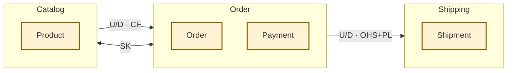
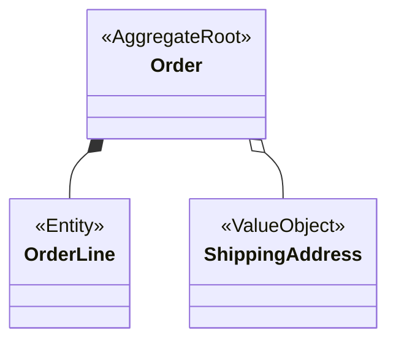

<!--
This is a cross-cutting top-level document (docs/en/specifications/
domain-overview.md), a sibling of architecture.md — NOT part of the
per-domain spec → design → test-spec pipeline. It carries no NAV NOTE,
no prev/next line, no Domain tag, and no All Documents index.

Diagram-first hard constraints (enforced by the domain-overview skill):
- Total intro prose (everything before section 1): ≤ 5 sentences.
- Each domain section in section 3: ≤ 3 sentences of prose.
- No attribute/field/method-level detail anywhere — that belongs in the
  domain's own design documents; link instead of writing.
-->

# Domain Overview

> **Generation note**: produced by `/dev-docs:domain-overview`. This
> document is diagram-first by design — each domain's detail lives in its
> own `<domain>/` documents. **Source mode**: docs-derived | code-derived |
> hybrid (state which; per domain if hybrid). Code-derived claims carry
> `[REF: path:line]`; judgment-call classifications carry
> `[ASSUMED: ...; basis: ...]`.

---

## Table of Contents

1. [Context Map](#context-map)
2. [Context Relationships](#context-relationships)
3. [Domains](#domains)
4. [Pattern Legend](#pattern-legend)

---

## Context Map

<!-- ≤ 5 sentences: what the system is and how to read the map. -->

<!--
Diagram rules:
- One subgraph per bounded context (domain); nodes are AGGREGATE ROOTS
  only — no entities, no value objects in this diagram.
- Keep node and subgraph labels short (one or two words).
- Every edge points UPSTREAM → DOWNSTREAM and is labeled
  "U/D · <pattern abbreviations>" (e.g. "U/D · OHS+PL").
- Symmetric patterns (P, SK) use a bidirectional edge `<-->` labeled with
  the abbreviation only.
- Separate Ways (SW) pairs get NO edge — record them in the Context
  Relationships table only.
- Every edge drawn here must have a matching row in the Context
  Relationships table.
-->

---

## Context Relationships

<!--
One row per relationship, including SW pairs that have no edge in the map.
Evidence column: [REF: path:line] for code-derived rows, a doc path
citation for docs-derived rows, or [ASSUMED: ...; basis: ...] when the
pattern classification is a judgment call. An unclassifiable relationship
gets Pattern "?" plus an [ASSUMED: ...] — never omit the row.
-->

| Upstream | Downstream | Pattern(s) | Integration Mechanism | Evidence |
|----------|------------|------------|----------------------|----------|
| Order | Shipping | OHS+PL | Versioned shipment-request events | [REF: src/order/events/shipment-requested.ts:12] |
| Catalog | Order | CF | Direct import of catalog product model | [ASSUMED: Conformist — no translation layer found at the boundary; basis: docs/en/specifications/order/design/data-model.md references Catalog's Product shape verbatim] |

---

## Domains

<!-- Repeat the ### block below once per bounded context, in the same
order the contexts appear in the Context Map. -->

### <Domain Name>

<!-- ≤ 3 sentences of prose: what this context owns and its core
responsibility. Link to the domain's own documents for anything deeper. -->

**Documents**: [@docs/en/specifications/<domain>/planning/spec.md](docs/en/specifications/<domain>/planning/spec.md)
<!-- List only documents that actually exist; drop this line if the
domain has no docs yet (code-derived context). -->

<!--
Mini-diagram rules:
- classDiagram with <<AggregateRoot>> / <<Entity>> / <<ValueObject>>
  stereotypes; empty class bodies — NO attributes, NO methods.
- `*--` composition for entities owned by the root; `o--` for value
  objects held by the root or an entity.
- Summary level only: the root plus its direct members. Deeper structure
  belongs in the domain's own data-model.md.
-->

---

## Pattern Legend

<!-- Fixed reference table — ship as-is, do not edit or trim. -->

| Abbrev | Pattern | Meaning |
|--------|---------|---------|
| U/D | Upstream/Downstream | The upstream context's model and release schedule influence the downstream context; the arrow points from upstream to downstream |
| P | Partnership | Two contexts (teams) succeed or fail together and coordinate planning and interfaces mutually |
| SK | Shared Kernel | Two contexts explicitly share a subset of the domain model or code |
| C/S | Customer/Supplier | Upstream/downstream where the downstream's needs factor into the upstream's planning, like a customer and a supplier |
| CF | Conformist | The downstream adopts the upstream's model as-is, with no translation |
| ACL | Anticorruption Layer | The downstream isolates itself behind a translation layer so the upstream's model cannot leak in |
| OHS | Open Host Service | The upstream exposes a well-defined protocol or service for any consumer to integrate with |
| PL | Published Language | Integration uses a well-documented, shared interchange language (schema, event format) — usually combined with OHS |
| SW | Separate Ways | The contexts have no significant relationship and evolve independently (listed in the table, never drawn as an edge) |
| BBoM | Big Ball of Mud | A demarcated area of mixed, entangled models; keep a boundary around it and do not let its model propagate |

---

## Sources Read

<!--
Required. List every file actually opened while writing this document —
docs and/or source files, with line ranges if read partially. Every
[REF: ...] citation above must point to a file listed here.
-->

---

## Related Documents

- [@docs/en/specifications/architecture.md](docs/en/specifications/architecture.md) — System architecture and module boundaries
<!-- Add per-domain spec/design links for the contexts mapped above;
list only documents that actually exist. -->

---

## Document Information

| Field | Value |
|-------|-------|
| **Created** | YYYY-MM-DD |
| **Last Modified** | YYYY-MM-DD |
| **Status** | Draft |
| **Tech Stack** | (auto-detected) |
| **Reference Documents** | <!-- list @-references from document discovery --> |

**Version History**:

- 1.0.0 (YYYY-MM-DD): Initial domain overview document
