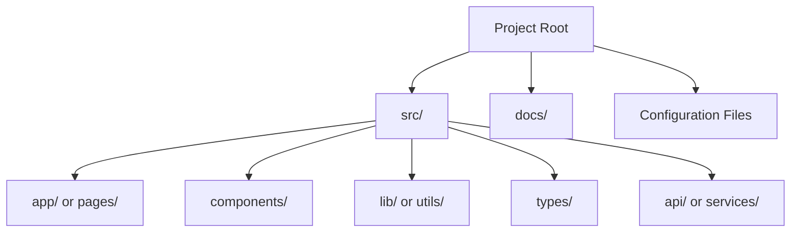
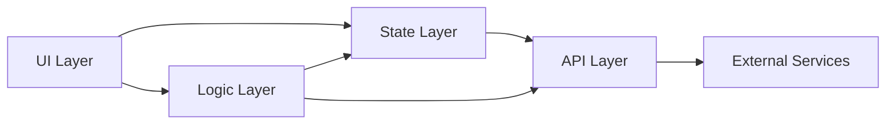

# Architecture

> **Created**: YYYY-MM-DD
> **Last Modified**: YYYY-MM-DD
> **Status**: Draft / Review / Final
> **Tech Stack**: (auto-detected)

## 1. Overview

<!-- High-level description of the project architecture -->

## 2. Project Structure

<!-- Replace with the actual project structure -->

## 3. Module Boundaries

<!-- Define the dependency rules between modules -->

| Layer | Allowed Dependencies | Description |
|-------|---------------------|-------------|
| UI | Logic, State, Types | Presentation and interaction |
| Logic | State, API, Types | Reusable business logic |
| State | API, Types | Application state management |
| API | Types | External communication |
| Types | None | Shared type definitions |

## 4. Key Files

| File | Purpose |
|------|---------|
| | |

## 5. References

- [@docs/en/specifications/infrastructure.md](docs/en/specifications/infrastructure.md) — Deployment and infrastructure
- [@docs/en/specifications/config.md](docs/en/specifications/config.md) — Environment variables and configuration
