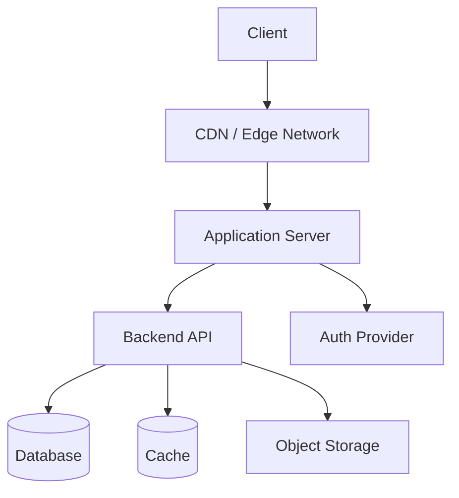
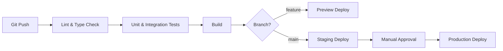

# Infrastructure

> **Created**: YYYY-MM-DD
> **Last Modified**: YYYY-MM-DD
> **Status**: Draft / Review / Final
> **Tech Stack**: (auto-detected)

## 1. Overview

<!-- High-level description of the infrastructure setup -->

## 2. Deployment Topology

<!-- Replace with the actual deployment topology -->

## 3. Environments

| Environment | URL | Purpose | Branch |
|------------|-----|---------|--------|
| Development | `localhost` | Local development | feature branches |
| Staging | | Pre-production testing | `develop` |
| Production | | Live service | `main` |

## 4. CI/CD Pipeline

<!-- Replace with the actual pipeline -->

## 5. External Services

| Service | Purpose | Provider |
|---------|---------|----------|
| Hosting | Application deployment | |
| Database | Data persistence | |
| Auth | Authentication | |
| Storage | File uploads | |
| Monitoring | Error tracking | |
| Analytics | Usage tracking | |

## 6. References

- [@docs/en/specifications/architecture.md](docs/en/specifications/architecture.md) — Project structure and module boundaries
- [@docs/en/specifications/config.md](docs/en/specifications/config.md) — Environment variables and configuration
