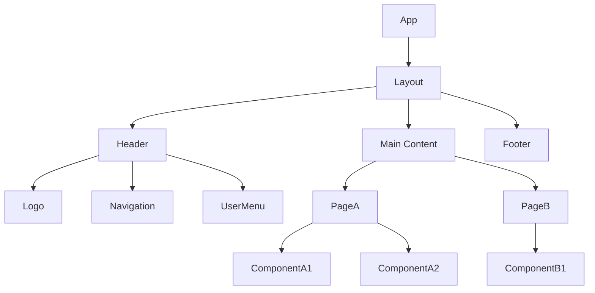
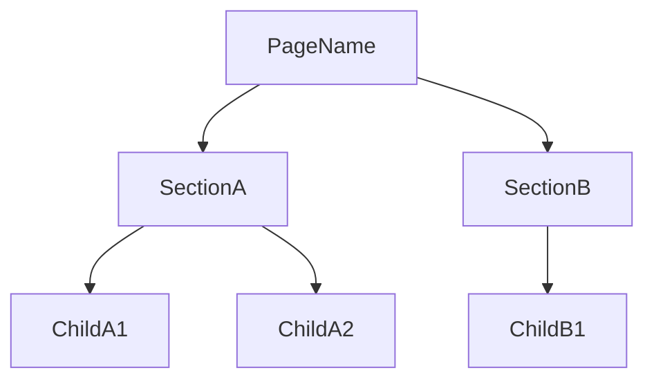

<!--
NAV NOTE: design/ is a dynamic set. The canonical order of the full
pipeline is: spec → [user-flows → sequence-diagram → api-spec →
data-model → component-diagram → domain-state-machine → client-store →
infra-spec] → test-spec. At generation time, re-chain the prev/next
links below through only the design documents actually generated for
this domain, keeping that order: the first generated design document's
prev is ../planning/spec.md, and the last generated design document's
next is ../verification/test-spec.md. Apply the same substitution to
the All Documents index at the bottom. Always link document to document
— never a folder — and never link a design/*.md file that was not
generated for this domain.
-->
> [← Data Model](data-model.md) | [Domain State Machine →](domain-state-machine.md)

# Component Diagram

> **Generation note**: this file is only produced when the codebase has a
> frontend component tree. It covers UI structure, component composition,
> and frontend data-fetching conventions — state management lives in
> `client-store.md`, and request/response shapes live in
> `api-spec.md`/`data-model.md` (not duplicated here as DTOs).
>
> **Domain**: Frontend-only

---

## Table of Contents

1. [UI Overview](#ui-overview)
2. [Component Tree](#component-tree)
3. [Shared Components](#shared-components)
4. [Page Components](#page-components)
5. [Data Fetching & Error Handling](#data-fetching--error-handling)

---

## 1. UI Overview

| # | View | URL / Trigger | Access | Related UC |
|---|------|---------------|--------|------------|
| 1 | e.g., Login | `/login` | Public | UC-AUTH-01 |
| 2 | e.g., Dashboard | `/dashboard` | Authenticated | UC-DASH-01 |
| 3 | | | | |

### Shared Layout

- **Header**: Logo, navigation menu, user menu (changes based on auth state)
- **Footer**: Copyright information, link collections
- **Error Views**: 404 (Not found), 500 (Server error)

### Responsive Strategy

| Viewport | Changes |
|----------|---------|
| Desktop (>=1024px) | Default layout |
| Tablet (768-1023px) | Sidebar hidden, hamburger menu |
| Mobile (<768px) | Single column, bottom navigation |

---

## 2. Component Tree

### Overall Structure



### Component Classification Summary

| Category | Count | Examples |
|----------|-------|---------|
| Layout | N | Layout, Header, Footer, Sidebar |
| UI (Shared) | N | Button, Input, Modal, Toast |
| Feature | N | LoginForm, UserProfile |
| Page | N | LoginPage, DashboardPage |

---

## 3. Shared Components

### 3.1 Layout Components

| Component | Role | Used In |
|-----------|------|---------|
| Layout | Top-level layout wrapper | All pages |
| Header | Top navigation bar | Layout |
| Footer | Bottom information area | Layout |
| Sidebar | Side navigation | Authenticated pages |

### 3.2 UI Components

| Component | Role | Props |
|-----------|------|-------|
| Button | General-purpose button | variant, size, disabled, onClick |
| Input | Text input field | type, placeholder, error, onChange |
| Modal | Modal dialog | isOpen, onClose, title, children |
| Toast | Notification message | type, message, duration |

### 3.3 Props Interfaces

```typescript
interface ButtonProps {
  variant: 'primary' | 'secondary' | 'danger' | 'ghost';
  size: 'sm' | 'md' | 'lg';
  disabled?: boolean;
  loading?: boolean;
  onClick?: () => void;
  children: React.ReactNode;
}

interface InputProps {
  type?: 'text' | 'email' | 'password' | 'number';
  placeholder?: string;
  value: string;
  error?: string;
  onChange: (value: string) => void;
}

interface ModalProps {
  isOpen: boolean;
  onClose: () => void;
  title: string;
  children: React.ReactNode;
}
```

---

## 4. Page Components

### 4.1 <Page Name>

**URL**: `/path`
**Related UC**: [UC-<AREA>-01](../planning/spec.md#uc-area-01)

#### Layout

```text
+-----------------------------+
|        Header / Nav         |
+---------+-------------------+
| Sidebar |   Main Content    |
|         |                   |
|         | +--------------+  |
|         | | Component A  |  |
|         | +--------------+  |
|         | +--------------+  |
|         | | Component B  |  |
|         | +--------------+  |
+---------+-------------------+
|          Footer             |
+-----------------------------+
```

#### Component Hierarchy



#### Props Interfaces

```typescript
interface SectionAProps {
  // define props
}

interface ChildA1Props {
  // define props
}
```

---

### 4.2 <Next Page Name>

<!-- Repeat the same structure as above -->

---

## 5. Data Fetching & Error Handling

<!--
Optional — include when the feature owns frontend data-fetching concerns.
Endpoint contracts and DTOs stay in api-spec.md/data-model.md when those
files exist for this domain; this section covers only the client-side
conventions (caching, client configuration, error UX).
-->

### 5.1 Caching Strategy

| Data | staleTime | gcTime | Revalidation Trigger |
|------|-----------|--------|---------------------|
| User profile | 5 min | 30 min | On page focus |
| List data | 1 min | 10 min | On page navigation |
| Static data | 1 hour | 24 hours | Manual invalidation |

### 5.2 API Client Configuration

```typescript
// Base configuration
interface ApiClientConfig {
  baseURL: string;
  timeout: number;
  headers: Record<string, string>;
}

// Interceptors
// - Request: Automatically attach token to Authorization header
// - Response: Token refresh logic on 401
// - Error: Call common error handler
```

### 5.3 Error Handling

| HTTP Status | Handling |
|-------------|----------|
| 401 Unauthorized | Attempt token refresh -> on failure, redirect to login page |
| 403 Forbidden | Display "Permission denied" toast |
| 404 Not Found | Navigate to 404 error page |
| 422 Validation | Display per-field error messages |
| 500 Server Error | Display "Server error occurred" toast + retry button |
| Network Error | Display "Please check your network connection" toast |

---

## Sources Read

<!--
Populated by dev-reverse-docs only — omitted entirely for forward planning
(dev-planning). List every component file/line-range actually opened; the
tree and props above must trace back to a file listed here.
-->

---

## Related Documents

### Supporting References

- [Client Store](client-store.md) — Client-side state management for these components
- [Specification](../planning/spec.md) — Requirements, user stories, and multi-actor flows

---

## Document Information

| Field | Value |
|-------|-------|
| **Created** | YYYY-MM-DD |
| **Last Modified** | YYYY-MM-DD |
| **Status** | Draft |
| **Tech Stack** | (auto-detected) |
| **Reference Documents** | <!-- list @-references from document discovery --> |

**Version History**:

- 1.0.0 (YYYY-MM-DD): Initial component diagram document

---
> **All Documents**
> <!-- Keep only the design/*.md entries actually generated for this domain; current document in bold, not linked -->
> [Specification](../planning/spec.md) |
> [User Flows](user-flows.md) |
> [Sequence Diagrams](sequence-diagram.md) |
> [API Spec](api-spec.md) |
> [Data Model](data-model.md) |
> **Component Diagram** |
> [Domain State Machine](domain-state-machine.md) |
> [Client Store](client-store.md) |
> [Infra Spec](infra-spec.md) |
> [Test Spec](../verification/test-spec.md)
