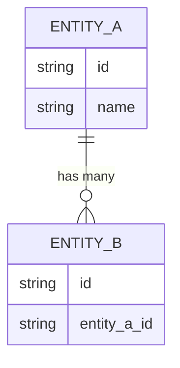

<!--
NAV NOTE: design/ is a dynamic set. The canonical order of the full
pipeline is: requirements → user-stories → use-case → [user-flows →
sequence-diagram → api-spec → data-model → component-diagram →
state-diagram → infra-spec] → test-spec. At generation time, re-chain the
prev/next links below through only the design documents actually generated
for this domain, keeping that order: the first generated design document's
prev is ../planning/use-case.md, and the last generated design document's
next is ../verification/test-spec.md. Apply the same substitution to the
All Documents index at the bottom. Always link document to document —
never a folder — and never link a design/*.md file that was not generated
for this domain.
-->
> [← API Spec](api-spec.md) | [Component Diagram →](component-diagram.md)

# Data Model

> **Generation note**: this file is only produced when the codebase has an
> ORM mapping or a DB schema (migrations, `models/`, `entities/`, schema
> files). It owns entity shapes and relationships; `api-spec.md` links here
> instead of repeating field definitions.

---

## Table of Contents

1. [Overview](#overview)
2. [Entity Relationship Diagram](#entity-relationship-diagram)
3. [Data Models](#data-models)

---

## Overview

<!-- One paragraph: storage technology (RDBMS/NoSQL/etc.), ORM/mapping layer, migration tool -->

**Related Requirements**: <!-- e.g., NFR-PERF-01 -->

---

## Entity Relationship Diagram

<!-- Relationships between entities — cardinality, foreign keys, ownership -->



---

## Data Models

### <ModelName>

**Description**: <!-- Model purpose -->

**JSON Schema**:

```json
{
  "type": "object",
  "properties": {
    "id": {
      "type": "string",
      "description": "Unique identifier"
    },
    "name": {
      "type": "string",
      "description": "Display name"
    }
  },
  "required": ["id", "name"]
}
```

**Example**:

```json
{
  "id": "abc123",
  "name": "Example"
}
```

---

<!-- Repeat ### <ModelName> for each data model -->

---

## Sources Read

<!--
Populated by dev-reverse-docs only — omitted entirely for forward planning
(dev-planning). List every schema/model file/line-range actually opened;
the entity relationships and fields above must trace back to a file listed
here, or be tagged [ASSUMED: ...] if inferred rather than confirmed.
-->

---

## Related Documents

### Supporting References

- [API Specification](api-spec.md) — Endpoints whose bodies reference these entities
- [Requirements Analysis](../planning/requirements.md) — Functional and non-functional requirements
- [Use Case](../planning/use-case.md) — Actor-level flows that produce and consume this data

---

## Document Information

| Field | Value |
|-------|-------|
| **Created** | YYYY-MM-DD |
| **Last Modified** | YYYY-MM-DD |
| **Status** | Draft |
| **Tech Stack** | (auto-detected) |
| **Reference Documents** | <!-- list @-references from document discovery --> |

**Version History**:

- 1.0.0 (YYYY-MM-DD): Initial data model document

---
> **All Documents**
> <!-- Keep only the design/*.md entries actually generated for this domain; current document in bold, not linked -->
> [Requirements](../planning/requirements.md) |
> [User Stories](../planning/user-stories.md) |
> [Use Case](../planning/use-case.md) |
> [User Flows](user-flows.md) |
> [Sequence Diagrams](sequence-diagram.md) |
> [API Spec](api-spec.md) |
> **Data Model** |
> [Component Diagram](component-diagram.md) |
> [State Diagram](state-diagram.md) |
> [Infra Spec](infra-spec.md) |
> [Test Spec](../verification/test-spec.md)
