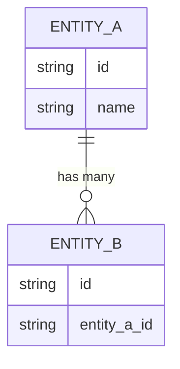

<!--
NAV NOTE: design/ is a dynamic set. At generation time, replace the
prev-link below with the previous document actually generated for this
domain (or ../planning/use-case.md if this is the first design document),
and apply the same substitution to the Related Documents and All Documents
blocks at the bottom. Never link a design/*.md file that was not generated
for this domain.
-->
> [← Sequence Diagrams](sequence-diagram.md) | [Test Spec →](../verification/test-spec.md)

# Data Model

> **Created**: YYYY-MM-DD
> **Last Modified**: YYYY-MM-DD
> **Status**: Draft
> **Tech Stack**: (auto-detected)
> **Reference Documents**: <!-- list @-references from document discovery -->

> **Generation note**: this file is only produced when the codebase has an
> ORM mapping or a DB schema (migrations, `models/`, `entities/`, schema
> files). It owns entity shapes and relationships; `api-spec.md` links here
> instead of repeating field definitions.

---

## Table of Contents

1. [Overview](#overview)
2. [Entity Relationship Diagram](#entity-relationship-diagram)
3. [Data Models](#data-models)

---

## Overview

<!-- One paragraph: storage technology (RDBMS/NoSQL/etc.), ORM/mapping layer, migration tool -->

**Related Requirements**: <!-- e.g., NFR-ARCH-01 -->

---

## Entity Relationship Diagram

<!-- Relationships between entities — cardinality, foreign keys, ownership -->



---

## Data Models

### <ModelName>

**Description**: <!-- Model purpose -->

**JSON Schema**:

```json
{
  "type": "object",
  "properties": {
    "id": {
      "type": "string",
      "description": "Unique identifier"
    },
    "name": {
      "type": "string",
      "description": "Display name"
    }
  },
  "required": ["id", "name"]
}
```

**Example**:

```json
{
  "id": "abc123",
  "name": "Example"
}
```

---

<!-- Repeat ### <ModelName> for each data model -->

---

## Sources Read

<!--
Populated by dev-reverse-docs only — omitted entirely for forward planning
(dev-planning). List every schema/model file/line-range actually opened;
the entity relationships and fields above must trace back to a file listed
here, or be tagged [ASSUMED: ...] if inferred rather than confirmed.
-->

---

## Related Documents

- **Previous**: [← Sequence Diagrams](sequence-diagram.md)
- **Next**: [Test Spec →](../verification/test-spec.md)
- **API Spec**: [API Specification](api-spec.md)
- **Requirements**: [Requirements Analysis](../planning/requirements.md)
- **Use Case**: [Use Case](../planning/use-case.md)

---

**Version History**:

- 1.0.0 (YYYY-MM-DD): Initial data model document

---
> **All Documents**
> <!-- list only the design/*.md files generated for this domain; current file in bold -->
> [Requirements](../planning/requirements.md) |
> [User Stories](../planning/user-stories.md) |
> [Use Case](../planning/use-case.md) |
> [Sequence Diagrams](sequence-diagram.md) |
> **Data Model** |
> [Test Spec](../verification/test-spec.md)
