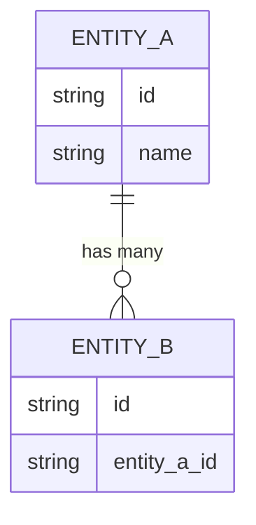
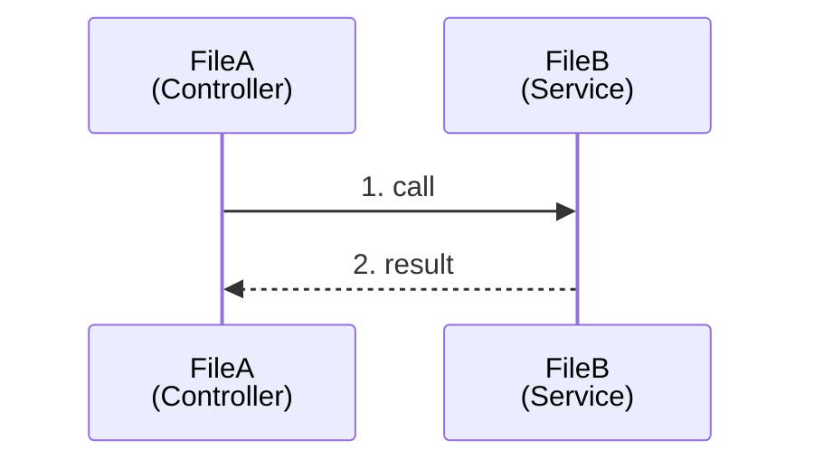
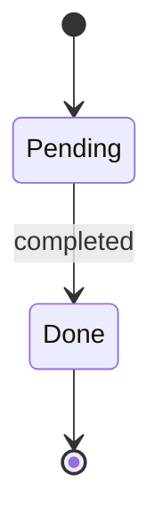
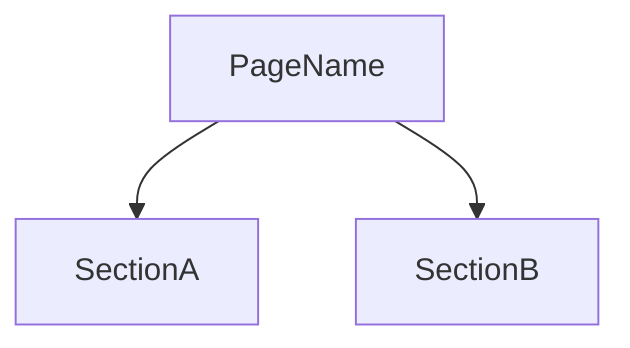
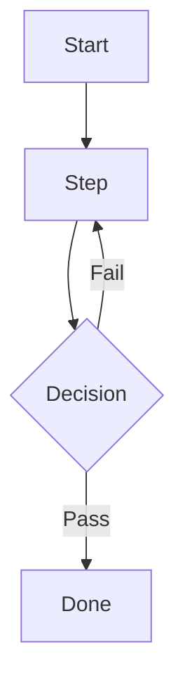
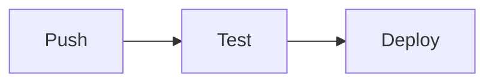

<!--
NAV NOTE: Lite tier only. This single file replaces the individual
design/*.md documents, so the chain is fixed: spec → design → test-spec.
Never generate this file alongside individual design/*.md files for the
same domain — a domain is either Lite (this file) or Full (individual
files). The All Documents index at the bottom is already the final
three-document set; no substitution needed.
-->
> [← Specification](../planning/spec.md) | [Test Spec →](../verification/test-spec.md)

# Design

> **Generation note**: Lite-tier single design document. Each H2 section
> below is the condensed form of one Full-tier design template and
> carries that template's Domain tag. Include ONLY the sections whose
> trigger applies (same triggers as the Design Document Selection table);
> drop the rest, including their Table of Contents entries. If more than
> ~4 sections are needed, the feature has outgrown Lite — switch to Full
> tier and generate individual design/*.md files instead.

---

## Table of Contents

<!-- Keep only the entries for sections actually included. -->

1. [Overview](#overview)
2. [API](#api)
3. [Data Model](#data-model)
4. [Core Flows](#core-flows)
5. [Domain State Machine](#domain-state-machine)
6. [Components](#components)
7. [Client Store](#client-store)
8. [User Flows](#user-flows)
9. [Infrastructure](#infrastructure)

---

## Overview

<!-- 2-3 sentences: the tech stack, which sections are present, and why
(one line per included section tying it to its trigger). -->

---

## API

<!-- Trigger: REST/GraphQL endpoints. Condensed api-spec.md — endpoint
catalog plus per-endpoint contract; no curl/JS example blocks. -->

> **Domain**: Backend-only

| HTTP Method | Path | Auth Required | Summary | Related Use Case |
|-------------|------|--------------|---------|------------------|
| POST | `/api/<resource>` | No | <!-- Summary --> | [UC-<AREA>-01](../planning/spec.md#uc-area-01) |

### METHOD /api/<path>

**Description**: <!-- What this endpoint does -->

**Request** (JSON):

```json
{
  "field1": "string (required)"
}
```

**Response — 200 OK** (JSON):

```json
{
  "id": "string",
  "field1": "string"
}
```

**Errors**: <!-- e.g., 400 invalid input, 401 not authenticated -->

<!-- Repeat ### METHOD /api/<path> per endpoint -->

---

## Data Model

<!-- Trigger: ORM mapping or DB schema. Condensed data-model.md. -->

> **Domain**: Backend-only



### <ModelName>

**Description**: <!-- Model purpose -->

```json
{
  "type": "object",
  "properties": {
    "id": { "type": "string", "description": "Unique identifier" }
  },
  "required": ["id"]
}
```

<!-- Repeat ### <ModelName> per model -->

---

## Core Flows

<!-- Trigger: backend service/component call chains. Condensed
sequence-diagram.md — 1-2 flows, participants labeled FileName<br/>(Layer).
In dev-reverse-docs mode, Source-Linked Mode rules (link/Note/CALLGRAPH)
apply to every diagram here exactly as they do in sequence-diagram.md. -->

> **Domain**: Backend-only

### <Flow Name>



<!-- Repeat ### <Flow Name> per core flow -->

---

## Domain State Machine

<!-- Trigger: a domain entity/workflow with explicit states and
transitions. Condensed domain-state-machine.md. -->

> **Domain**: Backend-only



| From | To | Trigger | Guard/Condition |
|------|----|---------|------------------|
| <!-- Pending --> | <!-- Done --> | <!-- event --> | <!-- condition --> |

---

## Components

<!-- Trigger: frontend component tree. Condensed component-diagram.md —
tree plus key prop interfaces only. -->

> **Domain**: Frontend-only



```typescript
interface SectionAProps {
  // define props
}
```

---

## Client Store

<!-- Trigger: client-side state management layer. Condensed
client-store.md. -->

> **Domain**: Frontend-only

| Category | Decision |
|----------|----------|
| State Management Library | (e.g., Zustand / Redux Toolkit / Pinia) |
| Server State Management | (e.g., TanStack Query / SWR) |

```typescript
interface SomeState {
  // define state
}

interface SomeActions {
  // define actions
}
```

---

## User Flows

<!-- Trigger: multi-step user-facing journeys. Condensed user-flows.md —
Exception Path entries feed the E2E scenarios in
../verification/test-spec.md. -->

> **Domain**: Frontend-only

### <Flow Name>

**Entry Condition**: <!-- e.g., User navigates to the page -->
**Exit Condition**: <!-- e.g., User reaches the confirmation screen -->



**Exception Paths**:

- <!-- Each entry becomes an E2E test candidate in test-spec.md -->

---

## Infrastructure

<!-- Trigger: deployment, environments, CI/CD, or infra resources.
Condensed infra-spec.md. -->

> **Domain**: Infra-only

| Environment | URL | Purpose | Deployed From |
|-------------|-----|---------|---------------|
| Production | `https://example.com` | Live environment | release/* |



---

## Sources Read

<!--
Populated by dev-reverse-docs only — omitted entirely for forward planning
(dev-planning). List every file/line-range actually opened; every claim
and diagram above must trace back to a file listed here, or be tagged
[ASSUMED: ...] if inferred rather than confirmed.
-->

---

## Related Documents

### Supporting References

- [Specification](../planning/spec.md) — Requirements, user stories, and multi-actor flows
- [Architecture](../../architecture.md) — Architecture structure and layer rules

---

## Document Information

| Field | Value |
|-------|-------|
| **Created** | YYYY-MM-DD |
| **Last Modified** | YYYY-MM-DD |
| **Status** | Draft |
| **Tech Stack** | (auto-detected) |
| **Reference Documents** | <!-- list @-references from document discovery --> |

**Version History**:

- 1.0.0 (YYYY-MM-DD): Initial design document

---
> **All Documents**
> [Specification](../planning/spec.md) |
> **Design** |
> [Test Spec](../verification/test-spec.md)
