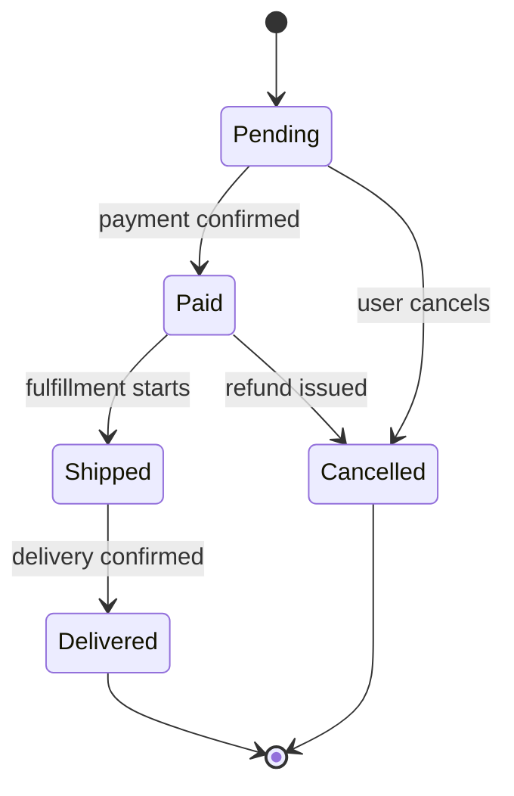

<!--
NAV NOTE: design/ is a dynamic set. The canonical order of the full
pipeline is: spec → [user-flows → sequence-diagram → api-spec →
data-model → component-diagram → domain-state-machine → client-store →
infra-spec] → test-spec. At generation time, re-chain the prev/next
links below through only the design documents actually generated for
this domain, keeping that order: the first generated design document's
prev is ../planning/spec.md, and the last generated design document's
next is ../verification/test-spec.md. Apply the same substitution to
the All Documents index at the bottom. Always link document to document
— never a folder — and never link a design/*.md file that was not
generated for this domain.
-->
> [← Component Diagram](component-diagram.md) | [Client Store →](client-store.md)

# Domain State Machine

> **Generation note**: this file is only produced when a domain
> entity/workflow has explicit states and transitions worth diagramming
> (e.g. an order/workflow status field: pending -> paid -> shipped).
> Client-side store state (Redux/Vuex/Pinia/Zustand/etc.) is a different
> axis and lives in `client-store.md`.
>
> **Domain**: Backend-only

---

## Table of Contents

1. [Overview](#overview)
2. [State Machine](#state-machine)

---

## Overview

<!-- One paragraph: which domain entity/workflow lifecycle is stateful here
and why it's significant enough to diagram -->

---

## State Machine

### Transition Table

| From | To | Trigger | Guard/Condition |
|------|----|---------|------------------|
| <!-- Pending --> | <!-- Paid --> | <!-- payment webhook --> | <!-- amount matches --> |

---

## Sources Read

<!--
Populated by dev-reverse-docs only — omitted entirely for forward planning
(dev-planning). List every file/line-range actually opened; the states and
transitions above must trace back to a file listed here, or be tagged
[ASSUMED: ...] if inferred rather than confirmed.
-->

---

## Related Documents

### Supporting References

- [Data Model](data-model.md) — Entities that carry these state fields
- [Sequence Diagrams](sequence-diagram.md) — Call flows that trigger the transitions
- [Specification](../planning/spec.md) — Requirements, user stories, and multi-actor flows

---

## Document Information

| Field | Value |
|-------|-------|
| **Created** | YYYY-MM-DD |
| **Last Modified** | YYYY-MM-DD |
| **Status** | Draft |
| **Tech Stack** | (auto-detected) |
| **Reference Documents** | <!-- list @-references from document discovery --> |

**Version History**:

- 1.0.0 (YYYY-MM-DD): Initial domain state machine document

---
> **All Documents**
> <!-- Keep only the design/*.md entries actually generated for this domain; current document in bold, not linked -->
> [Specification](../planning/spec.md) |
> [User Flows](user-flows.md) |
> [Sequence Diagrams](sequence-diagram.md) |
> [API Spec](api-spec.md) |
> [Data Model](data-model.md) |
> [Component Diagram](component-diagram.md) |
> **Domain State Machine** |
> [Client Store](client-store.md) |
> [Infra Spec](infra-spec.md) |
> [Test Spec](../verification/test-spec.md)
