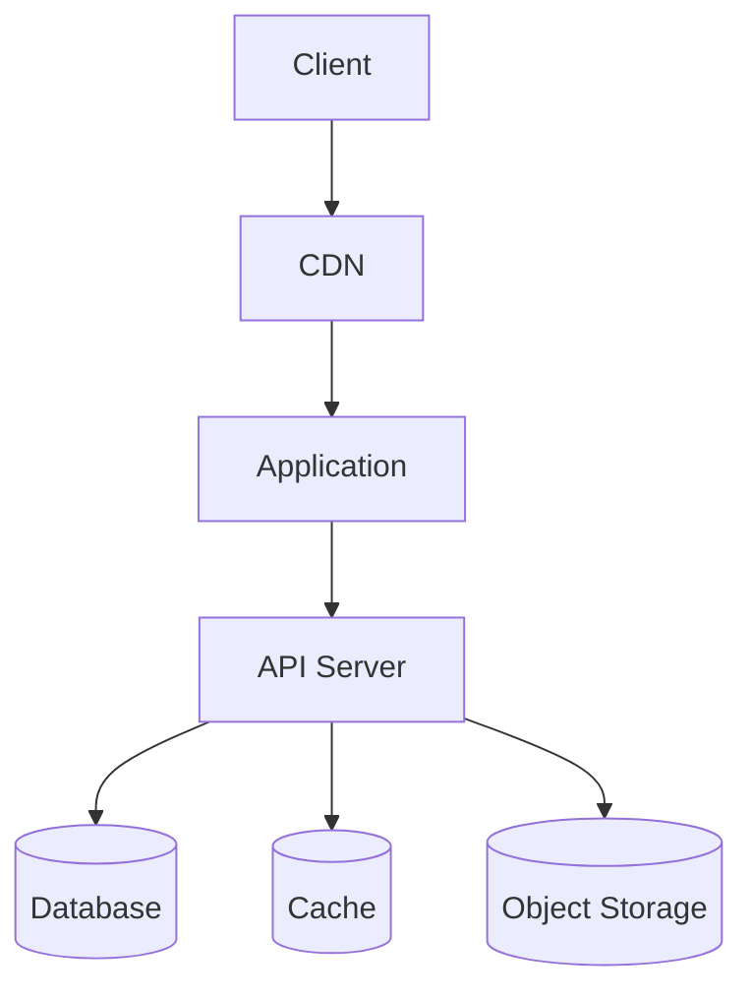
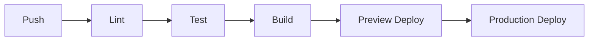

<!--
NAV NOTE: design/ is a dynamic set. The canonical order of the full
pipeline is: requirements → user-stories → use-case → [user-flows →
sequence-diagram → api-spec → data-model → component-diagram →
state-diagram → infra-spec] → test-spec. At generation time, re-chain the
prev/next links below through only the design documents actually generated
for this domain, keeping that order: the first generated design document's
prev is ../planning/use-case.md, and the last generated design document's
next is ../verification/test-spec.md. Apply the same substitution to the
All Documents index at the bottom. Always link document to document —
never a folder — and never link a design/*.md file that was not generated
for this domain.
-->
> [← State Diagram](state-diagram.md) | [Test Spec →](../verification/test-spec.md)

# Infrastructure Specification

> **Generation note**: this file is only produced when the feature touches
> deployment, environments, CI/CD, or infrastructure resources. It covers
> the HOW of running the system — application-internal design lives in the
> other `design/` documents, and the cross-cutting project-wide
> `infrastructure.md` created by `init-docs` stays the top-level overview;
> this document details the infrastructure of **this domain/feature** only.

---

## Table of Contents

1. [Deployment Topology](#deployment-topology)
2. [Environments](#environments)
3. [CI/CD Pipeline](#cicd-pipeline)
4. [Resource Definitions](#resource-definitions)
5. [Monitoring and Alerting](#monitoring-and-alerting)
6. [Security](#security)

---

## 1. Deployment Topology

<!-- Show how the feature's runtime pieces are deployed and connected -->

| Node | Platform / Service | Scaling | Related Requirement |
|------|--------------------|---------|---------------------|
| <!-- e.g., API Server --> | <!-- e.g., ECS Fargate --> | <!-- e.g., 2–6 tasks, CPU>70% --> | NFR-<CAT>-NN |

---

## 2. Environments

| Environment | URL | Purpose | Deployed From |
|-------------|-----|---------|---------------|
| Development | `http://localhost` | Local development | feature/* |
| Staging | `https://staging.example.com` | Pre-production testing | main |
| Production | `https://example.com` | Live environment | release/* |

### Environment-Specific Configuration

| Key | Development | Staging | Production |
|-----|-------------|---------|------------|
| <!-- e.g., LOG_LEVEL --> | debug | info | warn |

---

## 3. CI/CD Pipeline

| Stage | Tool / Job | Trigger | Gate |
|-------|-----------|---------|------|
| <!-- e.g., Test --> | <!-- e.g., GitHub Actions ci.yml --> | <!-- e.g., every push --> | <!-- e.g., must pass before merge --> |

---

## 4. Resource Definitions

<!-- Define infrastructure resources: compute, storage, networking, DNS -->

| Resource | Type | Spec / Size | Notes |
|----------|------|-------------|-------|
| <!-- e.g., app-db --> | <!-- e.g., RDS PostgreSQL --> | <!-- e.g., db.t4g.medium --> | <!-- e.g., multi-AZ in prod --> |

---

## 5. Monitoring and Alerting

<!-- Define monitoring targets, alert rules, dashboards -->

| Signal | Source | Threshold / Rule | Alert Channel |
|--------|--------|------------------|---------------|
| <!-- e.g., 5xx rate --> | <!-- e.g., ALB metrics --> | <!-- e.g., >1% for 5 min --> | <!-- e.g., #ops Slack --> |

---

## 6. Security

<!-- Define network policies, secrets management, access control -->

- **Network**: <!-- e.g., private subnets, security-group rules -->
- **Secrets**: <!-- e.g., managed via SSM Parameter Store, never in repo -->
- **Access control**: <!-- e.g., IAM roles per service, least privilege -->

---

## Sources Read

<!--
Populated by dev-reverse-docs only — omitted entirely for forward planning
(dev-planning). List every IaC/CI-config file/line-range actually opened;
the topology and resources above must trace back to a file listed here.
-->

---

## Related Documents

### Supporting References

- [Requirements Analysis](../planning/requirements.md) — Functional and non-functional requirements
- [infrastructure.md](../../infrastructure.md) — Project-wide infrastructure overview

---

## Document Information

| Field | Value |
|-------|-------|
| **Created** | YYYY-MM-DD |
| **Last Modified** | YYYY-MM-DD |
| **Status** | Draft |
| **Tech Stack** | (auto-detected) |
| **Reference Documents** | <!-- list @-references from document discovery --> |

**Version History**:

- 1.0.0 (YYYY-MM-DD): Initial infrastructure specification

---
> **All Documents**
> <!-- Keep only the design/*.md entries actually generated for this domain; current document in bold, not linked -->
> [Requirements](../planning/requirements.md) |
> [User Stories](../planning/user-stories.md) |
> [Use Case](../planning/use-case.md) |
> [User Flows](user-flows.md) |
> [Sequence Diagrams](sequence-diagram.md) |
> [API Spec](api-spec.md) |
> [Data Model](data-model.md) |
> [Component Diagram](component-diagram.md) |
> [State Diagram](state-diagram.md) |
> **Infra Spec** |
> [Test Spec](../verification/test-spec.md)
