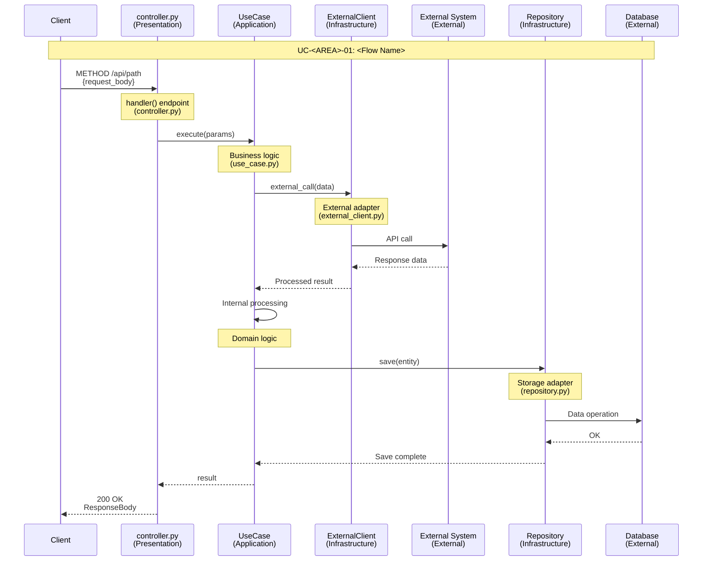
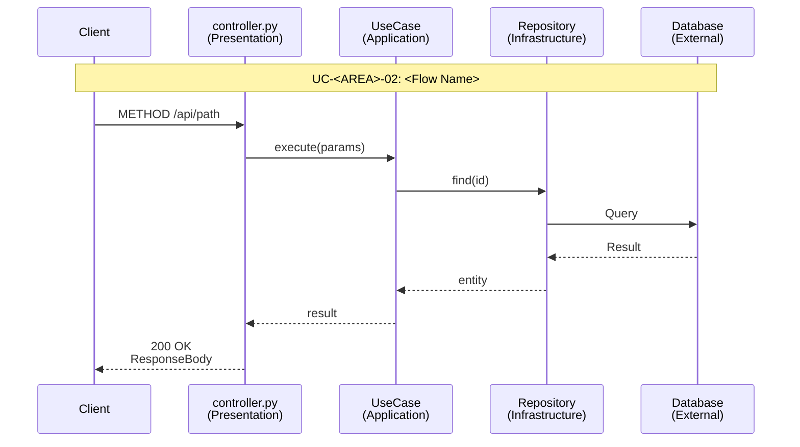
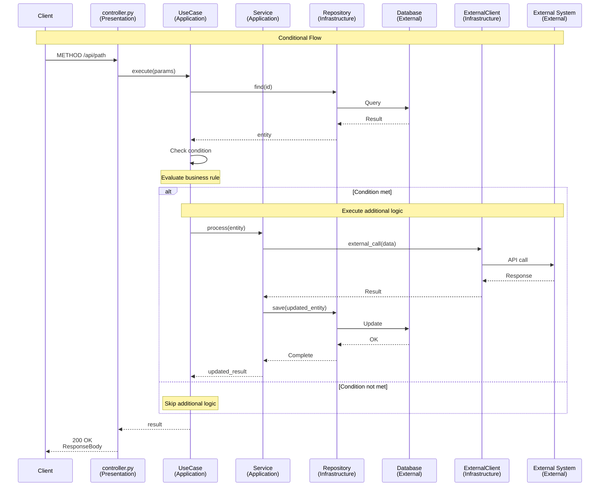
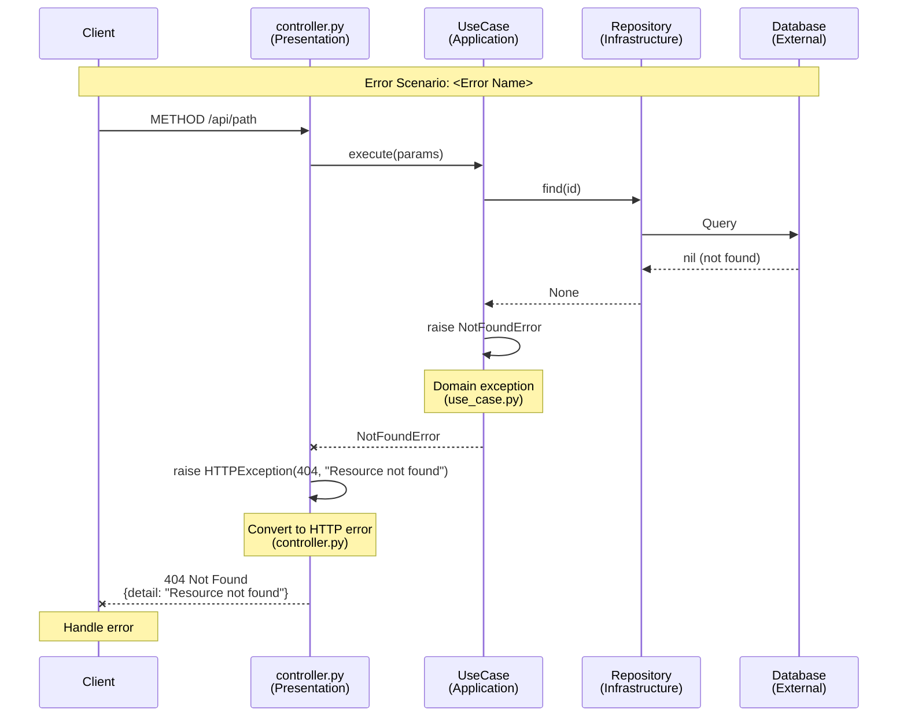
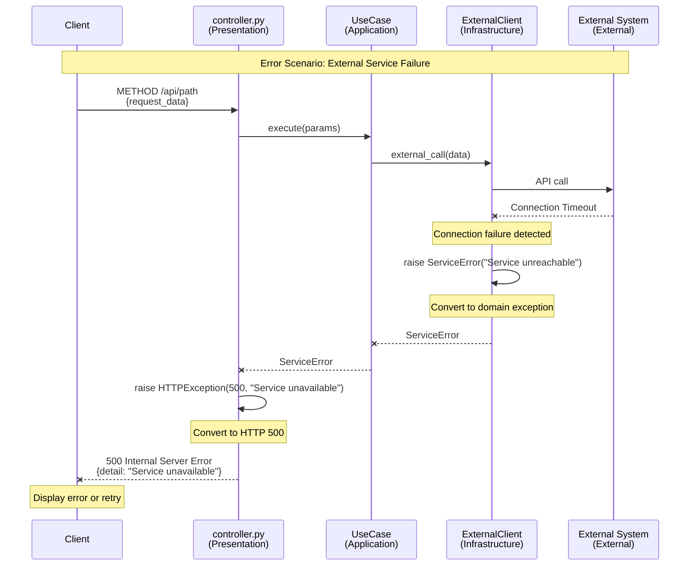
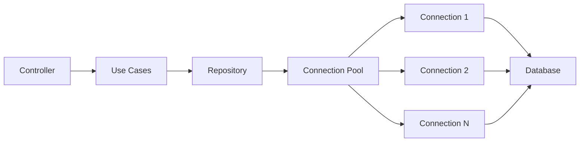
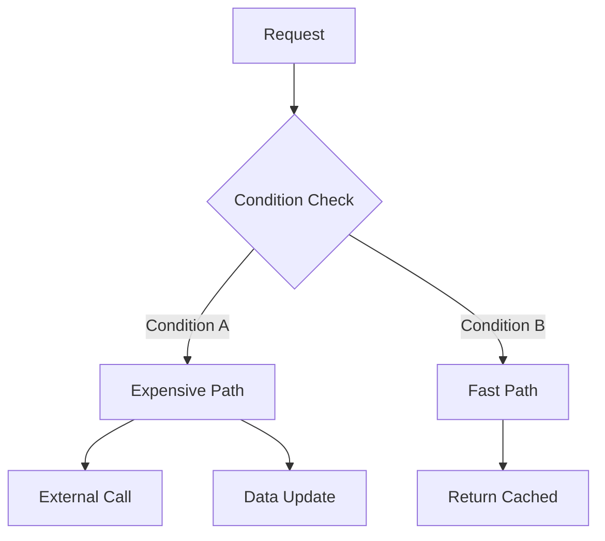

<!--
NAV NOTE: design/ is a dynamic set. The canonical order of the full
pipeline is: spec → [user-flows → sequence-diagram → api-spec →
data-model → component-diagram → domain-state-machine → client-store →
infra-spec] → test-spec. At generation time, re-chain the prev/next
links below through only the design documents actually generated for
this domain, keeping that order: the first generated design document's
prev is ../planning/spec.md, and the last generated design document's
next is ../verification/test-spec.md. Apply the same substitution to
the All Documents index at the bottom. Always link document to document
— never a folder — and never link a design/*.md file that was not
generated for this domain.
-->
> [← User Flows](user-flows.md) | [API Spec →](api-spec.md)

# Sequence Diagrams

> **Classification note**: this document is a **design/HOW** document — it
> shows inter-component call order, not actor↔feature relationships (that's
> the Multi-Actor Flows section's job, see `../planning/spec.md`).
>
> **Domain**: Backend-only

---

## Table of Contents

1. [Overview](#overview)
2. [Architecture Layer Structure](#architecture-layer-structure)
3. [Core Flows](#core-flows)
4. [Error Handling Flows](#error-handling-flows)
5. [Performance Optimization Points](#performance-optimization-points)

---

## Overview

This document represents all major flows as sequence diagrams, explicitly showing architecture layer interactions.

### Purpose

- **Implementation Traceability**: Code tracing possible using actual file names and methods
- **Architecture Understanding**: Visualize interactions between architecture layers
- **Debugging Support**: Understand entire request flow at a glance

### Related Documents

- [Specification](../planning/spec.md) — Requirements, user stories, and multi-actor flows

---

## Architecture Layer Structure

### Layer Overview

<!-- Adapt the layer structure to match the project's architecture pattern -->

```text
+---------------------------------------------------------+
|                  Presentation Layer (HTTP)               |
|              controllers/ or routes/                     |
|              (Framework Controllers/Handlers)            |
+------------------------+--------------------------------+
                         | uses
                         v
+---------------------------------------------------------+
|          Application Layer (Use Cases / Services)        |
|              use_cases/ or services/                     |
|  - Use Case classes or Service methods                   |
+----------+-------------------------+--------------------+
           | uses                    | uses
           v                         v
+----------------------+   +------------------------------+
|   Domain Layer       |   |  Infrastructure Layer        |
|  entities/models/    |   |  repositories/ or adapters/  |
|  - Domain Entities   |   |  - Repository Implementations|
|  - Value Objects     |   |  - External Service Clients  |
+----------------------+   +------------------------------+
```

### Participant Notation

In sequence diagrams, each participant is displayed in the following format:

```text
[FileName]<br/>(Layer)
```

**Examples**:

- `controller.py<br/>(Presentation)` - HTTP Controller
- `CreateUseCase<br/>(Application)` - Use Case (business workflow)
- `Service<br/>(Application)` - Application Service (shared logic)
- `ExternalClient<br/>(Infrastructure)` - External Service Adapter
- `Repository<br/>(Infrastructure)` - Data Storage Adapter

### Source-Linked Mode (dev-reverse-docs only)

When this template is used by **dev-reverse-docs** (documenting existing
code), every diagram in this file is augmented with source evidence so
`doc-verifier` can check it claim-by-claim. **dev-planning** (forward mode)
omits all of this — no code exists yet for a feature being planned.

1. **Participant source links** — every participant gets a `link` line
   pointing at its source file:
   ```
   link <alias>: Source @ <repo_url>/blob/<branch>/<path>
   ```
   Resolve `<repo_url>` from the repo's `origin` remote (normalized to
   `https://`) and `<branch>` from the branch checked out during generation.
2. **Per-message evidence** — immediately after each arrow, one `Note` line
   with the real `path:line` the call was found at. Mermaid has no
   per-message click-through link, so this plain-text `Note` is the
   fallback that renders in every renderer.
3. **No fabricated evidence** — a message/flow that can't be confirmed from
   code gets `[ASSUMED: ...]` in place of the `Note`, never a guessed
   file:line.
4. **Hidden raw call-graph block** — a `<!-- CALLGRAPH: ... -->` HTML
   comment at the end of the flow's section records the raw call edges the
   diagram was built from, independent of the visible `Note`s, so
   `doc-verifier` has two things to cross-check instead of one.

**Worked example** (rewriting the first Core Flow below in Source-Linked Mode):

```mermaid
sequenceDiagram
    participant C as controller.py<br/>(Presentation)
    participant UC as UseCase<br/>(Application)
    participant R as Repository<br/>(Infrastructure)
    participant DB as Database<br/>(External)

    link C: Source @ https://github.com/<org>/<repo>/blob/<branch>/src/controller.py
    link UC: Source @ https://github.com/<org>/<repo>/blob/<branch>/src/use_case.py
    link R: Source @ https://github.com/<org>/<repo>/blob/<branch>/src/repository.py

    C->>UC: execute(params)
    Note right of UC: src/use_case.py:42

    UC->>R: save(entity)
    Note right of R: src/repository.py:88

    UC->>UC: sendWebhookIfConfigured()
    Note right of UC: [ASSUMED: no direct call site found; inferred from config flag]

    R-->>UC: entity
    UC-->>C: result
```

```text
<!-- CALLGRAPH:
1. controller.py:handle -> UseCase.execute | src/use_case.py:42
2. UseCase.execute -> Repository.save | src/repository.py:88
-->
```

---

## Core Flows

### <Flow Name> Flow

**Use Case**: [UC-<AREA>-01 (Name)](../planning/spec.md#uc-area-01-name)

**Description**: <!-- Brief description of the flow -->



**Key Steps**:

1. <!-- Key step 1 -->
2. <!-- Key step 2 -->
3. <!-- Key step 3 -->

**Related Code**:

- <!-- [controller.py](path) - endpoint -->
- <!-- [use_case.py](path) - method -->
- <!-- [repository.py](path) - method -->

---

### <Another Flow Name> Flow

**Use Case**: [UC-<AREA>-02 (Name)](../planning/spec.md#uc-area-02-name)

**Description**: <!-- Brief description -->



**Key Steps**:

1. <!-- Key step 1 -->
2. <!-- Key step 2 -->

**Related Code**:

- <!-- [file](path) - method -->

---

### Conditional Flow (with alt block)

**Use Case**: <!-- UC reference -->

**Description**: <!-- Flow with conditional branching -->



**Conditional Branch (alt)**:

- **Condition met**: <!-- Description of what happens -->
- **Condition not met**: <!-- Description of what happens -->

**Related Code**:

- <!-- [file](path) - method -->

---

<!-- Repeat ### <Flow Name> Flow for each major flow -->

---

## Error Handling Flows

### <Error Scenario Name> Error Flow

**Scenario**: <!-- Brief description of the error scenario -->



**Error Propagation Flow**:

1. **Data Layer Failure**: <!-- Database returns empty/error -->
2. **Domain Exception**: <!-- Application layer raises exception -->
3. **HTTP Exception**: <!-- Presentation layer converts to HTTP error -->
4. **Client Handling**: <!-- Client handles the error -->

---

### External Service Failure Flow

**Scenario**: <!-- External service communication failure -->



**Error Propagation Flow**:

1. **Network Error**: <!-- External service timeout/error -->
2. **Domain Exception**: <!-- Infrastructure layer raises exception -->
3. **HTTP Exception**: <!-- Presentation layer converts to HTTP error -->
4. **Client Handling**: <!-- Client handles the error -->

---

## Performance Optimization Points

### <Optimization Area>



**Optimizations**:

- <!-- Optimization 1 (e.g., Connection pooling) -->
- <!-- Optimization 2 (e.g., Timeout settings) -->

**Related Requirement**: <!-- e.g., NFR-PERF-01 -->

---

### <Another Optimization Area>



**Optimizations**:

- <!-- Optimization 1 -->
- <!-- Optimization 2 -->

**Related Requirement**: <!-- e.g., NFR-PERF-02 -->

---

## Sources Read

<!--
Populated by dev-reverse-docs only — omitted entirely for forward planning
(dev-planning). List every file/line-range actually opened while building
these diagrams; every Note and CALLGRAPH entry above must trace back to a
file listed here.
-->

---

## Related Documents

### Supporting References

- [Specification](../planning/spec.md) — Requirements, user stories, and multi-actor flows
- [Architecture](../../architecture.md) — Architecture structure and layer rules

---

## Document Information

| Field | Value |
|-------|-------|
| **Created** | YYYY-MM-DD |
| **Last Modified** | YYYY-MM-DD |
| **Status** | Draft |
| **Tech Stack** | (auto-detected) |
| **Reference Documents** | <!-- list @-references from document discovery --> |

**Version History**:

- 1.0.0 (YYYY-MM-DD): Initial sequence diagram document

---
> **All Documents**
> <!-- Keep only the design/*.md entries actually generated for this domain; current document in bold, not linked -->
> [Specification](../planning/spec.md) |
> [User Flows](user-flows.md) |
> **Sequence Diagrams** |
> [API Spec](api-spec.md) |
> [Data Model](data-model.md) |
> [Component Diagram](component-diagram.md) |
> [Domain State Machine](domain-state-machine.md) |
> [Client Store](client-store.md) |
> [Infra Spec](infra-spec.md) |
> [Test Spec](../verification/test-spec.md)
