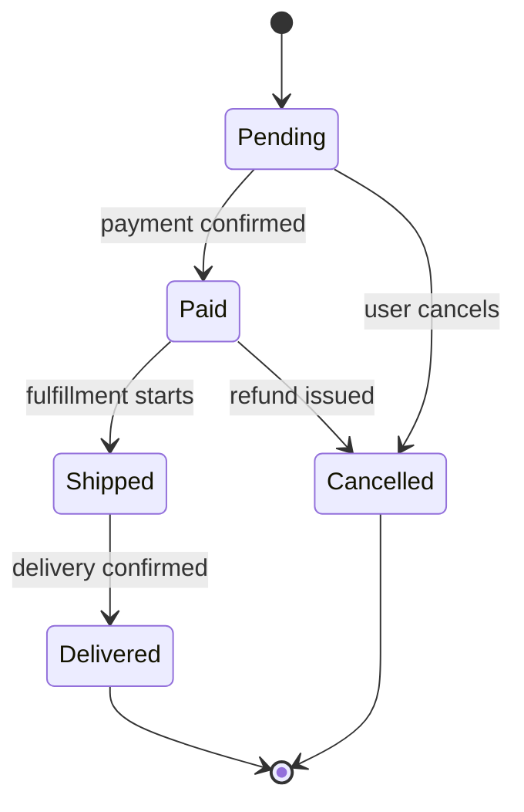

<!--
NAV NOTE: design/ is a dynamic set. The canonical order of the full
pipeline is: requirements → user-stories → use-case → [user-flows →
sequence-diagram → api-spec → data-model → component-diagram →
state-diagram → infra-spec] → test-spec. At generation time, re-chain the
prev/next links below through only the design documents actually generated
for this domain, keeping that order: the first generated design document's
prev is ../planning/use-case.md, and the last generated design document's
next is ../verification/test-spec.md. Apply the same substitution to the
All Documents index at the bottom. Always link document to document —
never a folder — and never link a design/*.md file that was not generated
for this domain.
-->
> [← Component Diagram](component-diagram.md) | [Infra Spec →](infra-spec.md)

# State Diagram

> **Generation note**: this file is only produced when the codebase has
> explicit state management — either a state machine worth diagramming
> (e.g. an order/workflow status field with transitions) or a
> client-side store (Redux/Vuex/Pinia/Zustand/etc.). Use whichever of the
> two sections below applies; both may apply.

---

## Table of Contents

1. [Overview](#overview)
2. [State Machine](#state-machine)
3. [Store Strategy](#store-strategy)
4. [Store Definitions](#store-definitions)

---

## Overview

<!-- One paragraph: what is stateful here — a domain entity's lifecycle, a
client-side store, or both — and why it's significant enough to diagram -->

---

## State Machine

<!-- Use when a domain entity/workflow has explicit states and transitions
(e.g. Order: pending -> paid -> shipped -> delivered). Omit this section
entirely if the codebase has no such state machine. -->



### Transition Table

| From | To | Trigger | Guard/Condition |
|------|----|---------|------------------|
| <!-- Pending --> | <!-- Paid --> | <!-- payment webhook --> | <!-- amount matches --> |

---

## Store Strategy

<!-- Use when the codebase has a client-side state management layer.
Omit this section entirely if there is none. -->

| Category | Decision |
|----------|----------|
| State Management Library | (e.g., Zustand / Redux Toolkit / Pinia) |
| Server State Management | (e.g., TanStack Query / SWR) |
| Global vs Local Criteria | (e.g., shared across 2+ pages -> global) |

### State Classification

| Category | Description | Management | Examples |
|----------|-------------|------------|----------|
| Server State | Data fetched from APIs | TanStack Query | User list, posts |
| Client State | UI state | Zustand / useState | Modal open, sidebar toggle |
| Auth State | Authentication info | Zustand (persist) | Token, user profile |
| Form State | Form input state | React Hook Form | Input values, validation errors |

---

## Store Definitions

#### Auth Store

```typescript
interface AuthState {
  user: User | null;
  token: string | null;
  isAuthenticated: boolean;
}

interface AuthActions {
  login: (credentials: LoginRequest) => Promise<void>;
  logout: () => void;
  refreshToken: () => Promise<void>;
}
```

#### <Next Store Name>

```typescript
interface SomeState {
  // define state
}

interface SomeActions {
  // define actions
}
```

---

## Sources Read

<!--
Populated by dev-reverse-docs only — omitted entirely for forward planning
(dev-planning). List every file/line-range actually opened; the states,
transitions, and store shapes above must trace back to a file listed here,
or be tagged [ASSUMED: ...] if inferred rather than confirmed.
-->

---

## Related Documents

### Supporting References

- [Component Diagram](component-diagram.md) — Components that read and mutate these states
- [Requirements Analysis](../planning/requirements.md) — Functional and non-functional requirements
- [Use Case](../planning/use-case.md) — Actor-level flows that drive the transitions

---

## Document Information

| Field | Value |
|-------|-------|
| **Created** | YYYY-MM-DD |
| **Last Modified** | YYYY-MM-DD |
| **Status** | Draft |
| **Tech Stack** | (auto-detected) |
| **Reference Documents** | <!-- list @-references from document discovery --> |

**Version History**:

- 1.0.0 (YYYY-MM-DD): Initial state diagram document

---
> **All Documents**
> <!-- Keep only the design/*.md entries actually generated for this domain; current document in bold, not linked -->
> [Requirements](../planning/requirements.md) |
> [User Stories](../planning/user-stories.md) |
> [Use Case](../planning/use-case.md) |
> [User Flows](user-flows.md) |
> [Sequence Diagrams](sequence-diagram.md) |
> [API Spec](api-spec.md) |
> [Data Model](data-model.md) |
> [Component Diagram](component-diagram.md) |
> **State Diagram** |
> [Infra Spec](infra-spec.md) |
> [Test Spec](../verification/test-spec.md)
