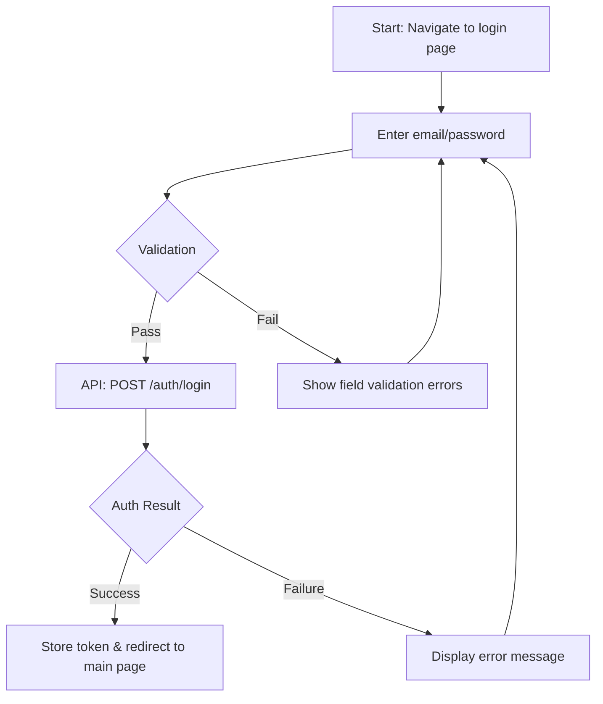
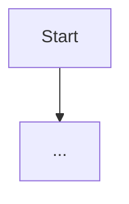
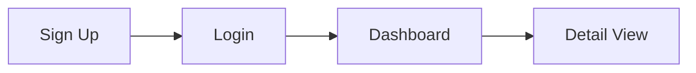

<!--
NAV NOTE: design/ is a dynamic set. At generation time, replace the
prev-link below with the previous document actually generated for this
domain (or ../planning/use-case.md if this is the first design document),
and apply the same substitution to the Related Documents and All Documents
blocks at the bottom. Never link a design/*.md file that was not generated
for this domain.
-->
> [← Use Case](../planning/use-case.md) | [Component Diagram →](component-diagram.md)

# User Flows

> **Created**: YYYY-MM-DD
> **Last Modified**: YYYY-MM-DD
> **Status**: Draft
> **Tech Stack**: (auto-detected)
> **Reference Documents**: <!-- list @-references from document discovery -->

> **Generation note**: this file is only produced when the feature has
> multi-step user-facing journeys (screen-to-screen navigation, wizards,
> checkout-style funnels). It shows HOW the UI moves the actor through the
> feature — the actor-level WHAT stays in `../planning/use-case.md`, and
> component structure lives in `component-diagram.md`. The **Exception
> Path** entries below feed the E2E scenarios in
> `../verification/test-spec.md`.

---

## Table of Contents

1. [Flow Overview](#flow-overview)
2. [Flow Details](#flow-details)
3. [Flow Relationships](#flow-relationships)

---

## 1. Flow Overview

<!-- List all user flows covered in this document -->

| # | Flow | Related Requirement | Related Use Case | Primary Actor |
|---|------|---------------------|------------------|---------------|
| 1 | e.g., Sign Up Flow | FR-AUTH-01 | UC-AUTH-01 | End User |
| 2 | e.g., Dashboard View Flow | FR-DASH-01 | UC-DASH-01 | Admin |

---

## 2. Flow Details

### 2.1 (Flow Name)

**Entry Condition**: (e.g., User navigates to the login page)
**Exit Condition**: (e.g., User is redirected to the main page)

#### Happy Path

#### Alternative Path

- (e.g., User selects social login)

#### Exception Path

<!-- Each entry here becomes an E2E test candidate in test-spec.md -->

- (e.g., Network error occurs)
- (e.g., Server is under maintenance)

---

### 2.2 (Next Flow Name)

<!-- Repeat the same structure as above -->

**Entry Condition**:
**Exit Condition**:

#### Happy Path

#### Alternative Path

#### Exception Path

---

## 3. Flow Relationships

<!-- Document relationships between flows if they connect to each other -->

---

## Sources Read

<!--
Populated by dev-reverse-docs only — omitted entirely for forward planning
(dev-planning). List every route/page/navigation file/line-range actually
opened; the flows above must trace back to a file listed here.
-->

---

## Related Documents

- **Previous**: [← Use Case](../planning/use-case.md)
- **Next**: [Component Diagram →](component-diagram.md)
- **Requirements**: [Requirements Analysis](../planning/requirements.md)
- **User Stories**: [User Stories](../planning/user-stories.md)
- **Test Spec**: [Test Specification](../verification/test-spec.md)

---

**Version History**:

- 1.0.0 (YYYY-MM-DD): Initial user flows document

---
> **All Documents**
> <!-- list only the design/*.md files generated for this domain; current file in bold -->
> [Requirements](../planning/requirements.md) |
> [User Stories](../planning/user-stories.md) |
> [Use Case](../planning/use-case.md) |
> **User Flows** |
> [Component Diagram](component-diagram.md) |
> [Test Spec](../verification/test-spec.md)
