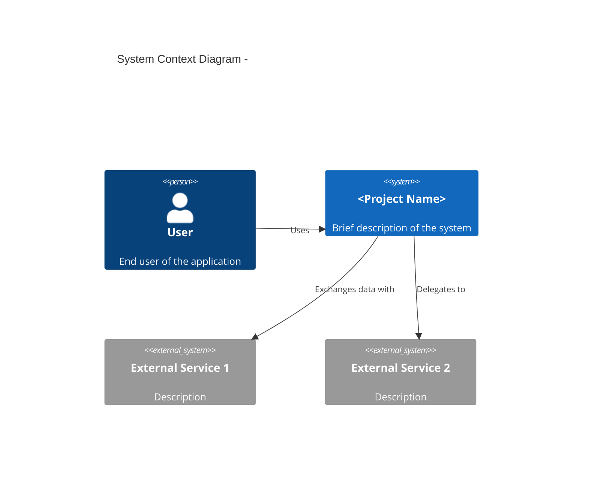

> [User Stories →](user-stories.md)

# Requirements Analysis

> **Classification note**: this document is a **planning/WHAT** document —
> it captures what the system must do in stakeholder language. Do not put
> implementation technology here (stacks, frameworks, code types, API
> paths, architecture patterns); that content belongs in the `../design/`
> documents. Measurable non-functional targets and business/operational
> constraints are planning content and do belong here.

---

## Table of Contents

1. [System Overview](#system-overview)
2. [Functional Requirements](#functional-requirements)
3. [Non-Functional Requirements](#non-functional-requirements)
4. [Constraints](#constraints)
5. [Requirements Traceability Matrix](#requirements-traceability-matrix)

---

## System Overview

### Project Information

**Project Name**: <!-- Project name -->
**Purpose**: <!-- One-line description of what the system does -->
**Version**: 0.1.0

### Stakeholders

| Role | Responsibility | Concerns |
|------|---------------|----------|
| **Product Owner** | Feature prioritization and scope | Business value, timeline, scope clarity |
| **End Users** | Use the application | Reliability, performance, ease of use |
| **Development Team** | Build and maintain the system | Clear, testable, unambiguous requirements |
| **Security / Compliance** | Risk and compliance review | Data protection, privacy, regulatory compliance |
| **Operations** | Keep the service running | Availability, supportability, observability |

### System Context

<!-- Describe the system's position among its users and neighboring systems.
Stay at the actor/system boundary — no protocols, no internal components. -->

### System Boundary

**In Scope**:

- <!-- Feature or capability 1 -->
- <!-- Feature or capability 2 -->
- <!-- Feature or capability 3 -->

**Out of Scope**:

- <!-- Explicitly excluded item 1 -->
- <!-- Explicitly excluded item 2 -->

---

## Functional Requirements

### FR-<AREA>: <Area Name>

<!-- Group related requirements by functional area (e.g., FR-AUTH, FR-USER, FR-ORDER) -->

| ID | Requirement | Priority | Status |
|----|-------------|----------|--------|
| **FR-<AREA>-01** | <!-- Requirement description --> | MUST | Planned |
| **FR-<AREA>-02** | <!-- Requirement description --> | MUST | Planned |
| **FR-<AREA>-03** | <!-- Requirement description --> | SHOULD | Planned |

**Detailed Description**:

**FR-<AREA>-01: <Requirement Name>**

- **Input**: <!-- What the actor provides -->
- **Process**:
  1. <!-- Step 1, described as observable behavior -->
  2. <!-- Step 2 -->
  3. <!-- Step 3 -->
- **Output**: <!-- What the actor receives -->
- **Related Use Case**: [UC-<AREA>-01](use-case.md#uc-area-01-name)

<!-- Repeat FR-<AREA>-NN blocks for each requirement -->

---

<!-- Repeat ### FR-<AREA>: <Area Name> sections for each functional area -->

---

## Non-Functional Requirements

<!-- State each NFR as a measurable, testable target in stakeholder terms
(e.g., "95% of searches respond within 200ms"). How the target is achieved
is a design concern — do not name technologies here. -->

### NFR-SEC: Security

| ID | Requirement | Priority | Status |
|----|-------------|----------|--------|
| **NFR-SEC-01** | <!-- Security requirement --> | MUST | Planned |
| **NFR-SEC-02** | <!-- Security requirement --> | MUST | Planned |

---

### NFR-PERF: Performance

| ID | Requirement | Priority | Status |
|----|-------------|----------|--------|
| **NFR-PERF-01** | <!-- Measurable performance target --> | SHOULD | Planned |
| **NFR-PERF-02** | <!-- Measurable performance target --> | SHOULD | Planned |

---

### NFR-AVAIL: Availability

| ID | Requirement | Priority | Status |
|----|-------------|----------|--------|
| **NFR-AVAIL-01** | <!-- Availability / recovery target --> | MUST | Planned |
| **NFR-AVAIL-02** | <!-- Availability / recovery target --> | SHOULD | Planned |

---

### NFR-USE: Usability

| ID | Requirement | Priority | Status |
|----|-------------|----------|--------|
| **NFR-USE-01** | <!-- Usability / accessibility requirement --> | SHOULD | Planned |
| **NFR-USE-02** | <!-- Usability / accessibility requirement --> | COULD | Planned |

---

## Constraints

<!-- Implementation-technology constraints (language, framework, database,
architecture pattern) are design decisions — record them in the
`../design/` documents, not here. -->

### Business Constraints

| Constraint | Description | Impact |
|-----------|-------------|--------|
| <!-- Budget --> | <!-- e.g., Must launch within existing subscription budget --> | <!-- Impact --> |
| <!-- Schedule --> | <!-- e.g., Must launch before the Q3 campaign --> | <!-- Impact --> |
| <!-- Regulation --> | <!-- e.g., Must comply with GDPR / local privacy law --> | <!-- Impact --> |

### Operational Constraints

| Constraint | Description | Impact |
|-----------|-------------|--------|
| <!-- External deps --> | <!-- e.g., Depends on a third-party service's availability --> | <!-- Impact --> |
| <!-- Environment --> | <!-- e.g., Must work in air-gapped networks --> | <!-- Impact --> |

### Development Process Constraints

| Constraint | Description | Impact |
|-----------|-------------|--------|
| <!-- Process --> | <!-- e.g., Issue documentation first --> | <!-- Impact --> |
| <!-- Docs --> | <!-- e.g., English documentation --> | <!-- Impact --> |

---

## Requirements Traceability Matrix

| Requirement ID | Category | Description | Use Case | Status |
|---------------|----------|-------------|----------|--------|
| **FR-<AREA>-01** | <!-- Area --> | <!-- Brief --> | UC-<AREA>-01 | Planned |
| **FR-<AREA>-02** | <!-- Area --> | <!-- Brief --> | UC-<AREA>-02 | Planned |

---

## Sources Read

<!--
Populated by dev-reverse-docs only — omitted entirely for forward planning
(dev-planning), since no code exists yet to read from.
List every file (and line range, if only part of it was read) actually
opened via Read/Grep while writing this document. Every [REF: path:line]
citation above must point to a file listed here. [REF] citations are
provenance markers, not design content — they are allowed (and required by
dev-reverse-docs) even though this is a non-technical planning document.
-->

---

## Related Documents

### Supporting References

- [Architecture](../../architecture.md) — Architecture structure and layer rules
- [Configuration](../../config.md) — Environment variables and config schema
- [Infrastructure](../../infrastructure.md) — System context and infrastructure diagrams

---

## Document Information

| Field | Value |
|-------|-------|
| **Created** | YYYY-MM-DD |
| **Last Modified** | YYYY-MM-DD |
| **Status** | Draft |
| **Reference Documents** | <!-- list @-references from document discovery --> |

**Version History**:

- 1.0.0 (YYYY-MM-DD): Initial requirements analysis document

---
> **All Documents**
> <!-- Keep only the design/*.md entries actually generated for this domain; current document in bold, not linked -->
> **Requirements** |
> [User Stories](user-stories.md) |
> [Use Case](use-case.md) |
> [User Flows](../design/user-flows.md) |
> [Sequence Diagrams](../design/sequence-diagram.md) |
> [API Spec](../design/api-spec.md) |
> [Data Model](../design/data-model.md) |
> [Component Diagram](../design/component-diagram.md) |
> [Domain State Machine](../design/domain-state-machine.md) |
> [Client Store](../design/client-store.md) |
> [Infra Spec](../design/infra-spec.md) |
> [Test Spec](../verification/test-spec.md)
