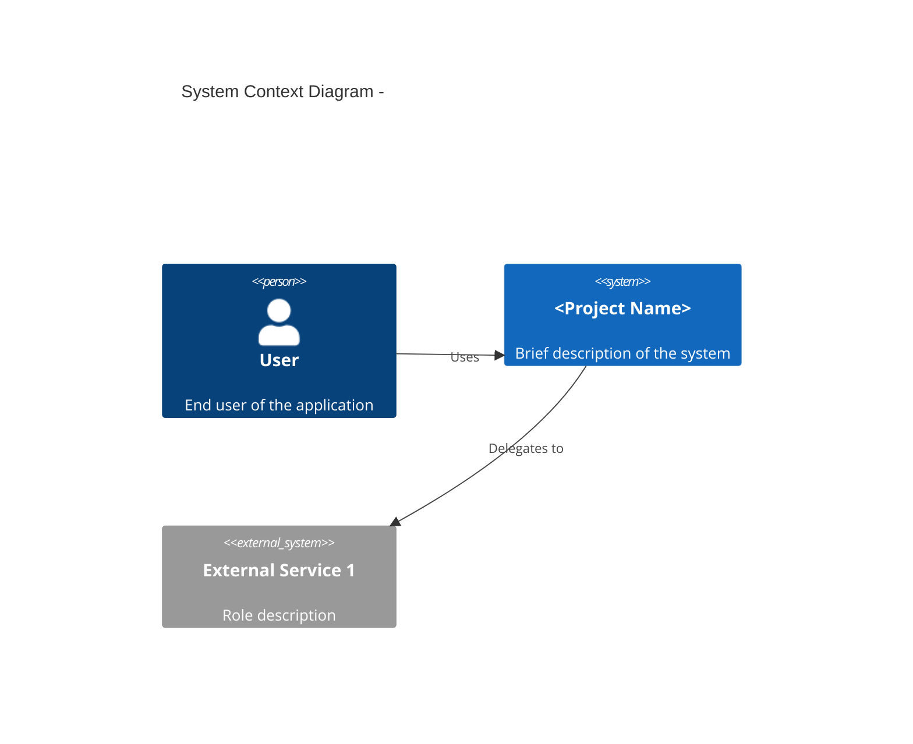
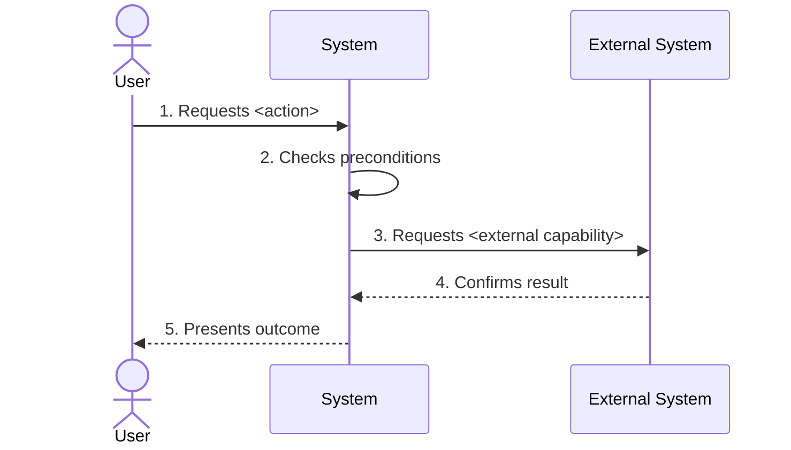

<!--
NAV NOTE: this is the first document in the pipeline, so it has no
prev-link. The next-link below points at the first design document in
canonical order (user-flows.md by default). At generation time, replace it
with the first design/*.md file actually generated for this domain — never
link the ../design/ folder or a design file that was not generated. Apply
the same substitution to the All Documents index at the bottom.
In-document ID links use GitHub heading-derived anchors, e.g.
"### UC-AUTH-01: Login" -> spec.md#uc-auth-01-login.
-->
> [User Flows →](../design/user-flows.md)

# Specification

> **Classification note**: this document is a **planning/WHAT** document.
> Apply the tech-neutrality test to every sentence: *if the stack were
> swapped (Python→Java, REST→GraphQL, PostgreSQL→MongoDB), would it still
> be true?* True — it is WHAT and stays here. False — it is HOW and
> belongs in the `../design/` documents. Refer to external systems by
> their **role** (Secondary Actor), never by protocol or product API.
> Measurable non-functional targets and business/operational constraints
> are planning content and do belong here.

---

## Table of Contents

<!-- Drop the Multi-Actor Flows entry when that section is omitted (see
its gate below). -->

1. [Overview](#1-overview)
2. [Functional Requirements](#2-functional-requirements)
3. [Non-Functional Requirements](#3-non-functional-requirements)
4. [Constraints](#4-constraints)
5. [User Stories](#5-user-stories)
6. [Multi-Actor Flows](#6-multi-actor-flows)
7. [Traceability](#7-traceability)

---

## 1. Overview

### Purpose & Scope

**Project Name**: <!-- Project name -->
**Purpose**: <!-- One-line description of what the system does -->

**In Scope**:

- <!-- Feature or capability 1 -->
- <!-- Feature or capability 2 -->

**Out of Scope**:

- <!-- Explicitly excluded item 1 -->
- <!-- Explicitly excluded item 2 -->

### Actors

| Actor | Type | Description | Goals |
|-------|------|-------------|-------|
| <!-- e.g., End User --> | Primary | <!-- Who this actor is --> | <!-- What they want from the system --> |
| <!-- e.g., Admin --> | Primary | <!-- Who this actor is --> | <!-- What they want from the system --> |
| <!-- e.g., Payment Provider --> | Secondary | <!-- External system, described by role --> | <!-- What the system delegates to it --> |

### System Context

<!--
MULTI-ACTOR GATE: include this subsection only when the Actors table has
2+ actors or at least one Secondary Actor (external system) — the same
gate as section 6. Omit it (and its diagram) for single-actor features
with no external systems. Stay at the actor/system boundary — no
protocols, no internal components.
-->

---

## 2. Functional Requirements

### FR-<AREA>: <Area Name>

<!-- Group related requirements by functional area (e.g., FR-AUTH, FR-USER,
FR-ORDER). A complex requirement may add a short prose note below its
table row — do not add mandated Input/Process/Output blocks per FR. -->

| ID | Requirement | Priority | Status |
|----|-------------|----------|--------|
| **FR-<AREA>-01** | <!-- Requirement description --> | MUST | Planned |
| **FR-<AREA>-02** | <!-- Requirement description --> | MUST | Planned |
| **FR-<AREA>-03** | <!-- Requirement description --> | SHOULD | Planned |

---

<!-- Repeat ### FR-<AREA>: <Area Name> sections for each functional area -->

---

## 3. Non-Functional Requirements

<!-- State each NFR as a measurable, testable target in stakeholder terms
(e.g., "95% of searches respond within 200ms"). How the target is achieved
is a design concern — do not name technologies here. Categories: SEC
(security), PERF (performance), AVAIL (availability), USE (usability). -->

| ID | Category | Requirement | Priority | Status |
|----|----------|-------------|----------|--------|
| **NFR-SEC-01** | Security | <!-- Security requirement --> | MUST | Planned |
| **NFR-PERF-01** | Performance | <!-- Measurable performance target --> | SHOULD | Planned |
| **NFR-AVAIL-01** | Availability | <!-- Availability / recovery target --> | MUST | Planned |
| **NFR-USE-01** | Usability | <!-- Usability / accessibility requirement --> | SHOULD | Planned |

---

## 4. Constraints

<!-- Implementation-technology constraints (language, framework, database,
architecture pattern) are design decisions — record them in the
`../design/` documents, not here. -->

| Constraint | Type | Description | Impact |
|-----------|------|-------------|--------|
| <!-- e.g., Schedule --> | Business | <!-- e.g., Must launch before the Q3 campaign --> | <!-- Impact --> |
| <!-- e.g., External deps --> | Operational | <!-- e.g., Depends on a third-party service's availability --> | <!-- Impact --> |
| <!-- e.g., Process --> | Process | <!-- e.g., Issue documentation first --> | <!-- Impact --> |

---

## 5. User Stories

### US-01: <Story Name>

#### Story

**As a** <!-- Role (e.g., End User, Admin) -->
**I want to** <!-- Capability -->
**So that** <!-- Benefit -->

#### Acceptance Criteria

**Normal Cases:**

- [ ] **AC-US01-01**: **Given** <!-- precondition -->, **When** <!-- action -->, **Then** <!-- expected result -->
- [ ] **AC-US01-02**: **Given** <!-- precondition -->, **When** <!-- action -->, **Then** <!-- expected result -->

**Error Cases:**

- [ ] **AC-US01-03**: **Given** <!-- error precondition -->, **When** <!-- action -->, **Then** <!-- error handling -->

**Related**: FR-<AREA>-01, FR-<AREA>-02<!-- , UC-<AREA>-01 when section 6 exists -->

---

<!-- Repeat ### US-NN: <Story Name> for each user story -->

---

## 6. Multi-Actor Flows

> **Generation note**: this section is generated only when the feature
> involves **2+ actors or an external system (Secondary Actor)**. Omit
> the entire section, its Table of Contents entry, and the UC column of
> the Traceability matrix otherwise — a single-actor flow is already
> fully described by its user story and acceptance criteria.

<!--
MULTI-ACTOR GATE: same condition as the note above. When generated, keep
every flow at the actor/system boundary — no API paths, no internal
components; component call order belongs in ../design/. Each use case is
an H3 so its heading anchor (#uc-<area>-nn-<name>) is stable for
test-spec references.
-->

### UC-<AREA>-01: <Use Case Name>

#### Basic Information

| Item | Content |
|------|---------|
| **Actors** | <!-- Primary Actor (Primary), Secondary Actor (Secondary) --> |
| **Related Requirements** | [FR-<AREA>-01](#2-functional-requirements) |
| **Related User Stories** | [US-01](#us-01-story-name) |
| **Sequence Diagram** | [Flow Name](../design/sequence-diagram.md#flow-name) |

#### Preconditions

1. <!-- Precondition 1 -->
2. <!-- Precondition 2 -->

#### Postconditions

**On Success**:

1. <!-- Success postcondition 1 -->

**On Failure**:

1. <!-- Failure postcondition 1 -->

#### Main Flow

**Step-by-Step Description**:

1. **User Action**: <!-- What the user does -->
2. **Precondition Check**: <!-- What the system verifies before acting -->
3. **External Interaction**: <!-- What the system requests from an external actor, if any -->
4. **Result Confirmation**: <!-- What the external actor confirms -->
5. **Outcome**: <!-- What the user sees at the end -->

#### Alternative Flows

**A1: <Alternative Scenario Name>**

**Branch Point**: Step N (<!-- Step description -->)

**Flow**:

1. <!-- Alternative step 1 -->
2. <!-- Alternative step 2 -->

---

<!-- Repeat ### UC-<AREA>-NN: <Use Case Name> for each use case -->

---

## 7. Traceability

<!-- Drop the Use Case column when section 6 was omitted. -->

| Requirement ID | User Story (ACs) | Use Case | Status |
|---------------|-------------------|----------|--------|
| **FR-<AREA>-01** | US-01 (AC-US01-01..03) | UC-<AREA>-01 | Planned |
| **FR-<AREA>-02** | US-02 (AC-US02-01..02) | — | Planned |

---

## Sources Read

<!--
Populated by dev-reverse-docs only — omitted entirely for forward planning
(dev-planning), since no code exists yet to read from.
List every file (and line range, if only part of it was read) actually
opened via Read/Grep while writing this document. Every [REF: path:line]
citation above must point to a file listed here. [REF] citations are
provenance markers, not design content — they are allowed (and required by
dev-reverse-docs) even though this is a non-technical planning document.
-->

---

## Related Documents

### Supporting References

- [Architecture](../../architecture.md) — Architecture structure and layer rules
- [Configuration](../../config.md) — Environment variables and config schema
- [Infrastructure](../../infrastructure.md) — System context and infrastructure diagrams

---

## Document Information

| Field | Value |
|-------|-------|
| **Created** | YYYY-MM-DD |
| **Last Modified** | YYYY-MM-DD |
| **Status** | Draft |
| **Reference Documents** | <!-- list @-references from document discovery --> |

**Version History**:

- 1.0.0 (YYYY-MM-DD): Initial specification document

---
> **All Documents**
> <!-- Keep only the design/*.md entries actually generated for this domain; current document in bold, not linked -->
> **Specification** |
> [User Flows](../design/user-flows.md) |
> [Sequence Diagrams](../design/sequence-diagram.md) |
> [API Spec](../design/api-spec.md) |
> [Data Model](../design/data-model.md) |
> [Component Diagram](../design/component-diagram.md) |
> [Domain State Machine](../design/domain-state-machine.md) |
> [Client Store](../design/client-store.md) |
> [Infra Spec](../design/infra-spec.md) |
> [Test Spec](../verification/test-spec.md)
