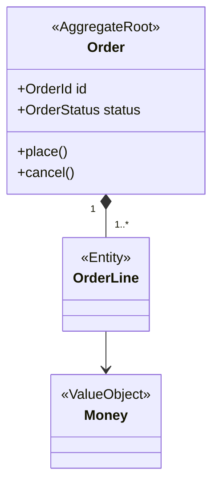
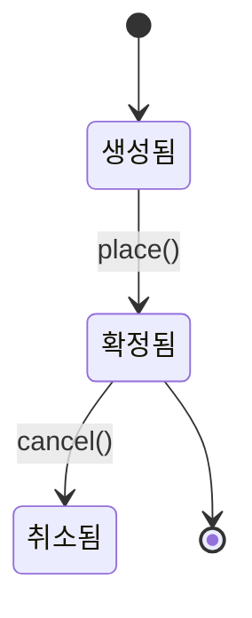

<!--
템플릿: 백엔드 설계 문서 (domain-model.md)

내비게이션 규칙은 `${CLAUDE_PLUGIN_ROOT}/references/document-order.md` 참조.

**책임 경계**: 이 문서는 불변식과 행위를 소유한다. 컬럼 타입, 인덱스,
외래 키 제약은 `erd.md`가 소유한다. 같은 표를 두 번 찍지 않는다.

도메인 모델과 영속성 모델이 같은 프로젝트(ORM 엔티티가 곧 도메인 모델)에서는
`erd.md`만 만들고, 이 문서 개요에 "도메인 모델 = 영속성 모델"이라고 명시한 뒤
불변식과 행위만 기술한다.

모든 타입·필드 이름은 `glossary.md`의 영문 식별자를 따른다. 여기서 새로
지어내지 않는다.
-->

> [← 레이어 구조](layered-architecture.md) | [다음: ERD →](erd.md)

# 도메인 모델

> **도메인**: <!-- 도메인 이름 -->
>
> **계층**: 백엔드

---

## 목차

1. [개요](#개요)
2. [애그리거트 구조](#애그리거트-구조)
3. [애그리거트 상세](#애그리거트-상세)
4. [도메인 서비스](#도메인-서비스)
5. [리포지토리 인터페이스](#리포지토리-인터페이스)
6. [도메인 이벤트](#도메인-이벤트)
7. [상태 전이](#상태-전이)

---

## 개요

<!--
이 도메인의 모델이 무엇을 표현하는지 3~5문장.
영속성 모델과 동일하면 여기에 "도메인 모델 = 영속성 모델" 사실과 그 근거를
적는다.
-->

---

## 애그리거트 구조

<!--
`classDiagram`으로 애그리거트 루트, 엔티티, 값 객체와 그 관계를 그린다.
스테레오타입을 반드시 붙인다: <<AggregateRoot>> <<Entity>> <<ValueObject>>

**애그리거트 경계를 넘는 참조는 ID로만** 그린다. 다른 애그리거트의 객체를
직접 참조하는 선을 그리지 않는다. 실제 코드가 직접 참조하고 있다면 그
사실을 `## 애그리거트 상세`의 비고에 기록한다.

다른 도메인의 애그리거트는 여기 그리지 않는다 — domain-map.md의 일이다.
-->

---

## 애그리거트 상세

### <애그리거트 루트 이름>

| 항목 | 내용 |
|---|---|
| **한국어 용어** | <!-- glossary.md와 일치 --> |
| **경로** | |
| **식별자** | |
| **근거** | |

**불변식**

<!--
이 애그리거트가 항상 참으로 유지하는 조건. 코드에서 예외를 던지거나 검증하는
지점이 근거다. 값 범위 제약(길이, 최소/최대)은 여기가 아니라 erd.md나
api-interface.md에 속한다 — 여기는 **여러 필드에 걸친 규칙**을 쓴다.
-->

| 불변식 | 위반 시 동작 | 근거 |
|---|---|---|
| | | |

**행위**

<!-- 애그리거트가 스스로 수행하는 조작. getter/setter는 적지 않는다. -->

| 메서드 | 하는 일 | 사전 조건 | 발행 이벤트 | 근거 |
|---|---|---|---|---|
| | | | | |

**구성 요소**

| 이름 | 구분 | 역할 | 근거 |
|---|---|---|---|
| | <!-- 엔티티 / 값 객체 --> | | |

**비고**

<!-- 애그리거트 경계 위반 등 특기사항. 없으면 삭제. -->

---

## 도메인 서비스

<!--
한 애그리거트에 넣을 수 없는 도메인 로직만 여기 온다. 애그리거트에 들어갈
수 있는 로직이 서비스에 있으면 그 사실을 비고에 기록한다.
없으면 이 섹션과 목차 항목을 삭제한다.
-->

| 서비스 | 하는 일 | 관여 애그리거트 | 근거 |
|---|---|---|---|
| | | | |

---

## 리포지토리 인터페이스

<!--
Domain 계층이 선언하는 인터페이스만. 구현체는 Infrastructure에 있으며
layered-architecture.md가 위치를 소유한다.

조회 메서드는 **애그리거트 단위**여야 한다. 애그리거트 일부만 반환하는
메서드가 있으면 비고에 기록한다.
-->

| 인터페이스 | 대상 애그리거트 | 주요 메서드 | 근거 |
|---|---|---|---|
| | | | |

---

## 도메인 이벤트

<!--
발행되는 이벤트와 그것을 구독하는 쪽. 도메인 경계를 넘는 이벤트는
domain-map.md의 통합 계약과 일치해야 한다.
없으면 이 섹션과 목차 항목을 삭제한다.
-->

| 이벤트 | 발행 시점 | 페이로드 | 구독자 | 근거 |
|---|---|---|---|---|
| | | | <!-- 같은 도메인 / 다른 도메인 이름 / 외부 --> | |

---

## 상태 전이

<!--
상태를 가지는 애그리거트가 있을 때만 생성한다. 상태값이 없으면 이 섹션과
목차 항목을 삭제한다.

전이 표에는 **금지된 전이**도 적는다. 무엇이 안 되는지가 무엇이 되는지만큼
중요하다.
-->

### <애그리거트 이름>

| 현재 상태 | 이벤트·메서드 | 다음 상태 | 조건 | 근거 |
|---|---|---|---|---|
| | | | | |

**금지 전이**

| 현재 상태 | 시도 | 결과 | 근거 |
|---|---|---|---|
| | | | |

---

## 읽은 소스

<!-- 역방향 스킬 전용. 순방향 생성 시 제목까지 통째로 삭제한다. -->

---

## 관련 문서

- [레이어 구조](layered-architecture.md) — 각 구성 요소의 계층과 경로
- [ERD](erd.md) — 영속성 스키마와 이 모델의 매핑
- [시퀀스 다이어그램](sequence-diagram.md) — 이 모델이 참여하는 호출 흐름

### 참고 문서

- [용어집](../../../glossary.md) — 용어와 영문 식별자
- [도메인 지도](../../../domain-map.md) — 다른 도메인의 애그리거트와의 관계

---

## 문서 정보

| 항목 | 값 |
|---|---|
| **작성일** | YYYY-MM-DD |
| **최종 수정일** | YYYY-MM-DD |
| **상태** | 초안 |
| **분석 기준 커밋** | |
| **참고 문서** | |

**버전 이력**:

- 1.0.0 (YYYY-MM-DD): 최초 작성

---
> **전체 문서**
> [요구사항](../../planning/requirements.md) |
> [유저 스토리](../../planning/user-stories.md) |
> [정보 구조](../../planning/information-architecture.md) |
> [유저 플로우](../../planning/user-flows.md) |
> [인터페이스 계약](../../planning/api-interface.md) |
> [레이어 구조](layered-architecture.md) |
> **도메인 모델** |
> [ERD](erd.md) |
> [시퀀스 다이어그램](sequence-diagram.md) |
> [추적성](../../planning/traceability.md) |
> [테스트 명세](../../verification/test-spec.md)
