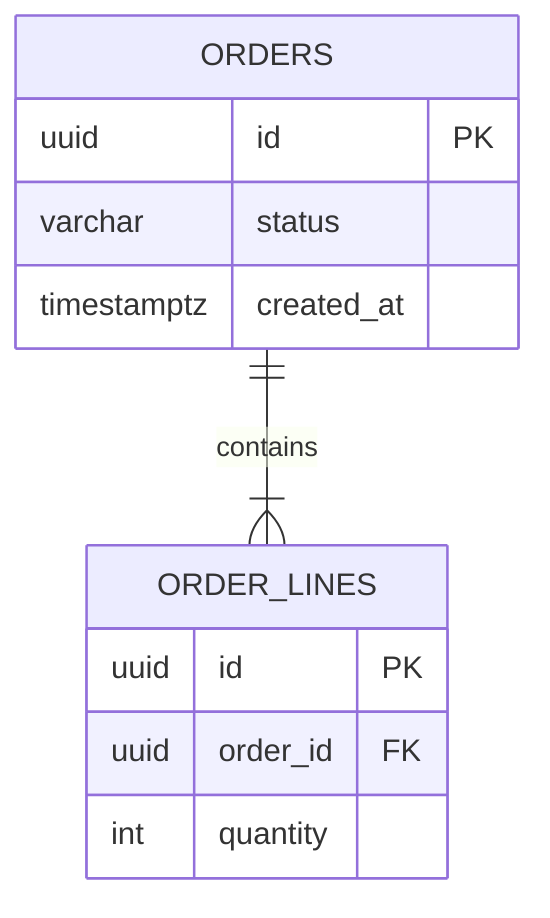

<!--
템플릿: 백엔드 설계 문서 (erd.md)

**조건부 문서다.** 도메인 모델과 구분되는 영속성 스키마 증거(마이그레이션
파일, DDL, 별도의 퍼시스턴스 엔티티)가 있을 때만 생성한다. 증거가 없으면
이 문서를 만들지 않고, 내비게이션 체인에서도 뺀다.

ORM 엔티티가 곧 도메인 모델인 프로젝트에서는 이 문서를 만들고
`domain-model.md`에 "도메인 모델 = 영속성 모델" 주석을 남긴다. 그 경우
`## 도메인 모델 매핑`의 매핑 표는 1:1이 되므로 표 대신 한 문장으로 대체한다.

**책임 경계**: 컬럼 타입, 인덱스, 제약, 외래 키는 이 문서가 소유한다.
불변식과 행위는 `domain-model.md`가 소유한다.

내비게이션 규칙은 `${CLAUDE_PLUGIN_ROOT}/references/document-order.md` 참조.
-->

> [← 도메인 모델](domain-model.md) | [다음: 시퀀스 다이어그램 →](sequence-diagram.md)

# ERD

> **도메인**: <!-- 도메인 이름 -->
>
> **계층**: 백엔드

---

## 목차

1. [개요](#개요)
2. [엔티티 관계도](#엔티티-관계도)
3. [테이블 정의](#테이블-정의)
4. [도메인 모델 매핑](#도메인-모델-매핑)
5. [인덱스와 성능](#인덱스와-성능)
6. [마이그레이션](#마이그레이션)

---

## 개요

| 항목 | 값 | 근거 |
|---|---|---|
| **저장소** | <!-- PostgreSQL 16 등 --> | |
| **매핑 계층** | <!-- ORM 또는 직접 매핑 --> | |
| **마이그레이션 도구** | | |
| **도메인 모델과의 관계** | <!-- 동일 / 분리 --> | |

---

## 엔티티 관계도

<!--
`erDiagram`으로 그린다. 카디널리티와 식별/비식별 관계를 정확히 표기한다.
다른 도메인의 테이블을 참조하면 그 테이블도 그리되, 컬럼은 생략하고
관계선만 그린 뒤 domain-map.md를 참조한다.
-->

---

## 테이블 정의

### <테이블명>

**근거**: <!-- [REF: path:line] — 마이그레이션 또는 엔티티 정의 -->

| 컬럼 | 타입 | 널 허용 | 기본값 | 제약 | 설명 |
|---|---|---|---|---|---|
| | | | | <!-- PK / FK / UNIQUE / CHECK --> | |

**외래 키**

| 컬럼 | 참조 대상 | 삭제 동작 | 갱신 동작 | 근거 |
|---|---|---|---|---|
| | | <!-- CASCADE / RESTRICT / SET NULL --> | | |

---

## 도메인 모델 매핑

<!--
도메인 모델과 영속성 모델이 다를 때만 채운다. 동일하면 표를 지우고
"도메인 모델과 영속성 모델이 동일하다"고 한 문장으로 쓴다.

`불일치` 열이 이 표의 존재 이유다. 값 객체가 여러 컬럼으로 펼쳐지거나,
애그리거트가 여러 테이블로 나뉘거나, 상속이 단일 테이블로 접히는 지점을
기록한다.
-->

| 도메인 구성 요소 | 구분 | 테이블·컬럼 | 불일치 | 근거 |
|---|---|---|---|---|
| | <!-- 애그리거트 / 엔티티 / 값 객체 --> | | | |

---

## 인덱스와 성능

<!--
인덱스는 그 자체로 비기능 요구사항의 근거다. 어떤 조회를 위한 인덱스인지
아는 경우에만 `목적` 열을 채운다.
-->

| 인덱스 | 테이블 | 컬럼 | 유형 | 목적 | 근거 |
|---|---|---|---|---|---|
| | | | <!-- B-tree / 유니크 / 부분 / GIN 등 --> | | |

**관련 비기능 요구사항**: <!-- NFR-PERF-NN 등. 없으면 삭제 -->

---

## 마이그레이션

<!--
순방향: 적용 순서와 되돌리기 가능 여부를 계획으로 적는다.
역방향: 실제 마이그레이션 파일 목록을 최신 것부터 몇 개만 적는다. 전체
이력을 옮겨 적지 않는다 — 저장소가 이미 가지고 있다.
-->

| 순서 | 내용 | 되돌리기 | 근거 |
|---|---|---|---|
| | | <!-- 가능 / 불가 --> | |

---

## 읽은 소스

<!-- 역방향 스킬 전용. 순방향 생성 시 제목까지 통째로 삭제한다. -->

---

## 관련 문서

- [도메인 모델](domain-model.md) — 불변식과 행위
- [레이어 구조](layered-architecture.md) — 영속성 어댑터의 위치
- [시퀀스 다이어그램](sequence-diagram.md) — 저장소 접근이 일어나는 흐름

### 참고 문서

- [인프라](../../../infrastructure.md) — 데이터 저장소 운영 정보
- [용어집](../../../glossary.md)

---

## 문서 정보

| 항목 | 값 |
|---|---|
| **작성일** | YYYY-MM-DD |
| **최종 수정일** | YYYY-MM-DD |
| **상태** | 초안 |
| **분석 기준 커밋** | |
| **참고 문서** | |

**버전 이력**:

- 1.0.0 (YYYY-MM-DD): 최초 작성

---
> **전체 문서**
> [요구사항](../../planning/requirements.md) |
> [유저 스토리](../../planning/user-stories.md) |
> [정보 구조](../../planning/information-architecture.md) |
> [유저 플로우](../../planning/user-flows.md) |
> [인터페이스 계약](../../planning/api-interface.md) |
> [레이어 구조](layered-architecture.md) |
> [도메인 모델](domain-model.md) |
> **ERD** |
> [시퀀스 다이어그램](sequence-diagram.md) |
> [추적성](../../planning/traceability.md) |
> [테스트 명세](../../verification/test-spec.md)
