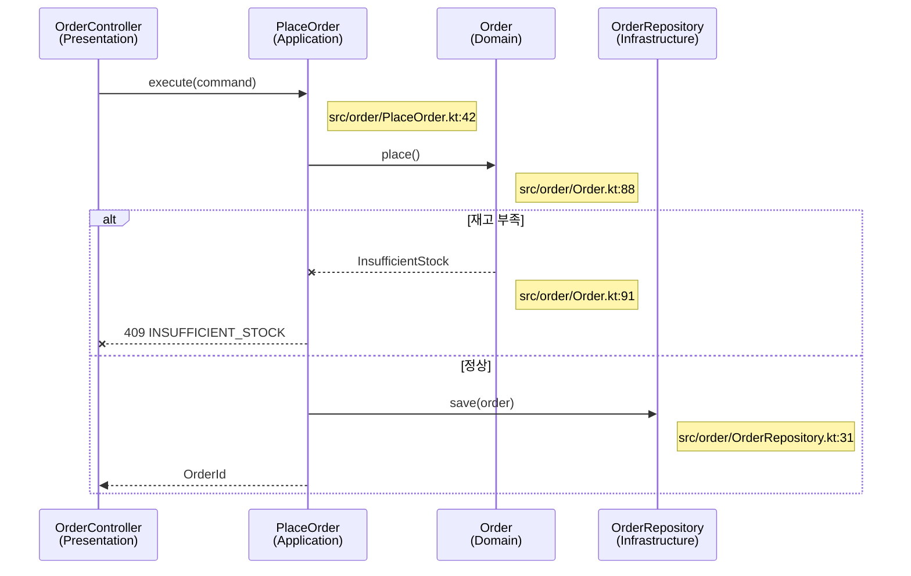

<!--
템플릿: 백엔드 설계 문서 (sequence-diagram.md)

내비게이션 규칙은 `${CLAUDE_PLUGIN_ROOT}/references/document-order.md` 참조.

**이 템플릿의 형식에 두 도구가 의존한다.** `operation-tracer` 에이전트가
TRACE 블록을 반환하면 스킬이 그것으로 아래 구조를 렌더링하고,
`citation-verifier`가 보이는 `Note`와 숨김 `CALLGRAPH` 블록을 양방향으로
대조한다. 구조를 바꾸면 검증이 깨진다.

**흐름 제목은 앵커다.** 재실행 시 기존 섹션을 찾는 기준이므로, 진입점이
아니라 **행위**로 이름 짓는다. "만료된 세션 토큰 갱신"이지
"POST /auth/refresh"가 아니다. 진입점이 바뀌어도 행위 이름은 유지된다.
-->

> [← ERD](erd.md) | [다음: 추적성 →](../../planning/traceability.md)

# 시퀀스 다이어그램

> **도메인**: <!-- 도메인 이름 -->
>
> **계층**: 백엔드

---

## 목차

1. [개요](#개요)
2. [참여자 표기 규약](#참여자-표기-규약)
3. [주요 흐름](#주요-흐름)
4. [단순 통과 오퍼레이션](#단순-통과-오퍼레이션)
5. [오류 처리 흐름](#오류-처리-흐름)

---

## 개요

이 문서는 오퍼레이션이 계층을 가로질러 어떻게 처리되는지를 흐름 단위로
보여준다. 계층의 역할과 각 구성 요소의 위치는
[레이어 구조](layered-architecture.md)가 소유한다.

---

## 참여자 표기 규약

참여자 라벨은 **계층 기준**이다. 프레임워크 타입명을 쓰지 않는다.

```text
[파일명]<br/>(계층)
```

| 계층 | 표기 예 |
|---|---|
| Presentation | `OrderController<br/>(Presentation)` |
| Application | `PlaceOrder<br/>(Application)` |
| Domain | `Order<br/>(Domain)` |
| Infrastructure | `OrderRepository<br/>(Infrastructure)` |
| 외부 | `PaymentGateway<br/>(External)` |

계층 이름은 [아키텍처 · 아키텍처 규약](../../../architecture.md#아키텍처-규약)의
매핑 표를 따른다. 도메인마다 다르게 부르지 않는다.

### Source-Linked 모드 (역방향 전용)

역방향 스킬이 이 문서를 만들 때는 모든 다이어그램에 소스 근거를 붙여
`citation-verifier`가 주장 단위로 검증할 수 있게 한다. 순방향 스킬은 아직
코드가 없으므로 이 절의 요소를 **전부 생략**한다.

1. **참여자 소스 링크** — 참여자마다 소스 파일을 가리키는 `link` 줄을 붙인다.

   ```text
   link <별칭>: Source @ <저장소 URL>/blob/<브랜치>/<경로>
   ```

   `<저장소 URL>`은 `git remote get-url origin`을 `https://`로 정규화해서,
   `<브랜치>`는 생성 시점에 체크아웃된 브랜치에서 얻는다.

2. **메시지별 근거** — 화살표 바로 다음 줄에 그 호출을 찾은 실제
   `경로:줄번호`를 `Note`로 남긴다. Mermaid에는 메시지 단위 링크가 없으므로,
   모든 렌더러에서 보이는 이 평문 `Note`가 대체 수단이다.

3. **근거를 지어내지 않는다** — 코드로 확인할 수 없는 메시지는 `Note` 대신
   `[ASSUMED: <추론>; basis: <근거>]`를 쓴다. 추측한 `파일:줄`을 절대 쓰지
   않는다.

4. **숨김 호출 그래프 블록** — 흐름 섹션 끝에 `<!-- CALLGRAPH: ... -->`
   주석으로 다이어그램의 원본 호출 간선을 기록한다. 보이는 `Note`와 독립된
   두 번째 근거이므로, `citation-verifier`가 둘을 교차 대조할 수 있다.

   **다이어그램을 먼저 그리고 근거를 나중에 채우지 않는다.** 호출 그래프를
   먼저 추출하고, 그것으로 다이어그램과 `Note`와 `CALLGRAPH`를 함께
   렌더링한다. 그래야 셋이 구조적으로 일치한다.

---

## 주요 흐름

<!--
흐름 하나당 한 섹션. 제목은 `### <FLOW 키>: <행위 이름>` 형식이다.

FLOW 키 형식:
- 백엔드: `FLOW-<도메인>-<오퍼레이션 ID>`
- 여러 도메인을 지나가면 여기 그리지 않는다 — domain-map.md의
  `FLOW-CROSS-` 흐름이 소유하고, 여기서는 자기 도메인 구간만 그린다.
-->

### FLOW-<도메인>-<오퍼레이션 ID>: <행위 이름>

| 항목 | 내용 |
|---|---|
| **오퍼레이션** | <!-- 카탈로그의 오퍼레이션 ID --> |
| **관련 스토리** | <!-- US-NN. 해당 앵커가 실제로 존재할 때만 링크한다 --> |
| **진입점** | <!-- [REF: path:line] --> |
| **추적 상태** | <!-- 완료 / 부분(사유) --> |



**주요 단계**

<!-- 다이어그램이 설명하지 못하는 것만 적는다. 화살표를 문장으로 옮겨 쓰지
     않는다. 트랜잭션 경계, 멱등성 처리, 락, 재시도가 있으면 여기 적는다. -->

| 단계 | 설명 | 근거 |
|---|---|---|
| | | |

**미해결 항목**

<!--
`operation-tracer`가 `unresolved`로 반환한 심볼. 없으면 이 소제목까지
삭제한다. 비어 있는 채로 남기지 않는다.
-->

| 심볼 | 사유 |
|---|---|

<!-- CALLGRAPH:
OrderController.kt:41 -> PlaceOrder.execute | src/order/PlaceOrder.kt:42
PlaceOrder.kt:55 -> Order.place | src/order/Order.kt:88
Order.kt:91 -x InsufficientStock | src/order/Order.kt:91
PlaceOrder.kt:60 -> OrderRepository.save | src/order/OrderRepository.kt:31
-->

---

## 단순 통과 오퍼레이션

<!--
진입점에서 저장소까지 분기 없이 통과하는 오퍼레이션은 다이어그램을 그리지
않고 여기 한 줄로 기록한다. 참여자가 3개 미만이고 분기가 없으면 여기에
속한다.

똑같이 생긴 CRUD 다이어그램 수십 개를 만드는 대신 이 표를 쓴다. 표가 비어
있으면 섹션과 목차 항목을 삭제한다.
-->

| 오퍼레이션 ID | 진입점 | 종착 | 근거 |
|---|---|---|---|
| | | <!-- 저장소 메서드 또는 외부 호출 --> | |

---

## 오류 처리 흐름

<!--
여러 흐름에 공통으로 적용되는 오류 처리만 여기 온다. 특정 흐름 안의 분기는
그 흐름의 `alt` 블록에 이미 있으므로 반복하지 않는다.

전역 예외 처리기, 재시도 정책, 서킷 브레이커, 보상 트랜잭션이 여기 속한다.
없으면 섹션과 목차 항목을 삭제한다.
-->

### <오류 처리 이름>

**적용 범위**: <!-- 어떤 흐름들에 적용되는지 -->

```mermaid
sequenceDiagram
    %% 공통 오류 처리
```

| 항목 | 내용 | 근거 |
|---|---|---|
| 감지 지점 | | |
| 처리 방식 | | |
| 호출자에게 보이는 결과 | | |

---

## 읽은 소스

<!--
역방향 스킬 전용. 재실행 시 이 원장을 **누적**한다 — 이전 실행의 항목을
지우지 않는다. 순방향 생성 시 제목까지 통째로 삭제한다.
-->

---

## 관련 문서

- [레이어 구조](layered-architecture.md) — 참여자의 계층과 경로
- [도메인 모델](domain-model.md) — 흐름에 참여하는 애그리거트
- [ERD](erd.md) — 저장소 접근이 닿는 스키마

### 참고 문서

- [인터페이스 계약](../../planning/api-interface.md) — 오퍼레이션 정의와 오류 코드
- [도메인 지도](../../../domain-map.md) — 여러 도메인을 지나는 흐름
- [추적성](../../planning/traceability.md) — 이 흐름과 스토리·테스트의 연결

---

## 문서 정보

| 항목 | 값 |
|---|---|
| **작성일** | YYYY-MM-DD |
| **최종 수정일** | YYYY-MM-DD |
| **상태** | 초안 |
| **분석 기준 커밋** | |
| **참고 문서** | |

**버전 이력**:

- 1.0.0 (YYYY-MM-DD): 최초 작성

---
> **전체 문서**
> [요구사항](../../planning/requirements.md) |
> [유저 스토리](../../planning/user-stories.md) |
> [정보 구조](../../planning/information-architecture.md) |
> [유저 플로우](../../planning/user-flows.md) |
> [인터페이스 계약](../../planning/api-interface.md) |
> [레이어 구조](layered-architecture.md) |
> [도메인 모델](domain-model.md) |
> [ERD](erd.md) |
> **시퀀스 다이어그램** |
> [추적성](../../planning/traceability.md) |
> [테스트 명세](../../verification/test-spec.md)
