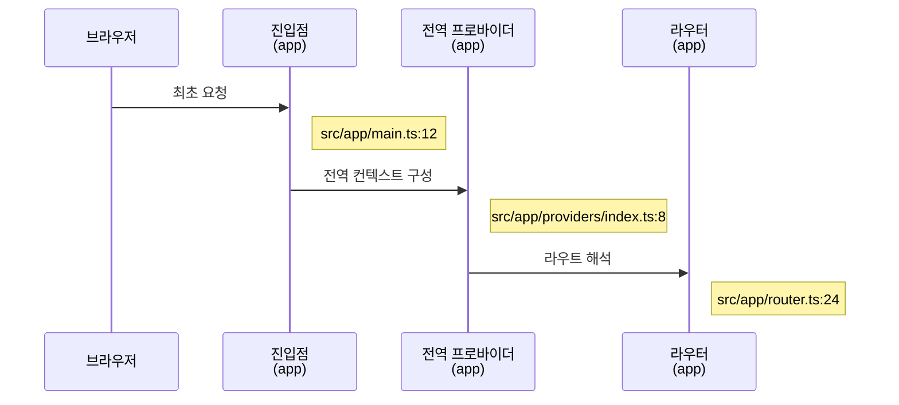
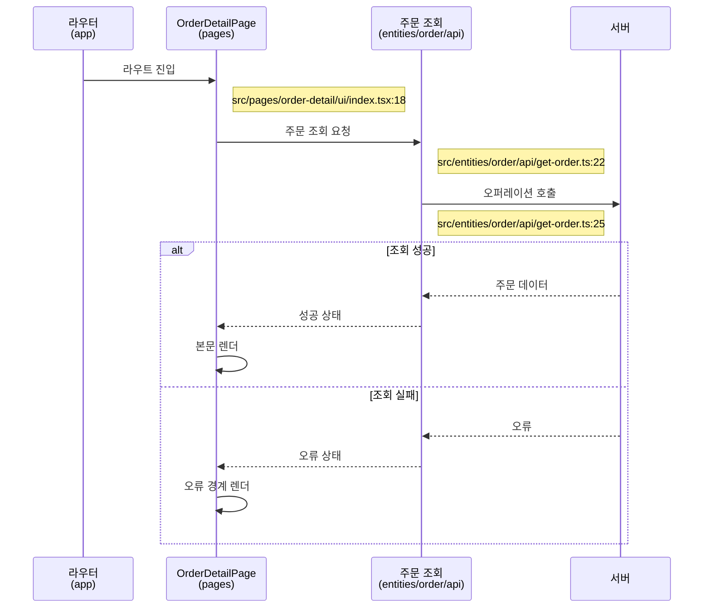

<!--
템플릿: 프론트엔드 설계 문서 (render-flow.md)

내비게이션 규칙은 `${CLAUDE_PLUGIN_ROOT}/references/document-order.md` 참조.

**책임 경계 — 이 문서는 라우트 하나가 그려지는 과정을 다룬다.**
- 구조(무엇이 무엇을 담는가) → `component-tree.md`
- 공유·전역 상태 → `state-flow.md`
- **지역 상태와 재렌더 유발 요인 → 이 문서**

지역 상태를 state-flow.md로 보내면 두 문서가 같은 페이지를 서로 참조하며
반복하게 된다. 경계는 "그 라우트를 벗어나면 사라지는가"다.

**프레임워크 중립 어휘**: 렌더링 모드는 "서버 / 클라이언트 / 사전 생성"으로,
경계는 "로딩 경계 / 오류 경계"로 쓴다. 프레임워크 고유 API 이름은
`architecture.md`의 감지 결과를 인용할 때만 등장한다.

`render-flow-tracer` 에이전트가 반환한 구조화 블록을 스킬이 이 형식으로
렌더링한다. 섹션 구조를 바꾸면 병합이 어긋난다.
-->

> [← UI 구성](component-tree.md) | [다음: 상태 흐름 →](state-flow.md)

# 렌더링 흐름

> **도메인**: <!-- 도메인 이름 -->
>
> **계층**: 프론트엔드

---

## 목차

1. [개요](#개요)
2. [앱 셸](#앱-셸)
3. [라우트별 렌더링 흐름](#라우트별-렌더링-흐름)
4. [로딩·오류 경계](#로딩오류-경계)

---

## 개요

| 항목 | 값 | 근거 |
|---|---|---|
| **기본 렌더링 모드** | | |
| **데이터 조회 계층** | | |
| **캐시 전략** | | |

---

## 앱 셸

<!--
모든 라우트가 공통으로 거치는 부분. **한 번만 기술한다.** 라우트마다 반복하면
N개의 동일한 서술이 생기고 곧 서로 어긋난다.

프론트엔드 전용 문서이므로 도메인이 여러 개여도 앱 셸은 하나다. 다른 도메인
문서에 이미 앱 셸이 기술되어 있으면 여기서는 링크만 하고 반복하지 않는다.
-->

**진입점**: <!-- [REF: path:line] -->

| 단계 | 구성 요소 | 하는 일 | 근거 |
|---|---|---|---|
| | | | |

**전역 가드**

<!-- 라우트 진입 전에 실행되는 검사. 없으면 소제목까지 삭제한다. -->

| 가드 | 검사 내용 | 실패 시 동작 | 근거 |
|---|---|---|---|
| | | | |

---

## 라우트별 렌더링 흐름

<!--
라우트 하나당 한 섹션. 제목은 `### <FLOW 키>: <라우트 이름>`.
FLOW 키 형식: `FLOW-<도메인>-<라우트 슬러그>`

**앱 셸 부분은 다시 그리지 않는다.** 라우트 경계 안쪽부터 시작한다.

역방향 생성 시 Source-Linked 규약을 따른다: 참여자 `link` 줄, 메시지별
`Note`(경로:줄번호), 확인 불가한 것은 `[ASSUMED: ...; basis: ...]`,
섹션 끝에 숨김 `CALLGRAPH` 블록. 상세 규약은
[백엔드 시퀀스 다이어그램](../backend/sequence-diagram.md#source-linked-모드-역방향-전용) 참조.
-->

### FLOW-<도메인>-<라우트 슬러그>: <라우트 이름>

| 항목 | 내용 |
|---|---|
| **라우트** | [`/orders/:orderId`](routing.md#라우트-목록) |
| **pages 슬라이스** | |
| **렌더링 모드** | |
| **관련 스토리** | US-NN |
| **추적 상태** | <!-- 완료 / 부분(사유) --> |

**데이터 조회**

<!--
`조회 시점`은 "라우트 진입 전 / 렌더 중 / 렌더 후 / 사용자 행동 시" 중 하나.
`캐시 키`는 state-flow.md의 서버 캐시 표와 일치해야 한다.
-->

| 조회 단위 | 대상 오퍼레이션 | 조회 시점 | 캐시 키 | 근거 |
|---|---|---|---|---|
| | | | | |

**지역 상태**

<!--
이 라우트를 벗어나면 사라지는 상태만. 다른 라우트와 공유되면
state-flow.md의 일이다.
-->

| 상태 | 담는 값 | 초기값 | 변경 계기 | 근거 |
|---|---|---|---|---|
| | | | | |

**재렌더 유발 요인**

<!--
무엇이 바뀌면 어떤 UI 단위가 다시 그려지는지. 성능 문제의 근원이 여기서
보인다.
-->

| 유발 요인 | 영향 받는 UI 단위 | 근거 |
|---|---|---|
| | | |

**미해결 항목**

<!-- 추적하지 못한 부분. 없으면 소제목까지 삭제한다. -->

| 심볼 | 사유 |
|---|---|

<!-- CALLGRAPH:
router.ts:31 -> OrderDetailPage | src/pages/order-detail/ui/index.tsx:18
index.tsx:24 -> getOrder | src/entities/order/api/get-order.ts:22
get-order.ts:25 -> http.get | src/entities/order/api/get-order.ts:25
-->

---

## 로딩·오류 경계

<!--
여러 라우트에 공통으로 적용되는 경계만. 특정 라우트 안의 분기는 위의 `alt`
블록에 이미 있으므로 반복하지 않는다.

없으면 이 섹션과 목차 항목을 삭제한다.
-->

| 경계 | 적용 범위 | 표시 내용 | 복구 수단 | 근거 |
|---|---|---|---|---|
| | | | <!-- 재시도 버튼, 자동 재시도 등 --> | |

**재시도 정책**

<!--
어떤 오류에서 재시도하는지. `api-interface.md`의 오류 모델에 있는
`재시도 가능` 열과 일치해야 한다. 어긋나면 그 사실을 기록한다.
-->

| 조건 | 재시도 방식 | 근거 |
|---|---|---|

---

## 읽은 소스

<!--
역방향 스킬 전용. 재실행 시 누적한다. 순방향 생성 시 제목까지 통째로
삭제한다.
-->

---

## 관련 문서

- [UI 구성](component-tree.md) — 렌더되는 단위들의 구조
- [상태 흐름](state-flow.md) — 라우트를 넘어 공유되는 상태
- [라우팅](routing.md) — 라우트 정의와 접근 제어

### 참고 문서

- [인터페이스 계약](../../planning/api-interface.md) — 조회 대상 오퍼레이션과 오류 코드
- [아키텍처](../../../architecture.md) — 감지된 프레임워크 환경
- [추적성](../../planning/traceability.md)

---

## 문서 정보

| 항목 | 값 |
|---|---|
| **작성일** | YYYY-MM-DD |
| **최종 수정일** | YYYY-MM-DD |
| **상태** | 초안 |
| **분석 기준 커밋** | |
| **참고 문서** | |

**버전 이력**:

- 1.0.0 (YYYY-MM-DD): 최초 작성

---
> **전체 문서**
> [요구사항](../../planning/requirements.md) |
> [유저 스토리](../../planning/user-stories.md) |
> [인터페이스 계약](../../planning/api-interface.md) |
> [FSD 구조](fsd-structure.md) |
> [라우팅](routing.md) |
> [UI 구성](component-tree.md) |
> **렌더링 흐름** |
> [상태 흐름](state-flow.md) |
> [유저 플로우](user-flows.md) |
> [추적성](../../planning/traceability.md) |
> [테스트 명세](../../verification/test-spec.md)
