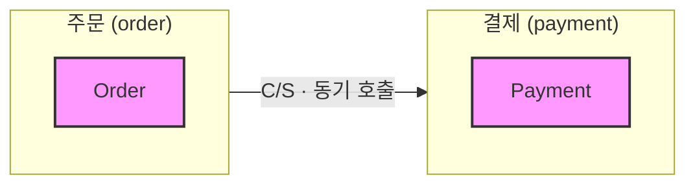
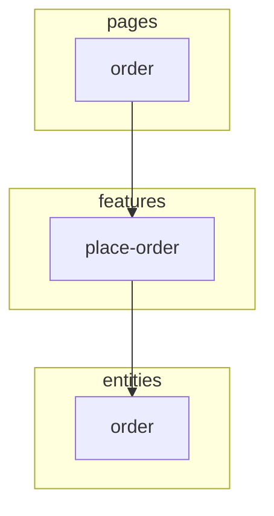
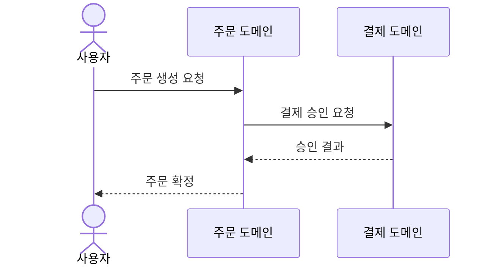

<!--
템플릿: 횡단 문서 (domain-map.md)

내비게이션 없음, 도메인 태그 없음. 병합 전용 — 섹션마다 소유자가 다르다.

이 문서만이 **도메인 사이**를 다룬다. 도메인 안의 내용은 각 도메인 디렉터리의
문서가 소유하므로 여기서 반복하지 않는다.

도메인이 하나뿐이면 `## 백엔드 컨텍스트 맵`, `## 도메인 간 통합 계약`,
`## 도메인 횡단 흐름`을 생성하지 않는다. 관계가 없는데 관계도를 그리지 않는다.
-->

<!-- GENERATED-BY: <스킬명>; commit: <sha>; root: <스캔 경로>; date: <YYYY-MM-DD> -->

# 도메인 지도

---

## 목차

1. [도메인 목록](#도메인-목록)
2. [백엔드 컨텍스트 맵](#백엔드-컨텍스트-맵)
3. [프론트엔드 슬라이스 의존 맵](#프론트엔드-슬라이스-의존-맵)
4. [도메인 간 통합 계약](#도메인-간-통합-계약)
5. [도메인 횡단 흐름](#도메인-횡단-흐름)
6. [패턴 범례](#패턴-범례)

---

## 도메인 목록

<!-- OWNER: 먼저 실행한 스킬 (이후 스킬은 자기 도메인 행만 추가) -->

| 도메인 | 한 줄 설명 | 계층 | 문서 |
|---|---|---|---|
| <!-- order --> | | <!-- 백엔드 / 프론트엔드 / 양쪽 --> | [기획](order/planning/requirements.md) · [설계](order/design/backend/layered-architecture.md) |

---

## 백엔드 컨텍스트 맵

<!-- OWNER: init-design-backend / reverse-design-backend -->

<!--
서브그래프 하나 = 바운디드 컨텍스트(도메인) 하나.
노드 = 애그리거트 루트. 애그리거트가 아닌 엔티티는 그리지 않는다.
엣지 라벨 = 컨텍스트 맵 패턴 약어 + 통합 방식. 화살표는 항상
upstream → downstream 방향이다.
속성 수준 상세는 절대 넣지 않는다 — domain-model.md의 일이다.
-->

### 컨텍스트 관계

<!--
`패턴` 열은 아래 범례의 약어만 쓴다. 코드 증거로 분류할 수 없으면
`[ASSUMED: ...; basis: ...]`를 쓰고 추측한 패턴을 단정하지 않는다.
-->

| Upstream | Downstream | 패턴 | 통합 방식 | 근거 |
|---|---|---|---|---|
| | | | <!-- 동기 호출 / 이벤트 / 공유 데이터 --> | |

---

## 프론트엔드 슬라이스 의존 맵

<!-- OWNER: init-design-frontend / reverse-design-frontend -->

<!--
FSD 레이어를 서브그래프로, 슬라이스를 노드로 그린다.
정상 의존(상위 → 하위)은 실선, **규칙 위반은 점선에 빨간 스타일**로 구분한다.
역방향에서 위반을 발견하면 사실로 기록만 하고 리팩터링을 제안하지 않는다.
-->

### 슬라이스 의존 관계

| 출발 슬라이스 | 도착 슬라이스 | 정상 여부 | 근거 |
|---|---|---|---|
| | | <!-- 정상 / 규칙 위반 --> | |

### FSD 의존 규칙 위반

<!-- 없으면 "발견되지 않음"이라고 적고 표를 삭제한다. -->

| 출발 | 도착 | 위반 유형 | 근거 |
|---|---|---|---|
| | | <!-- 같은 레이어 슬라이스 간 참조 / 하위→상위 역참조 --> | |

---

## 도메인 간 통합 계약

<!-- OWNER: init-planning / reverse-planning -->

<!--
위 컨텍스트 맵의 엣지를 **사용자 관점의 계약**으로 승격한 표다.
`계약 위치`는 실제 파일이나 문서 앵커를 가리킨다. "API를 통해" 같은 말은
계약이 아니다.
`실패 시 동작`은 코드에 근거가 있을 때만 적는다.
-->

| 출발 도메인 | 도착 도메인 | 방식 | 계약 위치 | 실패 시 동작 | 근거 |
|---|---|---|---|---|---|
| | | <!-- 동기 API / 이벤트 / 공유 데이터 --> | | | |

---

## 도메인 횡단 흐름

<!-- OWNER: init-planning / reverse-planning -->

<!--
두 개 이상의 도메인을 지나가는 흐름만 여기 그린다. 한 도메인 안에서 끝나는
흐름은 그 도메인의 sequence-diagram.md가 소유한다.

**다이어그램을 복제하지 않는다.** 각 구간은 해당 도메인의 `FLOW-` 키를
참조만 하고, 여기서는 도메인을 참여자로 삼아 한 단계 위에서 그린다.
-->

### FLOW-CROSS-<슬러그>: <흐름 이름>

**관련 유저 스토리**: <!-- US-NN, 여러 도메인에 걸치면 모두 나열 -->

**구간별 상세**:

| 순서 | 도메인 | 참조 FLOW 키 | 문서 |
|---|---|---|---|
| 1 | | `FLOW-order-...` | [시퀀스 다이어그램](order/design/backend/sequence-diagram.md) |

**실패 경로**:

<!-- 중간 도메인이 실패했을 때 앞선 도메인이 무엇을 되돌리는지. 보상
     트랜잭션이나 사가가 있으면 여기 기록한다. 코드 근거가 없으면
     `[ASSUMED: ...]`를 쓴다. -->

---

## 패턴 범례

<!--
고정 표다. 그대로 두고 편집하거나 줄이지 않는다. 사용하지 않은 패턴도
남겨 둔다 — 읽는 사람이 표기를 해석하는 근거다.
-->

| 약어 | 패턴 | 뜻 |
|---|---|---|
| P | Partnership | 두 컨텍스트가 함께 성공하거나 함께 실패한다. 조율된 계획으로 움직인다 |
| SK | Shared Kernel | 두 컨텍스트가 모델의 일부를 공유하고 함께 소유한다 |
| C/S | Customer/Supplier | Downstream이 고객, upstream이 공급자. 고객의 요구가 공급자 계획에 반영된다 |
| CF | Conformist | Downstream이 upstream 모델을 그대로 따른다. 번역 계층이 없다 |
| ACL | Anticorruption Layer | Downstream이 번역 계층을 두어 upstream 모델의 침투를 막는다 |
| OHS | Open Host Service | Upstream이 공개 프로토콜로 다수의 downstream에 서비스한다 |
| PL | Published Language | 통합에 쓰는 잘 정의된 공용 언어·스키마 |
| SW | Separate Ways | 통합하지 않기로 한 결정 |
| BBoM | Big Ball of Mud | 경계가 무너진 영역. 발견 사실로만 기록한다 |

---

## 읽은 소스

<!-- 역방향 스킬 전용. 순방향 생성 시 제목까지 통째로 삭제한다. -->

---

## 관련 문서

- [아키텍처](architecture.md) — 코드베이스 구조와 아키텍처 규약
- [인프라](infrastructure.md) — 배포 토폴로지와 외부 서비스
- [용어집](glossary.md) — 도메인 용어와 영문 식별자
- [문서 인덱스](README.md)

---

## 문서 정보

| 항목 | 값 |
|---|---|
| **작성일** | YYYY-MM-DD |
| **최종 수정일** | YYYY-MM-DD |
| **상태** | 초안 |
| **분석 기준 커밋** | |
| **참고 문서** | |

**버전 이력**:

- 1.0.0 (YYYY-MM-DD): 최초 작성
