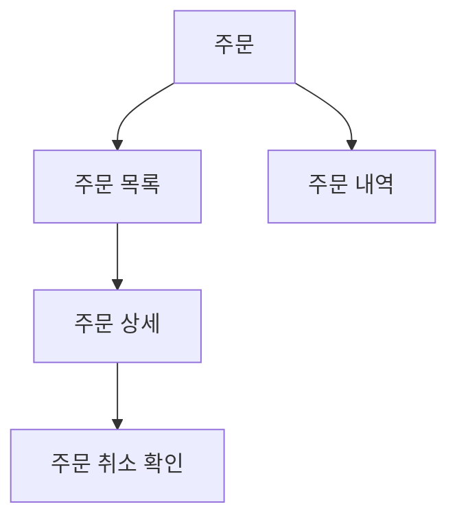

<!--
템플릿: 도메인 기획 문서 (information-architecture.md)

내비게이션 규칙은 `${CLAUDE_PLUGIN_ROOT}/references/document-order.md` 참조.

**조건부 문서다.** 사용자 인터페이스가 있는 프로젝트에서만 만든다. UI가 없으면
이 문서와 `user-flows.md`를 둘 다 만들지 않는다.

**기술 중립 문서다.** 스왑 테스트를 문장 단위로 통과해야 한다.

**책임 경계 — 이 문서는 화면이 무엇이고 어떻게 묶이는지까지만 다룬다.**

- **화면 안의 배치를 여기 적지 않는다.** 레이아웃, 반응형 규칙, 인터랙션
  패턴은 `../design/frontend/component-tree.md`가 소유한다. 이 경계를 어기면
  기획 문서가 화면 정의서로 자라나고, 구현이 바뀔 때마다 기획이 낡는다.
- **라우트 경로를 여기 적지 않는다.** `/orders/:id` 같은 주소는
  `../design/frontend/routing.md`가 소유한다. 여기서는 화면에 `SCR-` 키만
  부여하고, 설계 단계가 그 키에 라우트를 대응시킨다.
- **화면 사이의 이동은 여기 그리지 않는다.** 과업 단위 여정은
  `user-flows.md`가 소유한다. 이 문서의 `## 화면 계층`은 **포함 관계**이지
  전이가 아니다.
-->

> [← 유저 스토리](user-stories.md) | [다음: 유저 플로우 →](user-flows.md)

# 정보 구조

> **도메인**: <!-- 도메인 이름 -->

---

## 목차

1. [개요](#개요)
2. [화면 목록](#화면-목록)
3. [화면 계층](#화면-계층)
4. [내비게이션 구조](#내비게이션-구조)
5. [화면별 정보 요소](#화면별-정보-요소)
6. [다른 도메인으로의 연결](#다른-도메인으로의-연결)

---

## 개요

<!-- 이 도메인에서 사용자가 만나는 화면 묶음을 2~4문장으로. -->

---

## 화면 목록

<!--
ID 형식: `SCR-<영역>-NN` (01부터 순차). `<영역>`은 대문자 약어이며
`requirements.md`의 `FR-<영역>-NN`과 같은 약어를 쓴다.

**모든 화면은 최소 하나의 유저 스토리에 연결되어야 한다.** 어느 스토리와도
연결되지 않는 화면은 만들 이유가 없거나 스토리가 빠진 것이다. 판단이
서지 않으면 `traceability.md`의 미연결 항목으로 내린다.

`진입 권한`은 공개 화면도 "인증 불필요"로 명시한다. 빈 칸은 미확인과
구분되지 않는다. 권한 이름은 `api-interface.md`의 인가 표와 일치해야 한다.

`근거` 열은 순방향이면 "기획 결정", 역방향이면 `[REF: 경로:줄번호]`.
-->

| 화면 ID | 화면 이름 | 목적 | 관련 스토리 | 진입 권한 | 근거 |
|---|---|---|---|---|---|
| SCR-<영역>-01 | | | US-NN | | |

---

## 화면 계층

<!--
사이트맵이다. `flowchart TD`로 그린다. 노드는 화면, 간선은 **포함 관계**
(부모 화면이 자식 화면을 품는다)이지 사용자 이동이 아니다. 이동은
`user-flows.md`가 그린다.

화면이 평면적이어서 계층이 없으면 이 섹션과 목차 항목을 통째로 삭제한다.
억지로 한 단계짜리 트리를 그리지 않는다.
-->

---

## 내비게이션 구조

<!--
사용자가 화면에 도달하는 **상시 경로**를 적는다. 과업 도중의 일회성 이동은
`user-flows.md`의 몫이다.

`노출 조건`은 항상 보이면 "항상"이라고 적는다. 빈 칸으로 두지 않는다.
-->

| 내비게이션 요소 | 노출 위치 | 도착 화면 | 노출 조건 |
|---|---|---|---|
| <!-- 전역 메뉴 / 사이드바 / 탭 / 브레드크럼 --> | | SCR-<영역>-NN | |

---

## 화면별 정보 요소

<!--
화면 하나가 **무엇을 보여주고 무엇을 받는가**. 이 표가 `api-interface.md`의
오퍼레이션 입도를 정하는 근거다 — 한 화면이 한 번에 보여줘야 하는 것이
한 오퍼레이션의 응답 범위를 결정한다.

`대응 개념` 열은 `glossary.md`의 영문 식별자를 쓴다. 용어집에 없는 개념이
나오면 용어집에 먼저 추가한다.

**배치와 시각적 표현은 적지 않는다.** "상단에 크게" 같은 서술이 나오면
경계를 넘은 것이다.
-->

| 화면 ID | 표시 정보 | 대응 개념 | 사용자 행동 |
|---|---|---|---|
| SCR-<영역>-01 | | | |

---

## 다른 도메인으로의 연결

<!--
**조건부 섹션이다.** 도메인이 하나뿐이면 이 섹션과 목차 항목을 통째로
삭제한다.

여기 적은 연결은 `domain-map.md`의 도메인 횡단 흐름과 일치해야 한다.
어긋나면 둘 중 하나가 낡은 것이다.
-->

| 출발 화면 | 도착 도메인 | 도착 화면 | 계기 |
|---|---|---|---|
| SCR-<영역>-NN | | | |

---

## 읽은 소스

<!-- 역방향 스킬 전용. 순방향 생성 시 제목까지 통째로 삭제한다. -->

---

## 관련 문서

- [유저 스토리](user-stories.md) — 각 화면이 실현하는 스토리
- [유저 플로우](user-flows.md) — 화면 사이를 지나가는 여정
- [인터페이스 계약](api-interface.md) — 화면이 필요로 하는 오퍼레이션

### 참고 문서

- [용어집](../../glossary.md) — 표시 정보의 대응 개념
- [도메인 지도](../../domain-map.md) — 여러 도메인을 지나는 여정

---

## 문서 정보

| 항목 | 값 |
|---|---|
| **작성일** | YYYY-MM-DD |
| **최종 수정일** | YYYY-MM-DD |
| **상태** | 초안 |
| **분석 기준 커밋** | |
| **참고 문서** | |

**버전 이력**:

- 1.0.0 (YYYY-MM-DD): 최초 작성

---
> **전체 문서**
> <!-- 실제 생성된 문서만 남긴다. 현재 문서는 굵게, 링크하지 않는다. -->
> [요구사항](requirements.md) |
> [유저 스토리](user-stories.md) |
> **정보 구조** |
> [유저 플로우](user-flows.md) |
> [인터페이스 계약](api-interface.md) |
> [백엔드 설계](../design/backend/layered-architecture.md) |
> [프론트엔드 설계](../design/frontend/fsd-structure.md) |
> [추적성](traceability.md) |
> [테스트 명세](../verification/test-spec.md)
