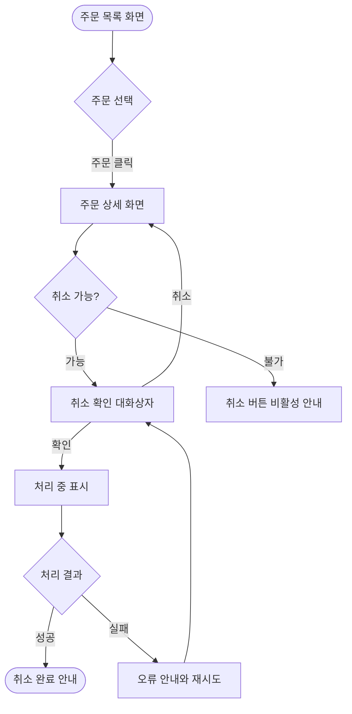

<!--
템플릿: 도메인 기획 문서 (user-flows.md)

내비게이션 규칙은 `${CLAUDE_PLUGIN_ROOT}/references/document-order.md` 참조.

**조건부 문서다.** 사용자 인터페이스가 있는 프로젝트에서만 만든다.
`information-architecture.md` 없이 이 문서만 만들지 않는다 — 플로우의 노드가
`SCR-` 키를 참조하므로 화면 목록이 먼저 있어야 한다.

**기술 중립 문서다.** 스왑 테스트를 문장 단위로 통과해야 한다. 프레임워크
이름, 라우트 경로, 컴포넌트 이름은 들어가지 않는다.

**책임 경계 — 이 문서는 사용자가 보는 것만 다룬다.**
화면 전환과 사용자 행동, 그리고 사용자에게 보이는 결과.

**백엔드 호출을 여기 그리지 않는다.** 서버 처리가 필요한 지점은 해당
`FLOW-` 키를 링크만 한다. 이 규칙을 어기면 유저 플로우와 백엔드 시퀀스
다이어그램이 같은 내용을 두 번 그리게 되고, 코드가 바뀔 때 두 곳이 어긋난다.
자세한 규칙은 `${CLAUDE_PLUGIN_ROOT}/references/planning-rules.md` 참조.

**라우트를 여기 적지 않는다.** 노드는 `information-architecture.md`의
`SCR-` 화면이고, 그 화면에 어떤 주소가 대응하는지는
`../design/frontend/routing.md`가 소유한다.
-->

> [← 정보 구조](information-architecture.md) | [다음: 인터페이스 계약 →](api-interface.md)

# 유저 플로우

> **도메인**: <!-- 도메인 이름 -->

---

## 목차

1. [개요](#개요)
2. [플로우 목록](#플로우-목록)
3. [플로우 상세](#플로우-상세)
4. [진입점](#진입점)

---

## 개요

<!-- 이 도메인에서 사용자가 하는 일을 2~4문장으로. -->

---

## 플로우 목록

<!--
ID 형식: `UF-<도메인>-NN` (01부터 순차). `<도메인>`은 디렉터리 이름과 같은
소문자 슬러그다.

`시작 화면`과 `종료 화면`은 `information-architecture.md`에 정의된 `SCR-`
키여야 한다. 정의되지 않은 키를 쓰면 `check-docs.sh`가 고아 참조로 잡는다.
-->

| 플로우 ID | 플로우 | 관련 스토리 | 시작 화면 | 종료 화면 | 주 액터 |
|---|---|---|---|---|---|
| UF-<도메인>-01 | | US-NN | SCR-<영역>-NN | SCR-<영역>-NN | |

---

## 플로우 상세

<!--
플로우 하나당 한 섹션. 유저 스토리 하나에 대응하는 것이 보통이다.

`flowchart TD`로 그린다. 노드는 **사용자가 보는 화면이나 결정**이고,
간선은 **사용자 행동**이다. 서버 처리는 노드 하나로 뭉뚱그리고 그 안을
그리지 않는다.
-->

### UF-<도메인>-01: <플로우 이름>

| 항목 | 내용 |
|---|---|
| **관련 스토리** | US-NN |
| **주 액터** | |
| **사전 조건** | |
| **성공 기준** | |

**정상 경로**

<!--
`관련 화면`은 `information-architecture.md`의 `SCR-` 키다.

`서버 흐름`은 **설계 단계에서 채운다.** 기획 단계에서는 서버 호출이 필요한
단계에 `설계 대기`, 필요 없는 단계에 `—`를 적는다. 설계 스킬이 `FLOW-` 키를
부여한 뒤 `설계 대기`를 그 키 링크로 바꾼다.
-->

| 단계 | 사용자 행동 | 보이는 결과 | 관련 화면 | 서버 흐름 |
|---|---|---|---|---|
| 1 | | | SCR-<영역>-NN | |

**대안 경로**

<!-- 목표에는 도달하지만 경로가 다른 경우. 없으면 소제목까지 삭제한다. -->

| 분기 지점 | 조건 | 이후 경로 |
|---|---|---|
| | | |

**예외 경로**

<!--
목표에 도달하지 못하는 경우와 그때 사용자가 보는 것.
오류 코드는 api-interface.md의 오류 모델을 링크하고 여기서 정의하지 않는다.
-->

| 발생 지점 | 원인 | 사용자에게 보이는 것 | 복구 수단 |
|---|---|---|---|
| | | | |

---

## 진입점

<!--
사용자가 이 도메인의 플로우에 들어오는 경로. 다른 도메인에서 넘어오는
경우가 있으면 information-architecture.md의 `## 다른 도메인으로의 연결`,
domain-map.md의 횡단 흐름 양쪽과 일치해야 한다.
-->

| 진입 경로 | 도착 플로우 | 전달 맥락 | 근거 |
|---|---|---|---|
| <!-- 내비게이션 메뉴 / 외부 링크 / 다른 도메인 --> | UF-<도메인>-NN | | |

---

## 읽은 소스

<!-- 역방향 스킬 전용. 순방향 생성 시 제목까지 통째로 삭제한다. -->

---

## 관련 문서

- [정보 구조](information-architecture.md) — 플로우가 지나가는 화면
- [유저 스토리](user-stories.md) — 이 플로우가 실현하는 스토리
- [인터페이스 계약](api-interface.md) — 오류 모델

### 참고 문서

- [도메인 지도](../../domain-map.md) — 여러 도메인을 지나는 여정
- [라우팅](../design/frontend/routing.md) — 화면에 대응하는 주소
- [렌더링 흐름](../design/frontend/render-flow.md) — 각 화면이 그려지는 과정

---

## 문서 정보

| 항목 | 값 |
|---|---|
| **작성일** | YYYY-MM-DD |
| **최종 수정일** | YYYY-MM-DD |
| **상태** | 초안 |
| **분석 기준 커밋** | |
| **참고 문서** | |

**버전 이력**:

- 1.0.0 (YYYY-MM-DD): 최초 작성

---
> **전체 문서**
> <!-- 실제 생성된 문서만 남긴다. 현재 문서는 굵게, 링크하지 않는다. -->
> [요구사항](requirements.md) |
> [유저 스토리](user-stories.md) |
> [정보 구조](information-architecture.md) |
> **유저 플로우** |
> [인터페이스 계약](api-interface.md) |
> [백엔드 설계](../design/backend/layered-architecture.md) |
> [프론트엔드 설계](../design/frontend/fsd-structure.md) |
> [추적성](traceability.md) |
> [테스트 명세](../verification/test-spec.md)
