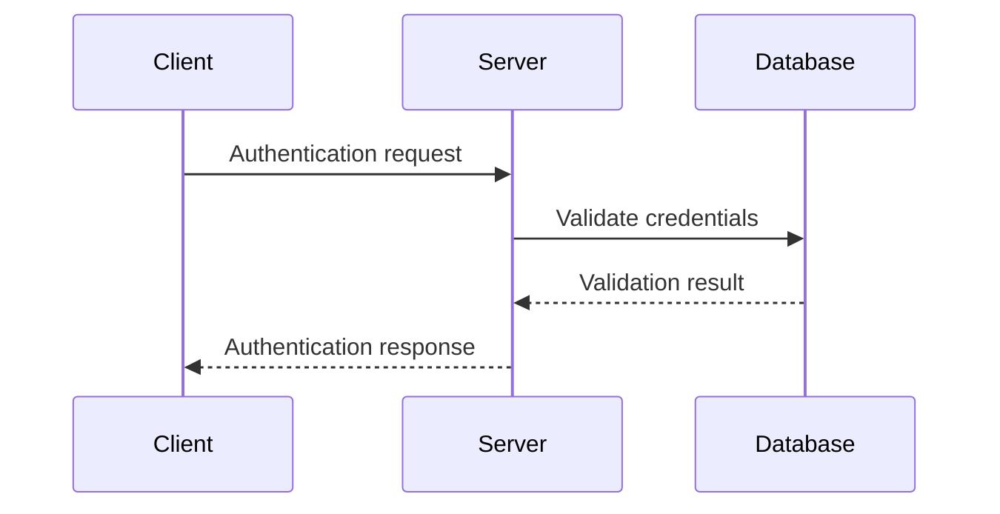

# API Specification

**Version**: 1.0.0
**Last Updated**: YYYY-MM-DD
**Status**: Draft

---

## Document Navigation

**Previous**: [← User Stories](user-stories.md) | **Next**: [Use Cases →](../workflows/use-cases.md)

---

## Table of Contents

1. [Overview](#overview)
2. [Endpoint Catalog](#endpoint-catalog)
3. [API Endpoints](#api-endpoints)
4. [Data Models](#data-models)
5. [Authentication](#authentication)
6. [Error Responses](#error-responses)

---

## Overview

### API Basic Information

| Item | Value |
|------|-------|
| **Base URL** | `http://localhost:<port>` (development), `https://api.example.com` (production) |
| **Protocol** | HTTP/1.1, HTTPS |
| **Data Format** | JSON (Content-Type: application/json) |
| **Authentication Method** | <!-- e.g., Bearer Token, Cookie, API Key --> |
| **CORS** | <!-- CORS policy --> |
| **Documentation** | <!-- e.g., Swagger UI (`/docs`), ReDoc (`/redoc`) --> |

### Authentication Mechanism

<!-- Describe the authentication method used by the API -->

**Related Requirements**: <!-- e.g., NFR-SEC-01, NFR-SEC-03 -->

---

## Endpoint Catalog

### Complete Endpoint List

| HTTP Method | Path | Auth Required | Summary | Related Use Case | Implementation |
|-------------|------|--------------|---------|------------------|----------------|
| POST | `/api/<resource>` | No | <!-- Summary --> | [UC-<AREA>-01](../workflows/use-cases.md#uc-area-01) | <!-- file.py --> |
| GET | `/api/<resource>` | Yes | <!-- Summary --> | [UC-<AREA>-02](../workflows/use-cases.md#uc-area-02) | <!-- file.py --> |
| GET | `/health` | No | Health check | [UC-HEALTH-01](../workflows/use-cases.md#uc-health-01) | <!-- file.py --> |

---

## API Endpoints

### METHOD /api/<path>

**Use Case**: [UC-<AREA>-01 (Name)](../workflows/use-cases.md#uc-area-01-name)

**Description**: <!-- What this endpoint does -->

#### Request

**HTTP Method**: `METHOD`
**Path**: `/api/<path>`

**Headers**:

```text
Content-Type: application/json
```

**Body Schema** (JSON):

```json
{
  "field1": "string (required)",
  "field2": "number (optional)"
}
```

| Field | Type | Required | Description | Validation Rules |
|-------|------|----------|-------------|------------------|
| `field1` | string | Yes | <!-- Description --> | <!-- Rules --> |
| `field2` | number | No | <!-- Description --> | <!-- Rules --> |

#### Response

**Success (200 OK)**:

**Headers**:

```text
Content-Type: application/json
```

**Body Schema** (JSON):

```json
{
  "id": "string",
  "field1": "string",
  "created_at": "string (ISO 8601)"
}
```

| Field | Type | Description | Example |
|-------|------|-------------|---------|
| `id` | string | Unique identifier | `"abc123"` |
| `field1` | string | <!-- Description --> | `"value"` |
| `created_at` | string | Creation timestamp (ISO 8601) | `"2025-12-10T12:00:00Z"` |

#### Error Responses

**400 Bad Request** - Invalid input:

```json
{
  "detail": "Invalid input"
}
```

**401 Unauthorized** - Authentication required:

```json
{
  "detail": "Not authenticated"
}
```

**500 Internal Server Error** - Server failure:

```json
{
  "detail": "Internal server error"
}
```

#### Examples

**curl**:

```bash
curl -X METHOD http://localhost:<port>/api/<path> \
  -H "Content-Type: application/json" \
  -d '{"field1": "value"}' \
  -v
```

**JavaScript (Fetch)**:

```javascript
const response = await fetch('http://localhost:<port>/api/<path>', {
  method: 'METHOD',
  headers: { 'Content-Type': 'application/json' },
  credentials: 'include',
  body: JSON.stringify({ field1: 'value' })
});

if (response.ok) {
  const data = await response.json();
  console.log('Success:', data);
}
```

#### Sequence Diagram

See [Flow Name Sequence Diagram](../workflows/sequence-diagram.md#flow-name)

---

<!-- Repeat ### METHOD /api/<path> for each endpoint -->

---

## Data Models

### <ModelName>

**Description**: <!-- Model purpose -->

**JSON Schema**:

```json
{
  "type": "object",
  "properties": {
    "id": {
      "type": "string",
      "description": "Unique identifier"
    },
    "name": {
      "type": "string",
      "description": "Display name"
    }
  },
  "required": ["id", "name"]
}
```

**Example**:

```json
{
  "id": "abc123",
  "name": "Example"
}
```

---

<!-- Repeat ### <ModelName> for each data model -->

---

## Authentication

### Authentication Flow

<!-- Describe the authentication flow if applicable -->



---

## Error Responses

### Standard Error Format

```json
{
  "detail": "Error message"
}
```

### HTTP Status Codes

| Code | Name | Meaning | Occurrence Scenario | Client Handling |
|------|------|---------|---------------------|-----------------|
| **200** | OK | Request successful | Normal response | Use data |
| **201** | Created | Resource created | Successful creation | Confirm and use |
| **400** | Bad Request | Invalid request | Malformed input, validation failure | Display error message |
| **401** | Unauthorized | Authentication failure | Missing or invalid credentials | Redirect to login |
| **403** | Forbidden | Access denied | Insufficient permissions | Display access denied |
| **404** | Not Found | Resource not found | Non-existent resource or endpoint | Display not found |
| **422** | Unprocessable Entity | Validation error | Business rule violation | Display validation errors |
| **500** | Internal Server Error | Server error | Unexpected failure | Retry or error page |

---

## Additional Resources

### Related Documents

- [Requirements Analysis](requirements.md) - Functional/non-functional requirements
- [User Stories](user-stories.md) - User stories by role
- [Use Case Specification](../workflows/use-cases.md) - Detailed use cases
- [Sequence Diagrams](../workflows/sequence-diagram.md) - Implementation flows

---

**Version History**:

- 1.0.0 (YYYY-MM-DD): Initial API specification document
