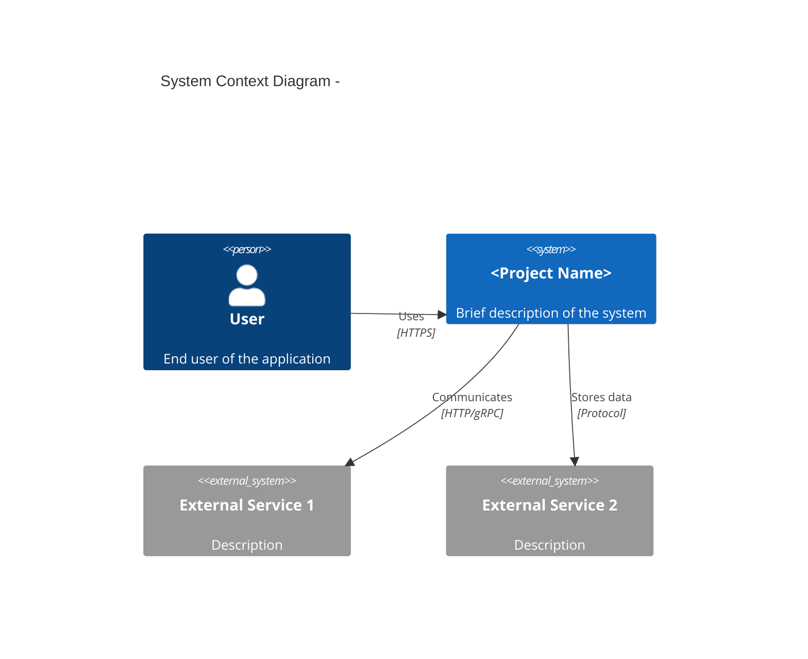

# Requirements Analysis

> **Created**: YYYY-MM-DD
> **Last Modified**: YYYY-MM-DD
> **Status**: Draft
> **Tech Stack**: (auto-detected)
> **Reference Documents**: <!-- list @-references from document discovery -->

---

## Document Navigation

**Next**: [User Stories →](user-stories.md)

---

## Table of Contents

1. [System Overview](#system-overview)
2. [Functional Requirements](#functional-requirements)
3. [Non-Functional Requirements](#non-functional-requirements)
4. [Constraints](#constraints)
5. [Requirements Traceability Matrix](#requirements-traceability-matrix)

---

## System Overview

### Project Information

**Project Name**: <!-- Project name -->
**Purpose**: <!-- One-line description of what the system does -->
**Version**: 0.1.0
**Architecture**: <!-- e.g., 4-Layer DDD, MVC, Hexagonal, Clean Architecture -->

### Stakeholders

| Role | Responsibility | Concerns |
|------|---------------|----------|
| **Frontend Team** | API integration | Clear API contract, error messages, CORS |
| **Backend Team** | Implementation and maintenance | Clean architecture, testability, maintainability |
| **Security Team** | Secure design review | Authentication, authorization, data protection |
| **DevOps** | Deployment and monitoring | Docker, health checks, observability |
| **End Users** | Use the application | Reliability, performance, ease of use |

### System Context

<!-- Describe the system's position in the overall architecture -->

### System Boundary

**In Scope**:

- <!-- Feature or capability 1 -->
- <!-- Feature or capability 2 -->
- <!-- Feature or capability 3 -->

**Out of Scope**:

- <!-- Explicitly excluded item 1 -->
- <!-- Explicitly excluded item 2 -->

---

## Functional Requirements

### FR-<AREA>: <Area Name>

<!-- Group related requirements by functional area (e.g., FR-AUTH, FR-USER, FR-ORDER) -->

| ID | Requirement | Priority | Status |
|----|-------------|----------|--------|
| **FR-<AREA>-01** | <!-- Requirement description --> | MUST | Planned |
| **FR-<AREA>-02** | <!-- Requirement description --> | MUST | Planned |
| **FR-<AREA>-03** | <!-- Requirement description --> | SHOULD | Planned |

**Detailed Description**:

**FR-<AREA>-01: <Requirement Name>**

- **Input**: <!-- What the system receives -->
- **Process**:
  1. <!-- Step 1 -->
  2. <!-- Step 2 -->
  3. <!-- Step 3 -->
- **Output**: <!-- What the system produces -->
- **Related Use Case**: [UC-<AREA>-01](../workflows/use-cases.md#uc-area-01-name)

<!-- Repeat FR-<AREA>-NN blocks for each requirement -->

---

<!-- Repeat ### FR-<AREA>: <Area Name> sections for each functional area -->

---

## Non-Functional Requirements

### NFR-SEC: Security

| ID | Requirement | Priority | Status |
|----|-------------|----------|--------|
| **NFR-SEC-01** | <!-- Security requirement --> | MUST | Planned |
| **NFR-SEC-02** | <!-- Security requirement --> | MUST | Planned |

---

### NFR-PERF: Performance

| ID | Requirement | Priority | Status |
|----|-------------|----------|--------|
| **NFR-PERF-01** | <!-- Performance target --> | SHOULD | Planned |
| **NFR-PERF-02** | <!-- Performance target --> | SHOULD | Planned |

---

### NFR-ARCH: Architecture

| ID | Requirement | Priority | Status |
|----|-------------|----------|--------|
| **NFR-ARCH-01** | <!-- Architecture constraint --> | MUST | Planned |
| **NFR-ARCH-02** | <!-- Architecture constraint --> | MUST | Planned |

---

### NFR-DEPLOY: Deployment

| ID | Requirement | Priority | Status |
|----|-------------|----------|--------|
| **NFR-DEPLOY-01** | <!-- Deployment requirement --> | MUST | Planned |
| **NFR-DEPLOY-02** | <!-- Deployment requirement --> | SHOULD | Planned |

---

## Constraints

### Technical Constraints

| Constraint | Description | Impact |
|-----------|-------------|--------|
| **Language** | <!-- e.g., Python 3.11+ --> | <!-- Impact on implementation --> |
| **Framework** | <!-- e.g., FastAPI 0.115+ --> | <!-- Impact on implementation --> |
| **Database** | <!-- e.g., PostgreSQL 16+ --> | <!-- Impact on implementation --> |

### Architecture Constraints

| Constraint | Description | Impact |
|-----------|-------------|--------|
| <!-- Pattern --> | <!-- e.g., Must follow DDD layer rules --> | <!-- Impact --> |
| <!-- DI --> | <!-- e.g., All dependencies via DI --> | <!-- Impact --> |

### Operational Constraints

| Constraint | Description | Impact |
|-----------|-------------|--------|
| <!-- External deps --> | <!-- e.g., External API is third-party --> | <!-- Impact --> |
| <!-- Deployment --> | <!-- e.g., Must work in air-gapped networks --> | <!-- Impact --> |

### Development Constraints

| Constraint | Description | Impact |
|-----------|-------------|--------|
| <!-- Process --> | <!-- e.g., Issue documentation first --> | <!-- Impact --> |
| <!-- Docs --> | <!-- e.g., English documentation --> | <!-- Impact --> |
| <!-- Diagrams --> | <!-- e.g., Mermaid format only --> | <!-- Impact --> |

---

## Requirements Traceability Matrix

| Requirement ID | Category | Description | Use Case | Implementation | Status |
|---------------|----------|-------------|----------|----------------|--------|
| **FR-<AREA>-01** | <!-- Area --> | <!-- Brief --> | UC-<AREA>-01 | <!-- file --> | Planned |
| **FR-<AREA>-02** | <!-- Area --> | <!-- Brief --> | UC-<AREA>-02 | <!-- file --> | Planned |

---

## Related Documents

### Specification Chain

- **-> Next**: [User Stories](user-stories.md)
- **-> Then**: [Use Cases](../workflows/use-cases.md)
- **-> Then**: [Sequence Diagrams](../workflows/sequence-diagram.md)

### Supporting References

- [Architecture](../../architecture.md) — Architecture structure and layer rules
- [Configuration](../../config.md) — Environment variables and config schema
- [Infrastructure](../../infrastructure.md) — System context and infrastructure diagrams

---

**Version History**:

- 1.0.0 (YYYY-MM-DD): Initial requirements analysis document

---
> **All Documents**
> **Requirements** |
> [User Stories](user-stories.md) |
> [Use Cases](../workflows/use-cases.md) |
> [Sequence Diagrams](../workflows/sequence-diagram.md) |
> [Domain Spec](../workflows/) |
> [Test Spec](../workflows/test-spec.md)
