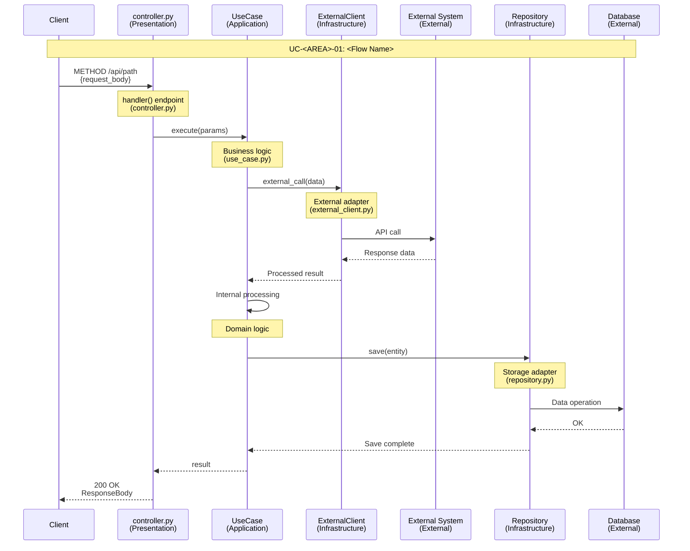
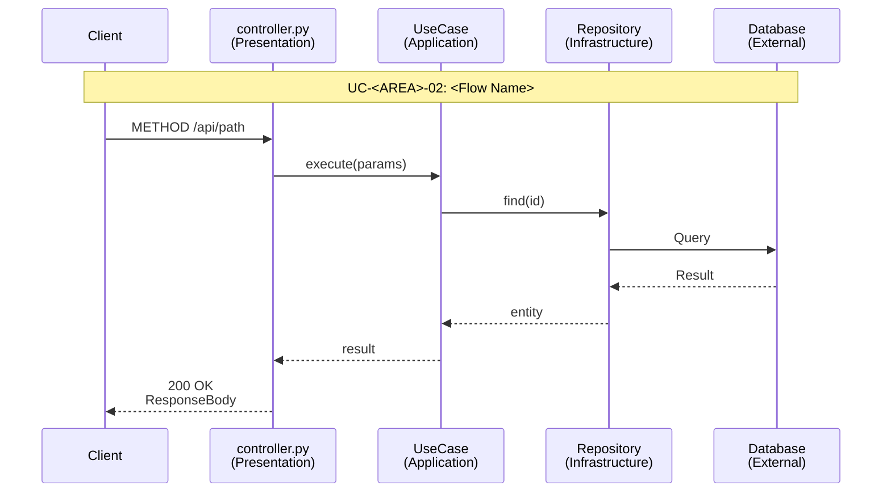
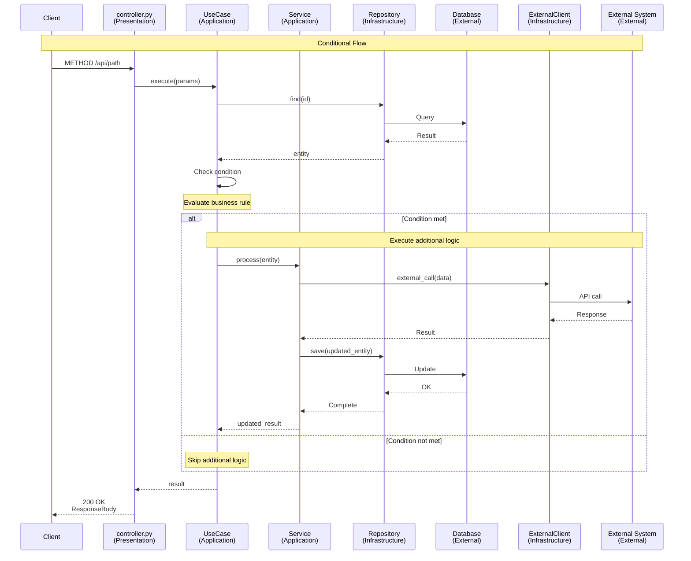
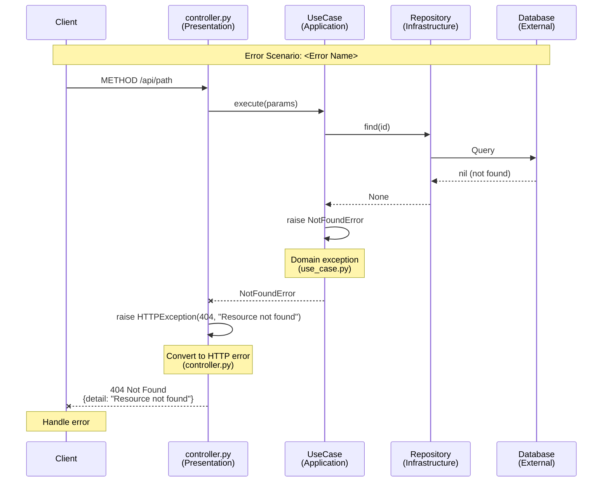
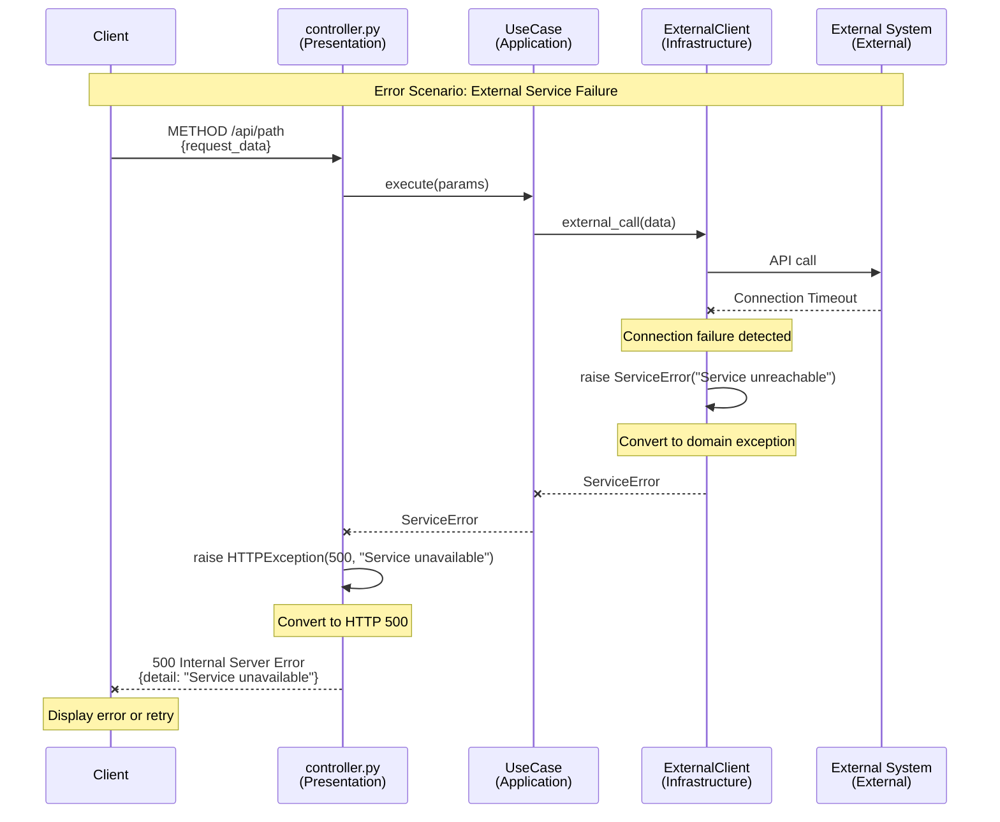
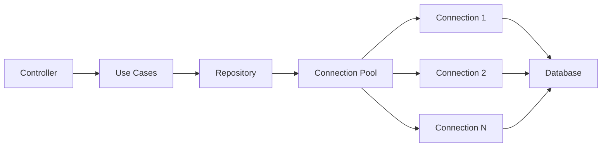
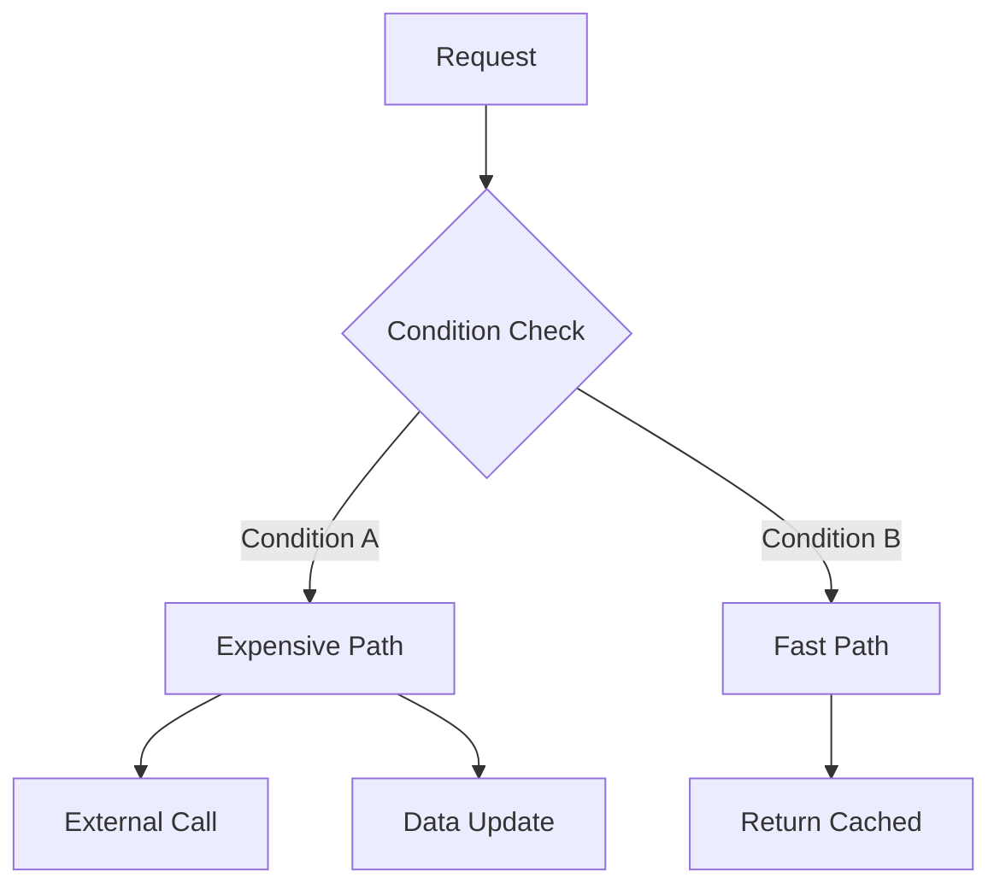

> [← Use Cases](use-cases.md) | [Domain Spec →](./)

# Sequence Diagrams

> **Created**: YYYY-MM-DD
> **Last Modified**: YYYY-MM-DD
> **Status**: Draft
> **Tech Stack**: (auto-detected)
> **Reference Documents**: <!-- list @-references from document discovery -->

---

## Table of Contents

1. [Overview](#overview)
2. [Architecture Layer Structure](#architecture-layer-structure)
3. [Core Flows](#core-flows)
4. [Error Handling Flows](#error-handling-flows)
5. [Performance Optimization Points](#performance-optimization-points)

---

## Overview

This document represents all major flows as sequence diagrams, explicitly showing architecture layer interactions.

### Purpose

- **Implementation Traceability**: Code tracing possible using actual file names and methods
- **Architecture Understanding**: Visualize interactions between architecture layers
- **Debugging Support**: Understand entire request flow at a glance

### Related Documents

- [Requirements Analysis](../requirements/requirements.md) - Functional/non-functional requirements
- [Use Case Specification](use-cases.md) - Detailed use case specifications
- [User Stories](../requirements/user-stories.md) - User stories

---

## Architecture Layer Structure

### Layer Overview

<!-- Adapt the layer structure to match the project's architecture pattern -->

```text
+---------------------------------------------------------+
|                  Presentation Layer (HTTP)               |
|              controllers/ or routes/                     |
|              (Framework Controllers/Handlers)            |
+------------------------+--------------------------------+
                         | uses
                         v
+---------------------------------------------------------+
|          Application Layer (Use Cases / Services)        |
|              use_cases/ or services/                     |
|  - Use Case classes or Service methods                   |
+----------+-------------------------+--------------------+
           | uses                    | uses
           v                         v
+----------------------+   +------------------------------+
|   Domain Layer       |   |  Infrastructure Layer        |
|  entities/models/    |   |  repositories/ or adapters/  |
|  - Domain Entities   |   |  - Repository Implementations|
|  - Value Objects     |   |  - External Service Clients  |
+----------------------+   +------------------------------+
```

### Participant Notation

In sequence diagrams, each participant is displayed in the following format:

```text
[FileName]<br/>(Layer)
```

**Examples**:

- `controller.py<br/>(Presentation)` - HTTP Controller
- `CreateUseCase<br/>(Application)` - Use Case (business workflow)
- `Service<br/>(Application)` - Application Service (shared logic)
- `ExternalClient<br/>(Infrastructure)` - External Service Adapter
- `Repository<br/>(Infrastructure)` - Data Storage Adapter

---

## Core Flows

### <Flow Name> Flow

**Use Case**: [UC-<AREA>-01 (Name)](use-cases.md#uc-area-01-name)

**Description**: <!-- Brief description of the flow -->



**Key Steps**:

1. <!-- Key step 1 -->
2. <!-- Key step 2 -->
3. <!-- Key step 3 -->

**Related Code**:

- <!-- [controller.py](path) - endpoint -->
- <!-- [use_case.py](path) - method -->
- <!-- [repository.py](path) - method -->

---

### <Another Flow Name> Flow

**Use Case**: [UC-<AREA>-02 (Name)](use-cases.md#uc-area-02-name)

**Description**: <!-- Brief description -->



**Key Steps**:

1. <!-- Key step 1 -->
2. <!-- Key step 2 -->

**Related Code**:

- <!-- [file](path) - method -->

---

### Conditional Flow (with alt block)

**Use Case**: <!-- UC reference -->

**Description**: <!-- Flow with conditional branching -->



**Conditional Branch (alt)**:

- **Condition met**: <!-- Description of what happens -->
- **Condition not met**: <!-- Description of what happens -->

**Related Code**:

- <!-- [file](path) - method -->

---

<!-- Repeat ### <Flow Name> Flow for each major flow -->

---

## Error Handling Flows

### <Error Scenario Name> Error Flow

**Scenario**: <!-- Brief description of the error scenario -->



**Error Propagation Flow**:

1. **Data Layer Failure**: <!-- Database returns empty/error -->
2. **Domain Exception**: <!-- Application layer raises exception -->
3. **HTTP Exception**: <!-- Presentation layer converts to HTTP error -->
4. **Client Handling**: <!-- Client handles the error -->

---

### External Service Failure Flow

**Scenario**: <!-- External service communication failure -->



**Error Propagation Flow**:

1. **Network Error**: <!-- External service timeout/error -->
2. **Domain Exception**: <!-- Infrastructure layer raises exception -->
3. **HTTP Exception**: <!-- Presentation layer converts to HTTP error -->
4. **Client Handling**: <!-- Client handles the error -->

---

## Performance Optimization Points

### <Optimization Area>



**Optimizations**:

- <!-- Optimization 1 (e.g., Connection pooling) -->
- <!-- Optimization 2 (e.g., Timeout settings) -->

**Related Requirement**: <!-- e.g., NFR-PERF-01 -->

---

### <Another Optimization Area>



**Optimizations**:

- <!-- Optimization 1 -->
- <!-- Optimization 2 -->

**Related Requirement**: <!-- e.g., NFR-PERF-02 -->

---

## Related Documents

- **Previous**: [← Use Cases](use-cases.md)
- **Next**: [Domain Spec →](./)
- **Requirements**: [Requirements Analysis](../requirements/requirements.md)
- **User Stories**: [User Stories](../requirements/user-stories.md)
- **Architecture**: [Architecture](../../architecture.md)

---

**Version History**:

- 1.0.0 (YYYY-MM-DD): Initial sequence diagram document

---
> **All Documents**
> [Requirements](../requirements/requirements.md) |
> [User Stories](../requirements/user-stories.md) |
> [Use Cases](use-cases.md) |
> **Sequence Diagrams** |
> [Domain Spec](./) |
> [Test Spec](test-spec.md)
