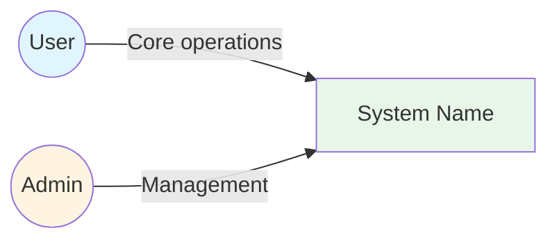
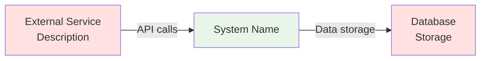
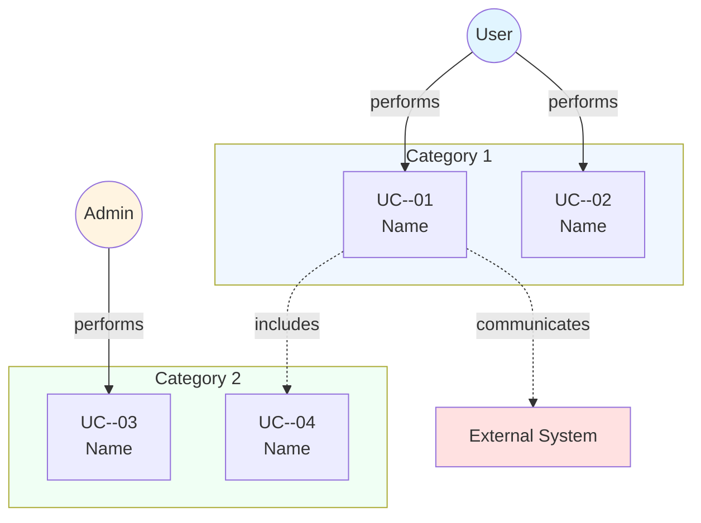
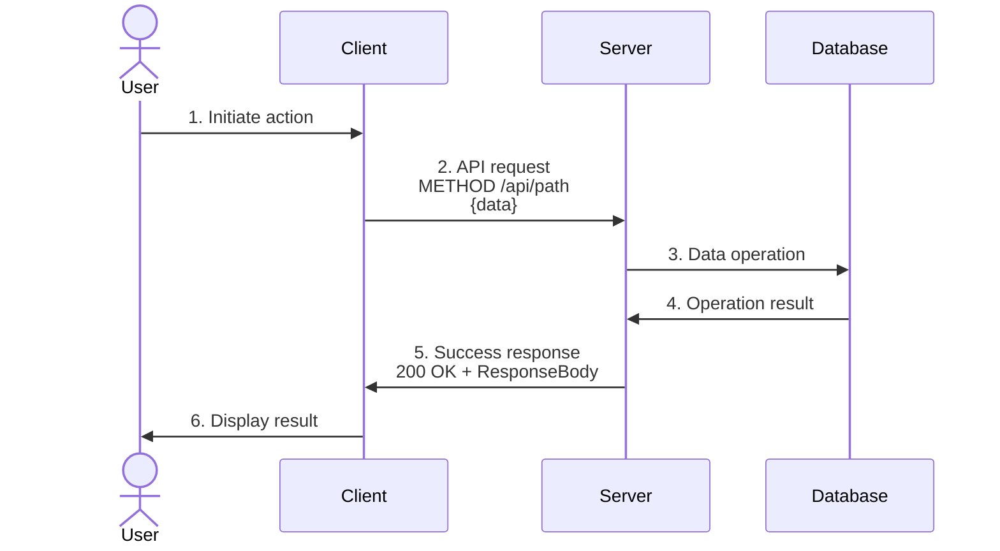

> [← User Stories](../requirements/user-stories.md) | [Sequence Diagrams →](sequence-diagram.md)

# Use Case Specification

> **Created**: YYYY-MM-DD
> **Last Modified**: YYYY-MM-DD
> **Status**: Draft
> **Tech Stack**: (auto-detected)
> **Reference Documents**: <!-- list @-references from document discovery -->

---

## Table of Contents

1. [Overview](#overview)
2. [Actors](#actors)
3. [Use Case Diagram](#use-case-diagram)
4. [Use Case Details](#use-case-details)

---

## Overview

This document defines all use cases for the system. Each use case includes detailed specifications with actors, preconditions, main flow, alternative flows, and postconditions.

### Use Case Categories

| Category | Count | Description |
|----------|-------|-------------|
| **<Category 1>** | <!-- N --> | <!-- Brief description --> |
| **<Category 2>** | <!-- N --> | <!-- Brief description --> |
| **Total** | **N** | - |

---

## Actors

### Primary Actors

#### 1. <Actor Name>

**Description**: <!-- Who this actor is -->

**Goals**:

- <!-- Goal 1 -->
- <!-- Goal 2 -->

**Characteristics**:

- <!-- Characteristic 1 -->
- <!-- Characteristic 2 -->

**Related Use Cases**:

- UC-<AREA>-01: <!-- Name -->
- UC-<AREA>-02: <!-- Name -->

---

<!-- Repeat #### N. <Actor Name> for each primary actor -->

### Secondary Actors

#### N. <External System Name>

**Description**: <!-- External system description -->

**Role**:

- <!-- Role 1 -->
- <!-- Role 2 -->

**Communication**:

- <!-- Protocol and method -->

**Related Use Cases**:

- UC-<AREA>-01: <!-- Name -->

---

## Use Case Diagram

### Complete System Use Cases

**Diagram Legend**:

- **Solid Arrow** (`-->`): Actor performs use case
- **Dashed Arrow** (`-.->` with "includes"): One use case includes another
- **Dashed Arrow** (`-.->` with "communicates"): Interaction with external system

---

## Use Case Details

### <Category Name> Use Cases

---

## UC-<AREA>-01: <Use Case Name>

### Basic Information

| Item | Content |
|------|---------|
| **Use Case ID** | UC-<AREA>-01 |
| **Use Case Name** | <!-- Name --> |
| **Actors** | <!-- Primary Actor (Primary), Secondary Actor (Secondary) --> |
| **Related Requirements** | [FR-<AREA>-01](../requirements/requirements.md#fr-area), [NFR-SEC-01](../requirements/requirements.md#nfr-sec) |
| **Related User Stories** | [US-01](../requirements/user-stories.md#us-01-name) |
| **Sequence Diagram** | [Flow Name](sequence-diagram.md#flow-name) |

### Description

<!-- Detailed description of what this use case does -->

### Preconditions

1. <!-- Precondition 1 -->
2. <!-- Precondition 2 -->
3. <!-- Precondition 3 -->

### Postconditions

**On Success**:

1. <!-- Success postcondition 1 -->
2. <!-- Success postcondition 2 -->

**On Failure**:

1. <!-- Failure postcondition 1 -->
2. <!-- Failure postcondition 2 -->

### Main Flow

**Step-by-Step Description**:

1. **User Action**: <!-- What the user does -->
2. **API Request**: <!-- Client sends request -->
3. **Data Operation**: <!-- Server processes -->
4. **Operation Result**: <!-- Database returns -->
5. **Response Return**: <!-- Server responds -->
6. **Display Result**: <!-- Client shows result -->

### Alternative Flows

#### A1: <Alternative Scenario Name>

**Branch Point**: Step N (<!-- Step description -->)

**Flow**:

1. <!-- Alternative step 1 -->
2. <!-- Alternative step 2 -->
3. <!-- Alternative step 3 -->

---

#### A2: <Another Alternative Scenario>

**Branch Point**: Step N (<!-- Step description -->)

**Flow**:

1. <!-- Alternative step 1 -->
2. <!-- Alternative step 2 -->

**Recovery**: <!-- Recovery strategy -->

---

<!-- Repeat ## UC-<AREA>-NN: <Use Case Name> for each use case -->

---

## Use Case Relationships

| Relationship | Use Case A | Use Case B | Description |
|-------------|------------|------------|-------------|
| include | UC-<AREA>-01 | UC-<AREA>-04 | <!-- Description --> |
| extend | UC-<AREA>-02 | UC-<AREA>-05 | <!-- Description --> |

---

## Related Documents

- **Previous**: [← User Stories](../requirements/user-stories.md)
- **Next**: [Sequence Diagrams →](sequence-diagram.md)
- **Requirements**: [Requirements Analysis](../requirements/requirements.md)
- **Architecture**: [Architecture](../../architecture.md)

---

**Version History**:

- 1.0.0 (YYYY-MM-DD): Initial use case specification document

---
> **All Documents**
> [Requirements](../requirements/requirements.md) |
> [User Stories](../requirements/user-stories.md) |
> **Use Cases** |
> [Sequence Diagrams](sequence-diagram.md) |
> [Domain Spec](./) |
> [Test Spec](test-spec.md)
