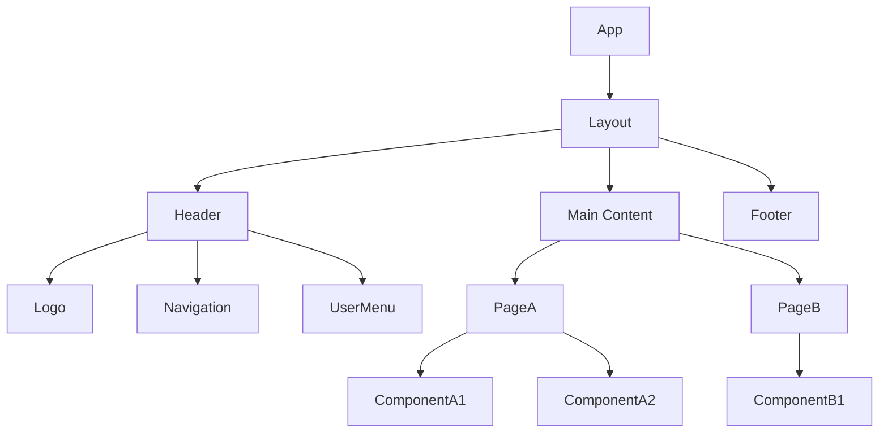
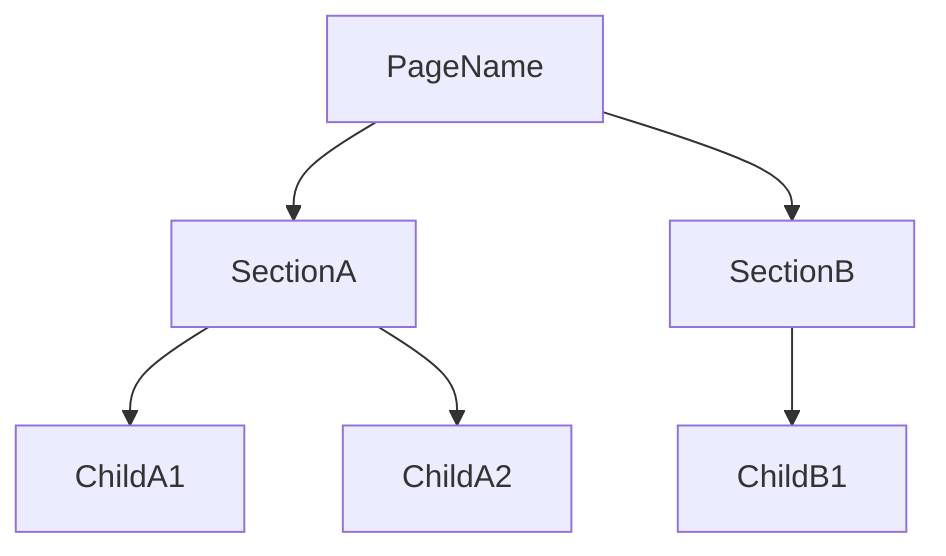

> [← Sequence Diagrams](sequence-diagram.md) | [Test Spec →](test-spec.md)

# Component Specification

> **Created**: YYYY-MM-DD
> **Last Modified**: YYYY-MM-DD
> **Status**: Draft
> **Tech Stack**: (auto-detected)
> **Reference Documents**: <!-- list @-references from document discovery -->

---

## Table of Contents

1. [UI Overview](#ui-overview)
2. [Component Tree](#component-tree)
3. [Shared Components](#shared-components)
4. [Page Components](#page-components)
5. [State Management](#state-management)
6. [API Integration](#api-integration)
7. [Error Handling](#error-handling)

---

## 1. UI Overview

| # | View | URL / Trigger | Access | Related UC |
|---|------|---------------|--------|------------|
| 1 | e.g., Login | `/login` | Public | UC-AUTH-01 |
| 2 | e.g., Dashboard | `/dashboard` | Authenticated | UC-DASH-01 |
| 3 | | | | |

### Shared Layout

- **Header**: Logo, navigation menu, user menu (changes based on auth state)
- **Footer**: Copyright information, link collections
- **Error Views**: 404 (Not found), 500 (Server error)

### Responsive Strategy

| Viewport | Changes |
|----------|---------|
| Desktop (>=1024px) | Default layout |
| Tablet (768-1023px) | Sidebar hidden, hamburger menu |
| Mobile (<768px) | Single column, bottom navigation |

---

## 2. Component Tree

### Overall Structure



### Component Classification Summary

| Category | Count | Examples |
|----------|-------|---------|
| Layout | N | Layout, Header, Footer, Sidebar |
| UI (Shared) | N | Button, Input, Modal, Toast |
| Feature | N | LoginForm, UserProfile |
| Page | N | LoginPage, DashboardPage |

---

## 3. Shared Components

### 3.1 Layout Components

| Component | Role | Used In |
|-----------|------|---------|
| Layout | Top-level layout wrapper | All pages |
| Header | Top navigation bar | Layout |
| Footer | Bottom information area | Layout |
| Sidebar | Side navigation | Authenticated pages |

### 3.2 UI Components

| Component | Role | Props |
|-----------|------|-------|
| Button | General-purpose button | variant, size, disabled, onClick |
| Input | Text input field | type, placeholder, error, onChange |
| Modal | Modal dialog | isOpen, onClose, title, children |
| Toast | Notification message | type, message, duration |

### 3.3 Props Interfaces

```typescript
interface ButtonProps {
  variant: 'primary' | 'secondary' | 'danger' | 'ghost';
  size: 'sm' | 'md' | 'lg';
  disabled?: boolean;
  loading?: boolean;
  onClick?: () => void;
  children: React.ReactNode;
}

interface InputProps {
  type?: 'text' | 'email' | 'password' | 'number';
  placeholder?: string;
  value: string;
  error?: string;
  onChange: (value: string) => void;
}

interface ModalProps {
  isOpen: boolean;
  onClose: () => void;
  title: string;
  children: React.ReactNode;
}
```

---

## 4. Page Components

### 4.1 <Page Name>

**URL**: `/path`
**Related UC**: [UC-<AREA>-01](use-cases.md#uc-area-01)

#### Layout

```text
+-----------------------------+
|        Header / Nav         |
+---------+-------------------+
| Sidebar |   Main Content    |
|         |                   |
|         | +--------------+  |
|         | | Component A  |  |
|         | +--------------+  |
|         | +--------------+  |
|         | | Component B  |  |
|         | +--------------+  |
+---------+-------------------+
|          Footer             |
+-----------------------------+
```

#### Component Hierarchy



#### Props Interfaces

```typescript
interface SectionAProps {
  // define props
}

interface ChildA1Props {
  // define props
}
```

---

### 4.2 <Next Page Name>

<!-- Repeat the same structure as above -->

---

## 5. State Management

### 5.1 Strategy

| Category | Decision |
|----------|----------|
| State Management Library | (e.g., Zustand / Redux Toolkit / Pinia) |
| Server State Management | (e.g., TanStack Query / SWR) |
| Global vs Local Criteria | (e.g., shared across 2+ pages -> global) |

### 5.2 State Classification

| Category | Description | Management | Examples |
|----------|-------------|------------|----------|
| Server State | Data fetched from APIs | TanStack Query | User list, posts |
| Client State | UI state | Zustand / useState | Modal open, sidebar toggle |
| Auth State | Authentication info | Zustand (persist) | Token, user profile |
| Form State | Form input state | React Hook Form | Input values, validation errors |

### 5.3 Store Definitions

#### Auth Store

```typescript
interface AuthState {
  user: User | null;
  token: string | null;
  isAuthenticated: boolean;
}

interface AuthActions {
  login: (credentials: LoginRequest) => Promise<void>;
  logout: () => void;
  refreshToken: () => Promise<void>;
}

interface User {
  id: string;
  email: string;
  name: string;
  role: 'user' | 'admin';
}
```

#### <Next Store Name>

```typescript
interface SomeState {
  // define state
}

interface SomeActions {
  // define actions
}
```

---

## 6. API Integration

### 6.1 Endpoint List

| # | Method | Path | Description | Auth | Related UC | Source |
|---|--------|------|-------------|------|------------|--------|
| 1 | POST | `/auth/login` | Login | No | UC-AUTH-01 | <!-- @-ref to api-spec --> |
| 2 | POST | `/auth/signup` | Sign up | No | UC-AUTH-02 | <!-- @-ref to api-spec --> |
| 3 | GET | `/users/me` | Get current user | Yes | UC-USER-01 | <!-- @-ref to api-spec --> |

### 6.2 Request / Response DTOs

#### POST `/auth/login`

```typescript
// Request
interface LoginRequest {
  email: string;
  password: string;
}

// Response (200 OK)
interface LoginResponse {
  accessToken: string;
  refreshToken: string;
  user: User;
}

// Error Response (401)
interface AuthErrorResponse {
  code: 'INVALID_CREDENTIALS' | 'ACCOUNT_LOCKED';
  message: string;
}
```

#### <Next Endpoint>

```typescript
// Request
interface SomeRequest {
  // define fields
}

// Response
interface SomeResponse {
  // define fields
}
```

### 6.3 Caching Strategy

| Data | staleTime | gcTime | Revalidation Trigger |
|------|-----------|--------|---------------------|
| User profile | 5 min | 30 min | On page focus |
| List data | 1 min | 10 min | On page navigation |
| Static data | 1 hour | 24 hours | Manual invalidation |

### 6.4 API Client Configuration

```typescript
// Base configuration
interface ApiClientConfig {
  baseURL: string;
  timeout: number;
  headers: Record<string, string>;
}

// Interceptors
// - Request: Automatically attach token to Authorization header
// - Response: Token refresh logic on 401
// - Error: Call common error handler
```

---

## 7. Error Handling

| HTTP Status | Handling |
|-------------|----------|
| 401 Unauthorized | Attempt token refresh -> on failure, redirect to login page |
| 403 Forbidden | Display "Permission denied" toast |
| 404 Not Found | Navigate to 404 error page |
| 422 Validation | Display per-field error messages |
| 500 Server Error | Display "Server error occurred" toast + retry button |
| Network Error | Display "Please check your network connection" toast |

---

## Related Documents

- **Previous**: [← Sequence Diagrams](sequence-diagram.md)
- **Next**: [Test Spec →](test-spec.md)
- **Requirements**: [Requirements Analysis](../requirements/requirements.md)
- **User Stories**: [User Stories](../requirements/user-stories.md)
- **Use Cases**: [Use Cases](use-cases.md)

---

**Version History**:

- 1.0.0 (YYYY-MM-DD): Initial component specification document

---
> **All Documents**
> [Requirements](../requirements/requirements.md) |
> [User Stories](../requirements/user-stories.md) |
> [Use Cases](use-cases.md) |
> [Sequence Diagrams](sequence-diagram.md) |
> **Component Spec** |
> [Test Spec](test-spec.md)
