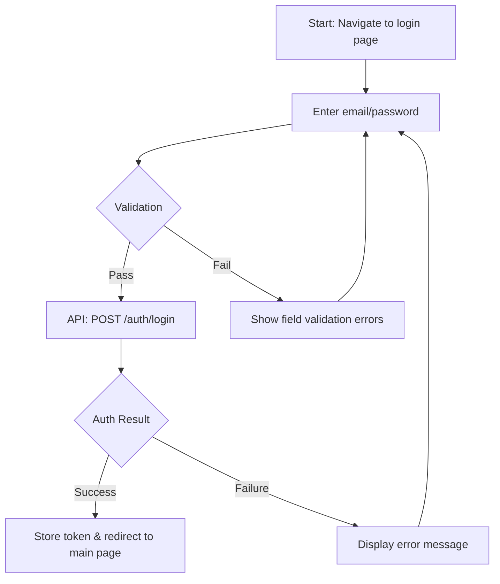
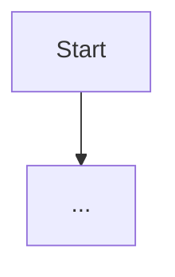
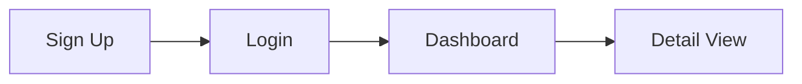

> [← Use Cases](use-cases.md) | [Sequence Diagrams →](sequence-diagram.md)

# User Flows

> **Created**: YYYY-MM-DD
> **Last Modified**: YYYY-MM-DD
> **Status**: Draft / Review / Final
> **Tech Stack**: (auto-detected)
> **Prerequisites**: [@<domain>/requirements/requirements.md](../requirements/requirements.md), [@<domain>/workflows/use-cases.md](use-cases.md)
> **Reference Documents**: <!-- list @-references from document discovery -->

## 1. Flow Overview

<!-- List all user flows covered in this document -->

| # | Flow | Related Requirement | Related Use Case | Primary Actor |
|---|------|---------------------|------------------|---------------|
| 1 | e.g., Sign Up Flow | FR-AUTH-01 | UC-AUTH-01 | End User |
| 2 | e.g., Dashboard View Flow | FR-DASH-01 | UC-DASH-01 | Admin |

## 2. Flow Details

### 2.1 (Flow Name)

**Entry Condition**: (e.g., User navigates to the login page)
**Exit Condition**: (e.g., User is redirected to the main page)

#### Happy Path

#### Alternative Path

- (e.g., User selects social login)

#### Exception Path

- (e.g., Network error occurs)
- (e.g., Server is under maintenance)

---

### 2.2 (Next Flow Name)

<!-- Repeat the same structure as above -->

**Entry Condition**:
**Exit Condition**:

#### Happy Path

#### Alternative Path

#### Exception Path

---

## 3. Flow Relationships

<!-- Document relationships between flows if they connect to each other -->

---
> **All Documents**
> [Requirements](../requirements/requirements.md) |
> [User Stories](../requirements/user-stories.md) |
> [Use Cases](use-cases.md) |
> **User Flows** |
> [Sequence Diagrams](sequence-diagram.md) |
> [<Domain Spec>](<domain-spec>.md) |
> [Test Spec](test-spec.md)
