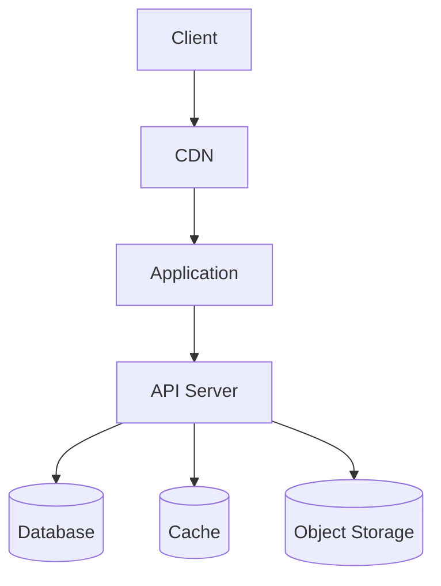
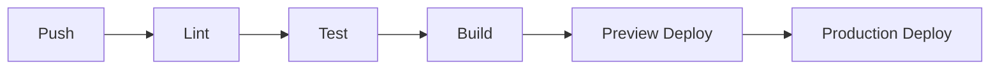

> [← Sequence Diagrams](../common/sequence-diagram-template.md) | [Test Spec →](test-spec.md)

# Infrastructure Specification

> **Created**: YYYY-MM-DD
> **Last Modified**: YYYY-MM-DD
> **Status**: Draft
> **Tech Stack**: (auto-detected)
> **Reference Documents**: <!-- list @-references from document discovery -->

---

## Table of Contents

1. [Deployment Topology](#deployment-topology)
2. [Environments](#environments)
3. [CI/CD Pipeline](#cicd-pipeline)
4. [Resource Definitions](#resource-definitions)
5. [Monitoring and Alerting](#monitoring-and-alerting)
6. [Security](#security)

---

## 1. Deployment Topology

<!-- TODO: Expand this template when infra domain is fully supported -->

---

## 2. Environments

| Environment | URL | Purpose | Branch |
|-------------|-----|---------|--------|
| Development | `http://localhost` | Local development | feature/* |
| Staging | `https://staging.example.com` | Pre-production testing | main |
| Production | `https://example.com` | Live environment | release/* |

---

## 3. CI/CD Pipeline

---

## 4. Resource Definitions

<!-- Define infrastructure resources: compute, storage, networking -->

---

## 5. Monitoring and Alerting

<!-- Define monitoring targets, alert rules, dashboards -->

---

## 6. Security

<!-- Define network policies, secrets management, access control -->

---

## Related Documents

- **Previous**: [← Sequence Diagrams](sequence-diagram.md)
- **Next**: [Test Spec →](test-spec.md)
- **Requirements**: [Requirements Analysis](../requirements/requirements.md)
- **Architecture**: [Architecture](../../architecture.md)

---

**Version History**:

- 1.0.0 (YYYY-MM-DD): Initial infrastructure specification (placeholder)

---
> **All Documents**
> [Requirements](../requirements/requirements.md) |
> [User Stories](../requirements/user-stories.md) |
> [Use Cases](use-cases.md) |
> [Sequence Diagrams](sequence-diagram.md) |
> **Infra Spec** |
> [Test Spec](test-spec.md)
