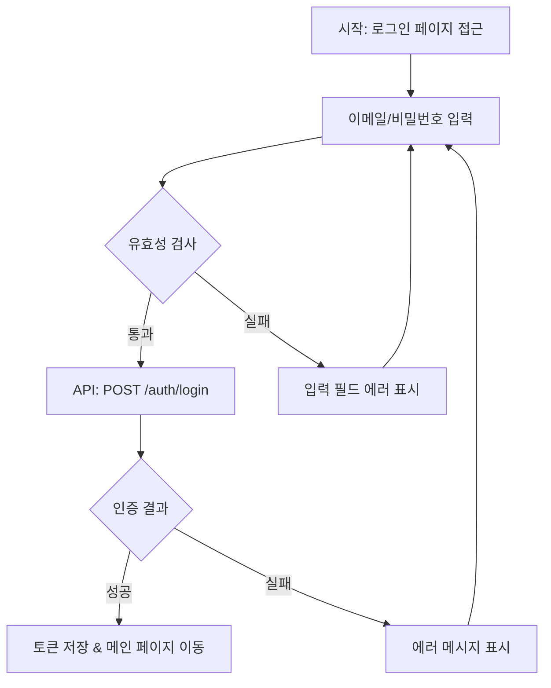
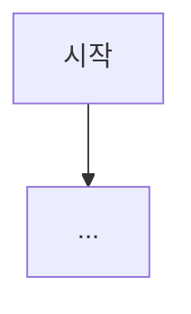

# 사용자 플로우 (User Flows)

> **생성일**: YYYY-MM-DD
> **최종 수정일**: YYYY-MM-DD
> **상태**: 초안 / 검토 중 / 확정
> **기술 스택**: (자동 감지 결과 기입)
> **선행 문서**: `docs/en/specifications/01-requirements.md`

## 1. 플로우 개요

<!-- 이 문서에서 다루는 사용자 플로우의 전체 목록을 나열한다 -->

| # | 플로우 | 관련 기능 | 주요 액터 |
|---|--------|----------|----------|
| 1 | 예: 회원가입 플로우 | FR-001 | 일반 사용자 |
| 2 | 예: 대시보드 조회 플로우 | FR-002 | 관리자 |

## 2. 플로우 상세

### 2.1 (플로우 이름)

**진입 조건 (Entry Condition)**: (예: 사용자가 로그인 페이지에 접근)
**종료 조건 (Exit Condition)**: (예: 사용자가 메인 페이지로 이동)

#### 정상 경로 (Happy Path)

#### 대체 경로 (Alternative Path)

- (예: 소셜 로그인 선택 시)

#### 예외 경로 (Exception Path)

- (예: 네트워크 오류 발생 시)
- (예: 서버 점검 중일 때)

---

### 2.2 (다음 플로우 이름)

<!-- 위와 동일한 구조를 반복한다 -->

**진입 조건 (Entry Condition)**:
**종료 조건 (Exit Condition)**:

#### 정상 경로 (Happy Path)

#### 대체 경로 (Alternative Path)

#### 예외 경로 (Exception Path)

---

## 3. 플로우 간 연결 관계

<!-- 플로우 간 이동 관계가 있으면 여기에 정리한다 -->

