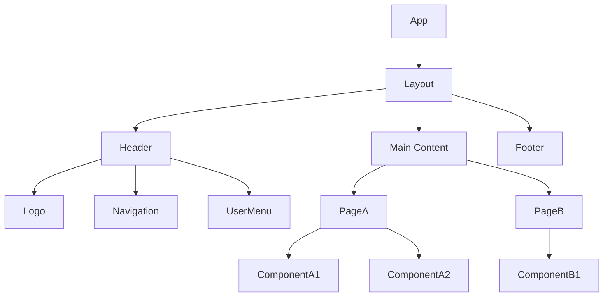
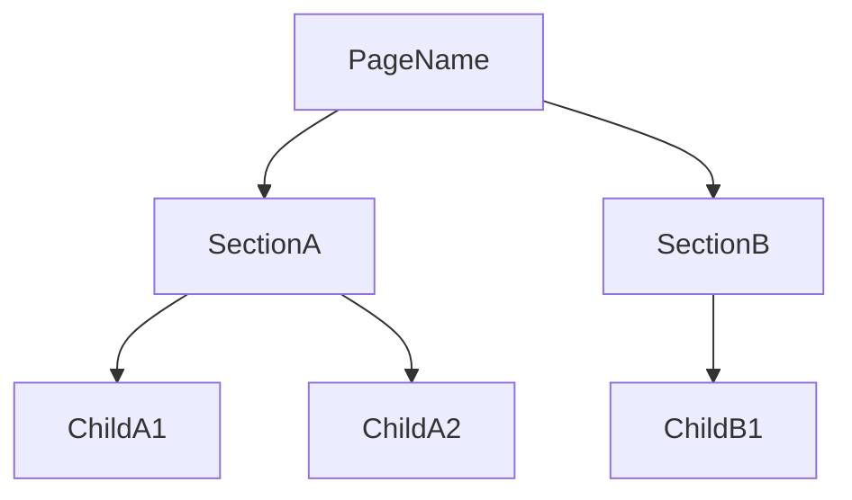

# 컴포넌트 트리 (Component Tree)

> **생성일**: YYYY-MM-DD
> **최종 수정일**: YYYY-MM-DD
> **상태**: 초안 / 검토 중 / 확정
> **기술 스택**: (자동 감지 결과 기입)
> **선행 문서**: `docs/specifications/01-requirements.md`, `docs/specifications/02-user-flows.md`, `docs/specifications/03-page-spec.md`, `docs/specifications/04-use-cases.md`

## 1. 전체 컴포넌트 구조



## 2. 공통 컴포넌트 (Shared Components)

### 2.1 Layout 컴포넌트

| 컴포넌트 | 역할 | 사용 위치 |
|----------|------|----------|
| Layout | 전체 레이아웃 래퍼 | 모든 페이지 |
| Header | 상단 네비게이션 | Layout |
| Footer | 하단 정보 영역 | Layout |
| Sidebar | 사이드 네비게이션 | 인증된 페이지 |

### 2.2 UI 컴포넌트

| 컴포넌트 | 역할 | Props |
|----------|------|-------|
| Button | 범용 버튼 | variant, size, disabled, onClick |
| Input | 텍스트 입력 필드 | type, placeholder, error, onChange |
| Modal | 모달 다이얼로그 | isOpen, onClose, title, children |
| Toast | 알림 메시지 | type, message, duration |

### 2.3 공통 컴포넌트 Props Interface

```typescript
interface ButtonProps {
  variant: 'primary' | 'secondary' | 'danger' | 'ghost';
  size: 'sm' | 'md' | 'lg';
  disabled?: boolean;
  loading?: boolean;
  onClick?: () => void;
  children: React.ReactNode;
}

interface InputProps {
  type?: 'text' | 'email' | 'password' | 'number';
  placeholder?: string;
  value: string;
  error?: string;
  onChange: (value: string) => void;
}

interface ModalProps {
  isOpen: boolean;
  onClose: () => void;
  title: string;
  children: React.ReactNode;
}
```

## 3. 페이지별 컴포넌트 (Page Components)

### 3.1 (페이지 이름)



#### Props Interface

```typescript
interface SectionAProps {
  // props 정의
}

interface ChildA1Props {
  // props 정의
}
```

---

### 3.2 (다음 페이지 이름)

<!-- 위와 동일한 구조를 반복한다 -->

---

## 4. 컴포넌트 분류 요약

| 분류 | 컴포넌트 수 | 예시 |
|------|-----------|------|
| Layout | N개 | Layout, Header, Footer, Sidebar |
| UI (공통) | N개 | Button, Input, Modal, Toast |
| Feature (기능) | N개 | LoginForm, UserProfile |
| Page | N개 | LoginPage, DashboardPage |
