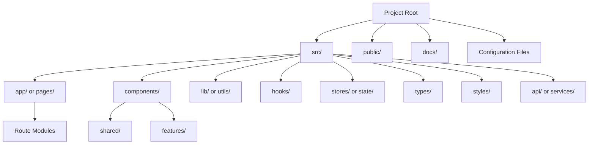
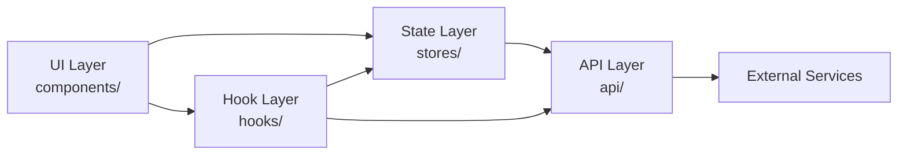

> [← Back to README](../README.md)

# Architecture

> **Created**: YYYY-MM-DD
> **Last Modified**: YYYY-MM-DD
> **Status**: Draft / Review / Final
> **Tech Stack**: (auto-detected)

## 1. Project Structure

<!-- Replace with the actual project structure -->

## 2. Module Boundaries

<!-- Define the dependency rules between modules -->

| Layer | Allowed Dependencies | Description |
|-------|---------------------|-------------|
| UI (components/) | Hooks, State, Types | Presentation and interaction |
| Hooks (hooks/) | State, API, Types | Reusable logic |
| State (stores/) | API, Types | Application state management |
| API (api/) | Types | External communication |
| Types (types/) | None | Shared type definitions |

## 3. Key Files

| File | Purpose |
|------|---------|
| `src/app/layout.tsx` | Root layout |
| `src/app/page.tsx` | Home page |
| `src/lib/api-client.ts` | API client configuration |
| `src/stores/auth.ts` | Authentication state |

## 4. References

- [@docs/en/specifications/infrastructure.md](docs/en/specifications/infrastructure.md) — Deployment and infrastructure
