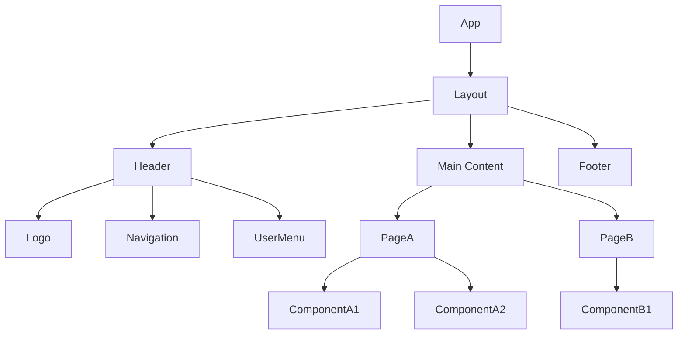
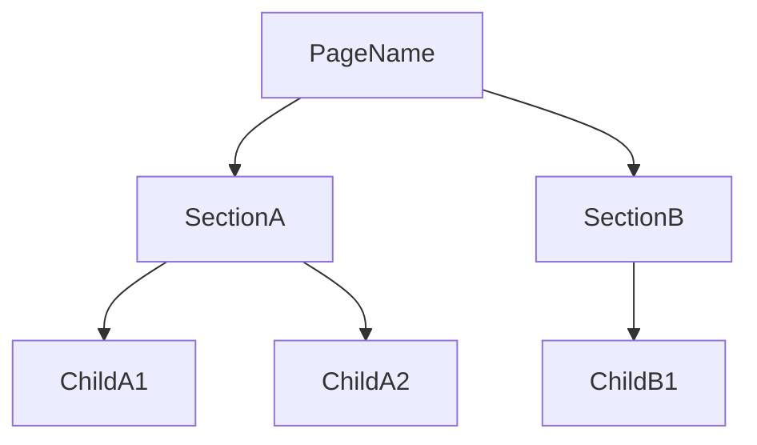

> [← Use Cases](use-cases.md) | [State & API →](state-api-integration.md)

# Component Tree

> **Created**: YYYY-MM-DD
> **Last Modified**: YYYY-MM-DD
> **Status**: Draft / Review / Final
> **Tech Stack**: (auto-detected)
> **Prerequisites**: [@<domain>/requirements/requirements.md](<domain>/requirements/requirements.md) through [@<domain>/workflows/use-cases.md](<domain>/workflows/use-cases.md)
> **Reference Documents**: <!-- list @-references from document discovery -->

## 1. Overall Component Structure



## 2. Shared Components

### 2.1 Layout Components

| Component | Role | Used In |
|-----------|------|---------|
| Layout | Top-level layout wrapper | All pages |
| Header | Top navigation bar | Layout |
| Footer | Bottom information area | Layout |
| Sidebar | Side navigation | Authenticated pages |

### 2.2 UI Components

| Component | Role | Props |
|-----------|------|-------|
| Button | General-purpose button | variant, size, disabled, onClick |
| Input | Text input field | type, placeholder, error, onChange |
| Modal | Modal dialog | isOpen, onClose, title, children |
| Toast | Notification message | type, message, duration |

### 2.3 Shared Component Props Interfaces

```typescript
interface ButtonProps {
  variant: 'primary' | 'secondary' | 'danger' | 'ghost';
  size: 'sm' | 'md' | 'lg';
  disabled?: boolean;
  loading?: boolean;
  onClick?: () => void;
  children: React.ReactNode;
}

interface InputProps {
  type?: 'text' | 'email' | 'password' | 'number';
  placeholder?: string;
  value: string;
  error?: string;
  onChange: (value: string) => void;
}

interface ModalProps {
  isOpen: boolean;
  onClose: () => void;
  title: string;
  children: React.ReactNode;
}
```

## 3. Page Components

### 3.1 (Page Name)



#### Props Interfaces

```typescript
interface SectionAProps {
  // define props
}

interface ChildA1Props {
  // define props
}
```

---

### 3.2 (Next Page Name)

<!-- Repeat the same structure as above -->

---

## 4. Component Classification Summary

| Category | Count | Examples |
|----------|-------|---------|
| Layout | N | Layout, Header, Footer, Sidebar |
| UI (Shared) | N | Button, Input, Modal, Toast |
| Feature | N | LoginForm, UserProfile |
| Page | N | LoginPage, DashboardPage |

---
> **All Documents**
> [Requirements](../requirements/requirements.md) |
> [User Flows](../requirements/user-flows.md) |
> [UI Spec](../requirements/ui-spec.md) |
> [Use Cases](use-cases.md) |
> **Component Tree** |
> [State & API](state-api-integration.md)
