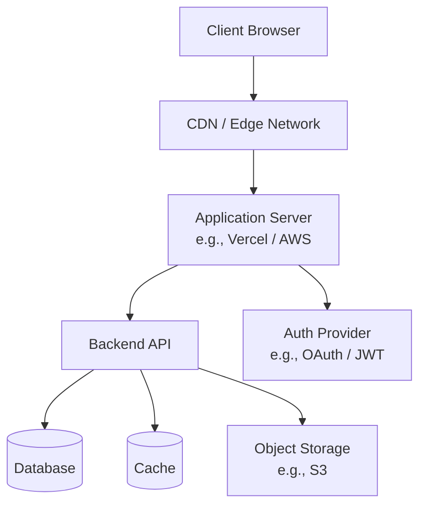
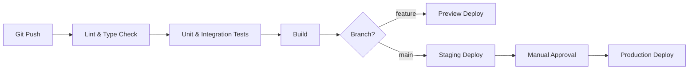

> [← Back to README](../README.md)

# Infrastructure

> **Created**: YYYY-MM-DD
> **Last Modified**: YYYY-MM-DD
> **Status**: Draft / Review / Final
> **Tech Stack**: (auto-detected)

## 1. Deployment Topology

<!-- Replace with the actual deployment topology -->

## 2. Environments

| Environment | URL | Purpose | Branch |
|------------|-----|---------|--------|
| Development | `localhost:3000` | Local development | feature branches |
| Staging | `staging.example.com` | Pre-production testing | `develop` |
| Production | `example.com` | Live service | `main` |

## 3. CI/CD Pipeline

## 4. External Services

| Service | Purpose | Provider |
|---------|---------|----------|
| Hosting | Application deployment | e.g., Vercel / AWS |
| Database | Data persistence | e.g., PostgreSQL / PlanetScale |
| Auth | Authentication | e.g., NextAuth / Auth0 |
| Storage | File uploads | e.g., AWS S3 / Cloudflare R2 |
| Monitoring | Error tracking | e.g., Sentry |
| Analytics | Usage tracking | e.g., Google Analytics / Mixpanel |

## 5. References

- [@docs/en/specifications/architecture.md](docs/en/specifications/architecture.md) — Project structure and module boundaries
