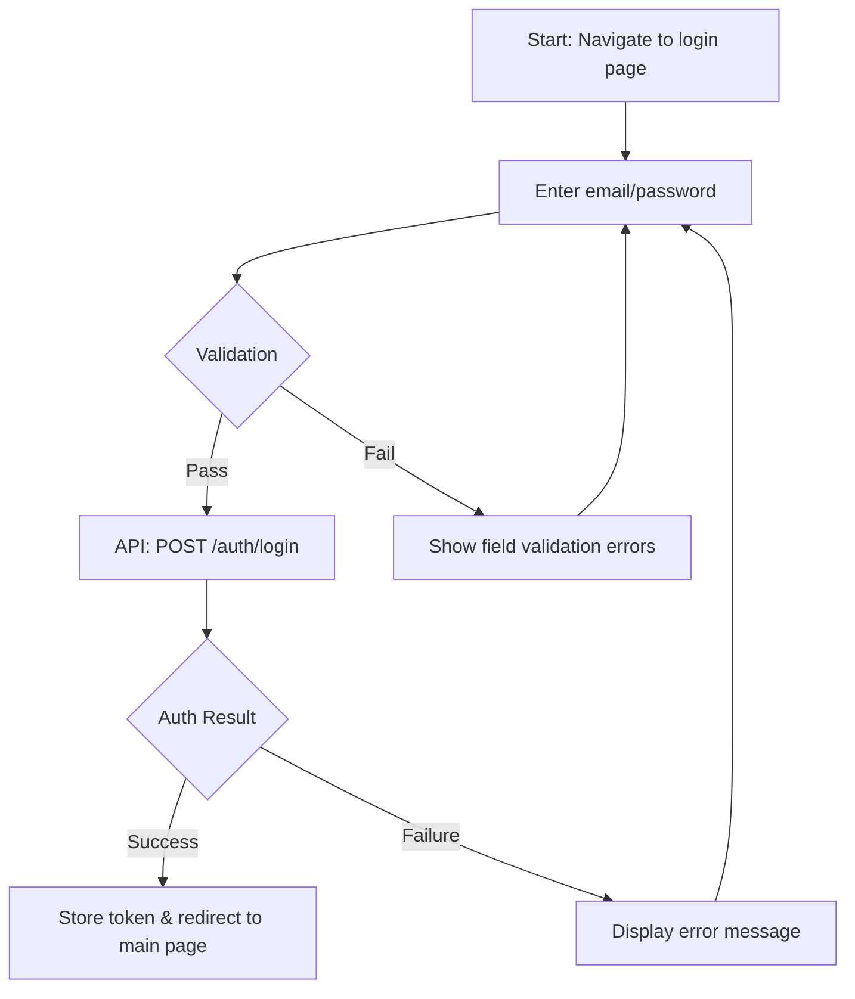
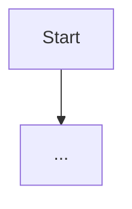

> [← Requirements](requirements.md) | [UI Spec →](ui-spec.md)

# User Flows

> **Created**: YYYY-MM-DD
> **Last Modified**: YYYY-MM-DD
> **Status**: Draft / Review / Final
> **Tech Stack**: (auto-detected)
> **Prerequisites**: [@<domain>/requirements/requirements.md](<domain>/requirements/requirements.md)
> **Reference Documents**: <!-- list @-references from document discovery -->

## 1. Flow Overview

<!-- List all user flows covered in this document -->

| # | Flow | Related Feature | Primary Actor |
|---|------|-----------------|---------------|
| 1 | e.g., Sign Up Flow | FR-001 | End User |
| 2 | e.g., Dashboard View Flow | FR-002 | Admin |

## 2. Flow Details

### 2.1 (Flow Name)

**Entry Condition**: (e.g., User navigates to the login page)
**Exit Condition**: (e.g., User is redirected to the main page)

#### Happy Path

#### Alternative Path

- (e.g., User selects social login)

#### Exception Path

- (e.g., Network error occurs)
- (e.g., Server is under maintenance)

---

### 2.2 (Next Flow Name)

<!-- Repeat the same structure as above -->

**Entry Condition**:
**Exit Condition**:

#### Happy Path

#### Alternative Path

#### Exception Path

---

## 3. Flow Relationships

<!-- Document relationships between flows if they connect to each other -->

---
> **All Documents**
> [Requirements](requirements.md) |
> **User Flows** |
> [UI Spec](ui-spec.md) |
> [Use Cases](../workflows/use-cases.md) |
> [Component Tree](../workflows/component-tree.md) |
> [State & API](../workflows/state-api-integration.md)
